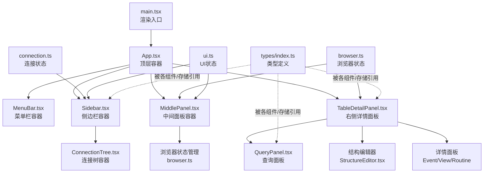
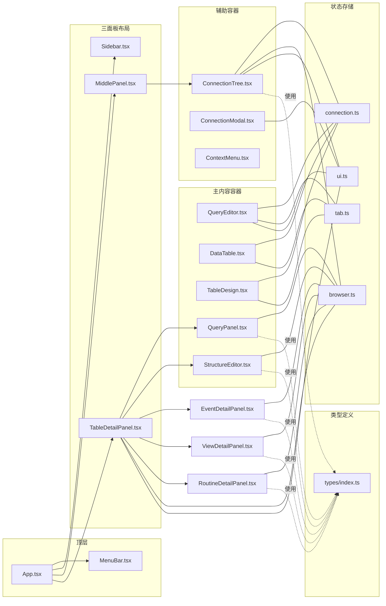
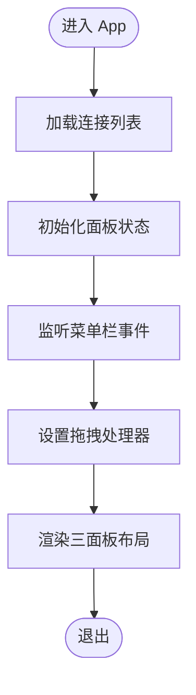
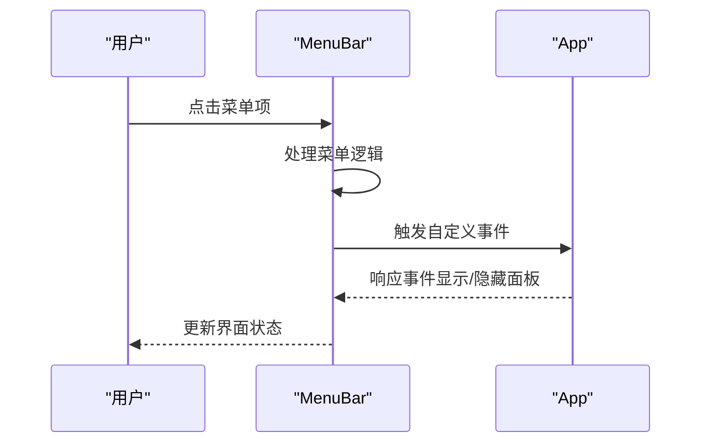
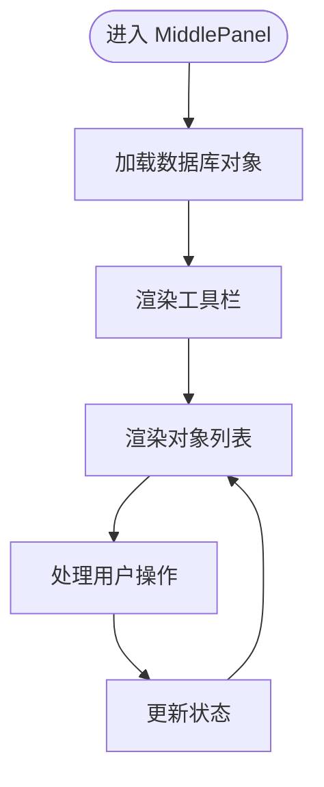
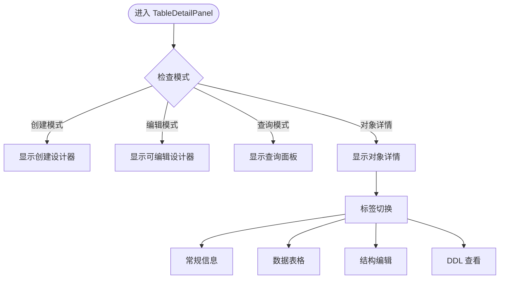
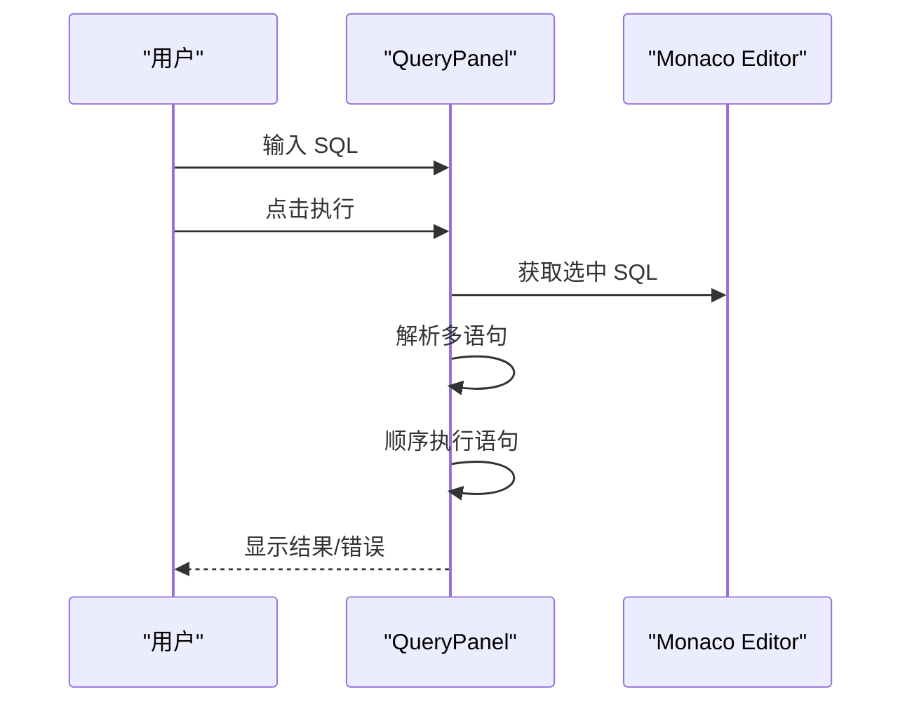
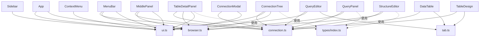

# 组件系统架构

<cite>
**本文引用的文件**
- [src/renderer/src/App.tsx](file://src/renderer/src/App.tsx)
- [src/renderer/src/main.tsx](file://src/renderer/src/main.tsx)
- [src/renderer/src/components/Sidebar.tsx](file://src/renderer/src/components/Sidebar.tsx)
- [src/renderer/src/components/MiddlePanel.tsx](file://src/renderer/src/components/MiddlePanel.tsx)
- [src/renderer/src/components/MenuBar.tsx](file://src/renderer/src/components/MenuBar.tsx)
- [src/renderer/src/components/TableDetailPanel.tsx](file://src/renderer/src/components/TableDetailPanel.tsx)
- [src/renderer/src/components/QueryPanel.tsx](file://src/renderer/src/components/QueryPanel.tsx)
- [src/renderer/src/components/EventDetailPanel.tsx](file://src/renderer/src/components/EventDetailPanel.tsx)
- [src/renderer/src/components/ViewDetailPanel.tsx](file://src/renderer/src/components/ViewDetailPanel.tsx)
- [src/renderer/src/components/RoutineDetailPanel.tsx](file://src/renderer/src/components/RoutineDetailPanel.tsx)
- [src/renderer/src/components/StructureEditor.tsx](file://src/renderer/src/components/StructureEditor.tsx)
- [src/renderer/src/components/NewTableDesigner.tsx](file://src/renderer/src/components/NewTableDesigner.tsx)
- [src/renderer/src/components/ConnectionTree.tsx](file://src/renderer/src/components/ConnectionTree.tsx)
- [src/renderer/src/components/QueryEditor.tsx](file://src/renderer/src/components/QueryEditor.tsx)
- [src/renderer/src/components/DataTable.tsx](file://src/renderer/src/components/DataTable.tsx)
- [src/renderer/src/components/TableDesign.tsx](file://src/renderer/src/components/TableDesign.tsx)
- [src/renderer/src/components/ConnectionModal.tsx](file://src/renderer/src/components/ConnectionModal.tsx)
- [src/renderer/src/components/ContextMenu.tsx](file://src/renderer/src/components/ContextMenu.tsx)
- [src/renderer/src/stores/connection.ts](file://src/renderer/src/stores/connection.ts)
- [src/renderer/src/stores/browser.ts](file://src/renderer/src/stores/browser.ts)
- [src/renderer/src/stores/tab.ts](file://src/renderer/src/stores/tab.ts)
- [src/renderer/src/stores/ui.ts](file://src/renderer/src/stores/ui.ts)
- [src/shared/types/index.ts](file://src/shared/types/index.ts)
</cite>

## 目录
1. [简介](#简介)
2. [项目结构](#项目结构)
3. [核心组件](#核心组件)
4. [架构总览](#架构总览)
5. [详细组件分析](#详细组件分析)
6. [依赖关系分析](#依赖关系分析)
7. [性能考量](#性能考量)
8. [故障排查指南](#故障排查指南)
9. [结论](#结论)
10. [附录](#附录)

## 简介
本文件系统性梳理了基于 React 的桌面应用组件系统架构，重点解释分层设计与职责划分（容器组件与展示组件）、核心布局组件（侧边栏、中间面板、菜单栏、右侧详情面板）的架构模式、组件间通信与数据流、可复用性与扩展性设计，并给出最佳实践与性能优化建议。该系统采用 Electron + React 技术栈，使用 Zustand 状态管理，通过 IPC 与后端交互。

## 项目结构
- 渲染进程入口负责挂载根组件 App，并在 StrictMode 下渲染。
- App 作为顶层容器，组织菜单栏、三面板布局（侧边栏 + 中间面板 + 右侧详情面板）、全局模态与上下文菜单。
- 组件按功能分层：容器组件负责状态与业务逻辑，展示组件专注 UI 呈现。
- 状态集中于 stores（Zustand），跨组件共享连接、浏览器状态、标签页、UI 尺寸与上下文菜单。

**更新** 新增三面板布局架构，包括菜单栏、中间面板和右侧详情面板，以及专门的浏览器状态管理。

图表来源
- [src/renderer/src/main.tsx:1-12](file://src/renderer/src/main.tsx#L1-L12)
- [src/renderer/src/App.tsx:1-136](file://src/renderer/src/App.tsx#L1-L136)
- [src/renderer/src/components/MenuBar.tsx:1-335](file://src/renderer/src/components/MenuBar.tsx#L1-L335)
- [src/renderer/src/components/Sidebar.tsx:1-80](file://src/renderer/src/components/Sidebar.tsx#L1-L80)
- [src/renderer/src/components/MiddlePanel.tsx:1-770](file://src/renderer/src/components/MiddlePanel.tsx#L1-L770)
- [src/renderer/src/components/TableDetailPanel.tsx:1-359](file://src/renderer/src/components/TableDetailPanel.tsx#L1-L359)
- [src/renderer/src/stores/browser.ts:1-179](file://src/renderer/src/stores/browser.ts#L1-L179)

章节来源
- [src/renderer/src/main.tsx:1-12](file://src/renderer/src/main.tsx#L1-L12)
- [src/renderer/src/App.tsx:1-136](file://src/renderer/src/App.tsx#L1-L136)

## 核心组件
- **布局容器组件**
  - App：管理三面板布局、菜单栏、拖拽调整、显隐控制。
  - MenuBar：提供完整的应用菜单功能，包括文件、视图、对象、工具、帮助菜单。
  - Sidebar：负责侧边栏宽度、连接树交互、拖拽调整等。
  - MiddlePanel：管理数据库对象列表（表、视图、函数、事件、查询）。
  - TableDetailPanel：右侧详情面板，支持表数据、结构、DDL等多种视图。
- **容器组件**
  - ConnectionTree：维护连接树展开状态、缓存节点数据、处理连接/数据库/表的上下文菜单与双击事件。
  - QueryEditor：管理 SQL 编辑、执行、结果面板尺寸拖拽、CSV 导出。
  - DataTable：分页、筛选、排序、加载表列与行数据。
  - TableDesign：加载并展示表结构、索引与基本信息。
  - ConnectionModal：连接配置的增删改查与连接测试。
  - ContextMenu：全局上下文菜单渲染与交互。
- **专用组件**
  - QueryPanel：完整的查询编辑器，支持多语句执行、自动补全、结果导出。
  - StructureEditor：表结构编辑器，包含字段、索引、外键、触发器、表选项等子编辑器。
  - NewTableDesigner：可视化表设计器，支持拖拽字段、设置约束等。
  - EventDetailPanel/ViewDetailPanel/RoutineDetailPanel：各类数据库对象的详情面板。
- **状态存储**
  - connection.ts：连接列表、状态、错误、展开集合。
  - browser.ts：浏览器状态（连接、数据库、表、分类、查询等）。
  - tab.ts：标签页集合、激活标签、增删改查。
  - ui.ts：侧栏宽度、中间面板宽度、结果面板高度、连接模态、上下文菜单。

**更新** 新增三面板布局相关的组件和浏览器状态管理，以及大量专用组件。

章节来源
- [src/renderer/src/components/App.tsx:1-136](file://src/renderer/src/components/App.tsx#L1-L136)
- [src/renderer/src/components/MenuBar.tsx:1-335](file://src/renderer/src/components/MenuBar.tsx#L1-L335)
- [src/renderer/src/components/MiddlePanel.tsx:1-770](file://src/renderer/src/components/MiddlePanel.tsx#L1-L770)
- [src/renderer/src/components/TableDetailPanel.tsx:1-359](file://src/renderer/src/components/TableDetailPanel.tsx#L1-L359)
- [src/renderer/src/components/QueryPanel.tsx:1-567](file://src/renderer/src/components/QueryPanel.tsx#L1-L567)
- [src/renderer/src/components/StructureEditor.tsx:1-67](file://src/renderer/src/components/StructureEditor.tsx#L1-L67)
- [src/renderer/src/components/NewTableDesigner.tsx:1-320](file://src/renderer/src/components/NewTableDesigner.tsx#L1-L320)
- [src/renderer/src/stores/browser.ts:1-179](file://src/renderer/src/stores/browser.ts#L1-L179)

## 架构总览
系统采用"容器组件 + 展示组件 + 状态存储"的分层模式：
- 容器组件负责数据获取、状态变更与副作用（IPC、DOM 事件、缓存）。
- 展示组件仅负责 UI 呈现与用户交互回调（传入 props）。
- 状态存储集中管理跨组件共享的状态，避免深层 props 传递。
- 数据流自上而下（props 下发）、自下而上（回调更新状态）。
- 三面板布局提供更丰富的数据库管理体验，支持同时查看和编辑多个数据库对象。

**更新** 新增三面板布局架构的完整组件关系图，包括菜单栏、中间面板和右侧详情面板。

图表来源
- [src/renderer/src/App.tsx:1-136](file://src/renderer/src/App.tsx#L1-L136)
- [src/renderer/src/components/MenuBar.tsx:1-335](file://src/renderer/src/components/MenuBar.tsx#L1-L335)
- [src/renderer/src/components/Sidebar.tsx:1-80](file://src/renderer/src/components/Sidebar.tsx#L1-L80)
- [src/renderer/src/components/MiddlePanel.tsx:1-770](file://src/renderer/src/components/MiddlePanel.tsx#L1-L770)
- [src/renderer/src/components/TableDetailPanel.tsx:1-359](file://src/renderer/src/components/TableDetailPanel.tsx#L1-L359)
- [src/renderer/src/components/QueryPanel.tsx:1-567](file://src/renderer/src/components/QueryPanel.tsx#L1-L567)
- [src/renderer/src/components/StructureEditor.tsx:1-67](file://src/renderer/src/components/StructureEditor.tsx#L1-L67)
- [src/renderer/src/stores/browser.ts:1-179](file://src/renderer/src/stores/browser.ts#L1-L179)

## 详细组件分析

### 容器组件：App（应用主容器）
- **职责**
  - 管理三面板布局（侧边栏、中间面板、右侧详情面板）的显隐与拖拽调整。
  - 处理菜单栏事件（显示/隐藏面板）。
  - 加载连接列表，初始化应用状态。
- **关键交互**
  - 监听 `nexsql-toggle-sidebar` 和 `nexsql-toggle-middle` 事件控制面板显隐。
  - 实现左右拖拽调整面板宽度。
  - 管理全局样式和布局容器。
- **状态管理**
  - 读取/设置 sidebarWidth、middlePanelWidth。
  - 控制面板显示状态（showSidebar、showMiddle）。

**更新** 新增三面板布局的完整流程，包括拖拽调整和事件监听。

图表来源
- [src/renderer/src/App.tsx:29-84](file://src/renderer/src/App.tsx#L29-L84)

章节来源
- [src/renderer/src/App.tsx:1-136](file://src/renderer/src/App.tsx#L1-L136)

### 容器组件：MenuBar（菜单栏）
- **职责**
  - 提供完整的应用菜单功能，包括文件、视图、对象、工具、帮助菜单。
  - 处理菜单项点击事件，触发相应的应用行为。
  - 显示当前数据库状态和连接信息。
- **关键交互**
  - 文件菜单：新建连接、导入/导出数据、刷新列表。
  - 视图菜单：控制面板显隐、刷新列表。
  - 对象菜单：新建数据库对象（表、视图、函数、事件、查询）。
  - 工具菜单：SQL 格式化、表优化等。
- **事件处理**
  - 通过自定义事件与应用其他部分通信（如 `nexsql-toggle-sidebar`）。

**更新** 新增菜单栏的完整功能分析，包括各个菜单组的作用和事件处理机制。

图表来源
- [src/renderer/src/components/MenuBar.tsx:140-161](file://src/renderer/src/components/MenuBar.tsx#L140-L161)

章节来源
- [src/renderer/src/components/MenuBar.tsx:1-335](file://src/renderer/src/components/MenuBar.tsx#L1-L335)

### 容器组件：MiddlePanel（中间面板）
- **职责**
  - 展示数据库对象列表（表、视图、函数、事件、查询）。
  - 管理对象列表的加载、搜索、排序、上下文菜单。
  - 处理对象的 CRUD 操作（创建、编辑、删除、重命名等）。
- **关键交互**
  - 分类标签切换：tables/views/functions/events/query。
  - 对象列表：支持搜索、排序、双击打开详情。
  - 上下文菜单：提供丰富的数据库对象操作。
  - 工具栏：刷新、新建、编辑、删除等操作。
- **性能优化**
  - 使用分页和虚拟滚动处理大量数据。
  - 缓存表结构和查询结果。
  - 按需加载数据，避免一次性加载所有对象。

**更新** 新增中间面板的完整工作流程，包括对象管理和操作处理。

图表来源
- [src/renderer/src/components/MiddlePanel.tsx:68-101](file://src/renderer/src/components/MiddlePanel.tsx#L68-L101)

章节来源
- [src/renderer/src/components/MiddlePanel.tsx:1-770](file://src/renderer/src/components/MiddlePanel.tsx#L1-L770)

### 容器组件：TableDetailPanel（右侧详情面板）
- **职责**
  - 根据所选数据库对象类型显示相应详情。
  - 支持表数据、结构、DDL、常规信息等多种视图。
  - 管理对象的编辑模式（新建、编辑）。
- **关键交互**
  - 详情标签切换：info/data/structure/ddl。
  - 对象类型路由：表、视图、函数、事件、查询。
  - 编辑模式：可视化设计器或可编辑 DDL。
  - 数据表格：支持分页、筛选、排序。
- **特殊处理**
  - 查询分类直接显示 QueryPanel。
  - 表编辑模式自动切换到结构标签。
  - 支持 DDL 复制、触发器展示等功能。

**更新** 新增右侧详情面板的完整路由逻辑和标签切换机制。

图表来源
- [src/renderer/src/components/TableDetailPanel.tsx:130-180](file://src/renderer/src/components/TableDetailPanel.tsx#L130-L180)

章节来源
- [src/renderer/src/components/TableDetailPanel.tsx:1-359](file://src/renderer/src/components/TableDetailPanel.tsx#L1-L359)

### 容器组件：QueryPanel（查询面板）
- **职责**
  - 提供完整的 SQL 编辑环境，支持语法高亮和自动补全。
  - 执行查询、显示结果、导出数据。
  - 管理保存的查询和查询历史。
- **关键交互**
  - Monaco Editor 集成，支持 SQL 语法高亮。
  - 自动补全：表名、字段名、SQL 关键字。
  - 多语句执行：按分号分割并顺序执行。
  - 结果导出：CSV、JSON 格式。
  - SQL 格式化：支持快捷键和菜单操作。
- **性能优化**
  - 表字段缓存，避免重复查询。
  - 多语句执行的错误处理和中断机制。
  - 结果集的分页显示。

**更新** 新增查询面板的完整查询执行流程，包括多语句处理和结果展示。

图表来源
- [src/renderer/src/components/QueryPanel.tsx:102-200](file://src/renderer/src/components/QueryPanel.tsx#L102-L200)

章节来源
- [src/renderer/src/components/QueryPanel.tsx:1-567](file://src/renderer/src/components/QueryPanel.tsx#L1-L567)

### 容器组件：StructureEditor（结构编辑器）
- **职责**
  - 提供表结构的可视化编辑界面。
  - 支持字段、索引、外键、触发器、表选项的管理。
- **关键交互**
  - 子标签切换：columns/indexes/foreignKeys/triggers/options。
  - 字段编辑：类型设置、约束配置、默认值设置。
  - 索引管理：主键、唯一键、普通索引等。
  - 外键关系：关联表和列的选择。
  - 触发器管理：触发时机和语句配置。
- **组件拆分**
  - ColumnsEditor：字段管理。
  - IndexesEditor：索引管理。
  - ForeignKeysEditor：外键管理。
  - TriggersEditor：触发器管理。
  - TableOptionsEditor：表选项设置。

**更新** 新增结构编辑器的子组件架构和功能模块。

章节来源
- [src/renderer/src/components/StructureEditor.tsx:1-67](file://src/renderer/src/components/StructureEditor.tsx#L1-L67)

### 容器组件：NewTableDesigner（表设计器）
- **职责**
  - 提供可视化的表创建界面。
  - 支持字段拖拽、类型设置、约束配置等。
- **关键交互**
  - 字段表格：支持添加、删除、移动字段。
  - 字段属性：名称、类型、是否为空、默认值、额外属性。
  - 主键设置：自动勾选非空约束。
  - 表选项：引擎、字符集、注释等。
  - SQL 生成：实时生成 CREATE TABLE 语句。
- **表单验证**
  - 表名必填检查。
  - 至少一个有效字段检查。
  - 字段名称去重和格式验证。

**更新** 新增表设计器的完整功能分析，包括字段管理和 SQL 生成。

章节来源
- [src/renderer/src/components/NewTableDesigner.tsx:1-320](file://src/renderer/src/components/NewTableDesigner.tsx#L1-L320)

### 详情面板组件
- **EventDetailPanel（事件详情面板）**
  - 显示事件的常规信息和 DDL。
  - 支持事件状态、类型、时间等信息查看。
- **ViewDetailPanel（视图详情面板）**
  - 显示视图的常规信息和 DDL。
  - 支持视图定义者、安全性、可更新性等信息。
- **RoutineDetailPanel（函数/存储过程详情面板）**
  - 显示函数或存储过程的常规信息和 DDL。
  - 区分 FUNCTION 和 PROCEDURE 类型显示。

**更新** 新增各类数据库对象详情面板的功能分析。

章节来源
- [src/renderer/src/components/EventDetailPanel.tsx:1-149](file://src/renderer/src/components/EventDetailPanel.tsx#L1-L149)
- [src/renderer/src/components/ViewDetailPanel.tsx:1-142](file://src/renderer/src/components/ViewDetailPanel.tsx#L1-L142)
- [src/renderer/src/components/RoutineDetailPanel.tsx:1-156](file://src/renderer/src/components/RoutineDetailPanel.tsx#L1-L156)

### 辅助容器：ConnectionModal（连接配置模态）
- 职责
  - 新建/编辑连接配置，支持连接测试。
- 关键交互
  - 表单校验、测试连接、保存并刷新连接列表。

章节来源
- [src/renderer/src/components/ConnectionModal.tsx:1-232](file://src/renderer/src/components/ConnectionModal.tsx#L1-L232)

### 辅助容器：ContextMenu（上下文菜单）
- 职责
  - 全局渲染上下文菜单，处理点击外部/ESC 关闭。
- 关键交互
  - 动态计算菜单位置，避免越界。

章节来源
- [src/renderer/src/components/ContextMenu.tsx:1-79](file://src/renderer/src/components/ContextMenu.tsx#L1-L79)

## 依赖关系分析
- **组件到存储**
  - App → ui.ts（宽度、模态）、browser.ts（面板显隐）
  - MenuBar → connection.ts、browser.ts、ui.ts
  - Sidebar → ui.ts（宽度、模态）
  - MiddlePanel → connection.ts、browser.ts、ui.ts
  - TableDetailPanel → connection.ts、browser.ts、ui.ts
  - QueryPanel → connection.ts、browser.ts
  - StructureEditor → connection.ts、browser.ts
  - ConnectionTree → connection.ts、ui.ts、browser.ts
  - QueryEditor → connection.ts、ui.ts、tab.ts
  - DataTable → connection.ts、tab.ts
  - TableDesign → connection.ts、tab.ts
  - ConnectionModal → connection.ts、ui.ts
  - ContextMenu → ui.ts
- **组件到类型**
  - 各组件均引用 shared/types 中的接口（ConnectionConfig、Tab、QueryResult、TableInfo 等）。

**更新** 新增三面板布局相关组件的依赖关系图，包括浏览器状态管理。

图表来源
- [src/renderer/src/App.tsx:13-16](file://src/renderer/src/App.tsx#L13-L16)
- [src/renderer/src/components/MenuBar.tsx:24-26](file://src/renderer/src/components/MenuBar.tsx#L24-L26)
- [src/renderer/src/components/MiddlePanel.tsx:21-24](file://src/renderer/src/components/MiddlePanel.tsx#L21-L24)
- [src/renderer/src/components/TableDetailPanel.tsx:3-6](file://src/renderer/src/components/TableDetailPanel.tsx#L3-L6)
- [src/renderer/src/stores/browser.ts:1-179](file://src/renderer/src/stores/browser.ts#L1-L179)

章节来源
- [src/renderer/src/stores/connection.ts:1-64](file://src/renderer/src/stores/connection.ts#L1-L64)
- [src/renderer/src/stores/browser.ts:1-179](file://src/renderer/src/stores/browser.ts#L1-L179)
- [src/renderer/src/stores/tab.ts:1-65](file://src/renderer/src/stores/tab.ts#L1-L65)
- [src/renderer/src/stores/ui.ts:1-41](file://src/renderer/src/stores/ui.ts#L1-L41)
- [src/shared/types/index.ts:1-124](file://src/shared/types/index.ts#L1-L124)

## 性能考量
- **状态粒度与订阅**
  - 使用 Zustand 的选择器订阅（如 s => s.tabs）减少不必要重渲染。
  - 浏览器状态按需加载，避免一次性加载所有数据库对象。
- **计算与缓存**
  - ConnectionTree 使用内存缓存 nodeCache，避免重复请求数据库/表列表。
  - DataTable 使用 useMemo 生成 gridColumns/gridRows，降低渲染成本。
  - QueryPanel 使用表字段缓存，避免重复查询。
  - MiddlePanel 使用搜索和排序的本地处理，减少网络请求。
- **事件与副作用**
  - App 的拖拽事件使用全局监听，注意在卸载时清理，避免内存泄漏。
  - MenuBar 的菜单事件使用防抖处理，避免频繁重渲染。
- **渲染优化**
  - 三面板布局使用 CSS Grid 和 Flexbox，避免复杂的 DOM 操作。
  - QueryEditor/DataTable 的结果面板高度限制范围，防止极端尺寸影响布局。
  - 结构编辑器使用子标签懒加载，只渲染当前激活的子编辑器。
- **异步与并发**
  - TableDetailPanel 对表详情和 DDL 采用 Promise.all 并行加载。
  - QueryPanel 对多语句执行进行错误处理和中断机制。
  - MiddlePanel 对数据库对象列表采用分页加载。
- **可访问性与 UX**
  - 拖拽条与键盘快捷键提升可用性；错误与加载状态明确反馈。
  - 三面板布局提供更好的空间利用率和操作效率。

**更新** 新增三面板布局和新组件的性能优化策略。

## 故障排查指南
- **连接问题**
  - 检查 connection.ts 中 statuses/errors 是否正确更新。
  - 确认 IPC 层返回的 IpcResponse.success 字段。
- **面板显示异常**
  - 检查 App.tsx 中的面板显隐状态（showSidebar、showMiddle）。
  - 确认拖拽事件是否正确注册和清理。
- **浏览器状态异常**
  - 检查 browser.ts 的 selectDatabase/selectTable/selectCategory 逻辑。
  - 确认 activeQuerySql、savedQueries 的状态一致性。
- **查询执行失败**
  - 检查 QueryPanel 的 SQL 解析和多语句执行逻辑。
  - 确认 Monaco Editor 的自动补全和语法高亮配置。
- **结构编辑器问题**
  - 检查 StructureEditor 的子编辑器状态同步。
  - 确认字段验证和 SQL 生成逻辑。
- **拖拽失效**
  - 确保全局 mousemove/mouseup 事件在组件挂载期间注册并在卸载时移除。
- **结果面板高度异常**
  - 检查 ui.ts 中 setResultPanelHeight 的范围限制是否生效。
- **上下文菜单不消失**
  - 确认 ContextMenu 的点击外部/ESC 监听是否正确注册与清理。

**更新** 新增三面板布局和新组件相关的故障排查指南。

章节来源
- [src/renderer/src/App.tsx:45-84](file://src/renderer/src/App.tsx#L45-L84)
- [src/renderer/src/stores/browser.ts:94-114](file://src/renderer/src/stores/browser.ts#L94-L114)
- [src/renderer/src/stores/connection.ts:47-51](file://src/renderer/src/stores/connection.ts#L47-L51)
- [src/renderer/src/stores/ui.ts:33-34](file://src/renderer/src/stores/ui.ts#L33-L34)
- [src/renderer/src/components/ContextMenu.tsx:9-34](file://src/renderer/src/components/ContextMenu.tsx#L9-L34)

## 结论
该组件系统通过清晰的分层设计实现了高内聚低耦合：容器组件承担业务与状态，展示组件专注 UI，Zustand 提供简洁的状态管理，类型定义贯穿全链路保证一致性。新增的三面板布局架构显著提升了数据库管理的效率和用户体验，菜单栏提供了完整的应用控制能力，中间面板和右侧详情面板支持丰富的数据库对象操作。浏览器状态管理使得应用能够更好地跟踪用户的数据库浏览历史和偏好设置。建议持续关注事件清理、状态订阅粒度与大型表格的虚拟化渲染，以进一步提升稳定性与用户体验。

**更新** 总结三面板布局架构带来的改进和优势。

## 附录
- **最佳实践**
  - 保持容器组件与展示组件职责单一，尽量无副作用。
  - 使用选择器订阅最小状态片段，避免过度重渲染。
  - 对耗时操作（数据库请求）采用缓存与并发策略。
  - 为全局事件与定时器提供统一的注册/清理机制。
  - 三面板布局中合理分配空间，避免某个面板过窄或过宽。
  - 使用浏览器状态管理记录用户偏好和浏览历史。
- **扩展性建议**
  - 新增标签类型时，遵循现有 Tab 接口与 openTab 策略。
  - 新增容器组件时，优先考虑复用现有 IPC 与类型定义。
  - 对复杂交互（如拖拽、快捷键）抽象为可复用 Hook。
  - 为新组件提供统一的错误处理和加载状态管理。
  - 考虑组件的可访问性设计，支持键盘导航和屏幕阅读器。
- **性能优化建议**
  - 使用虚拟滚动处理大量数据列表。
  - 实施适当的缓存策略，避免重复的数据请求。
  - 优化 Monaco Editor 的配置，平衡功能和性能。
  - 实施懒加载机制，只在需要时加载重型组件。
  - 使用 Web Workers 处理复杂的 SQL 解析和格式化任务。

**更新** 新增三面板布局和新组件相关的最佳实践和扩展性建议。