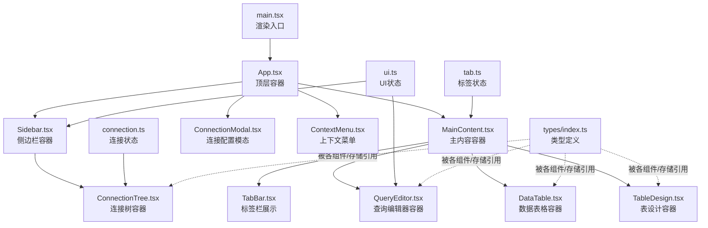
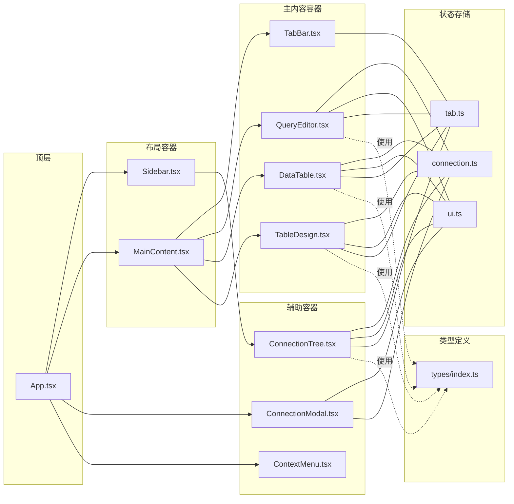
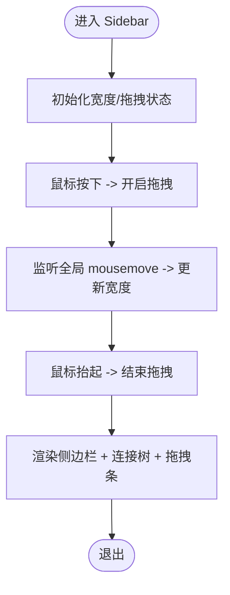
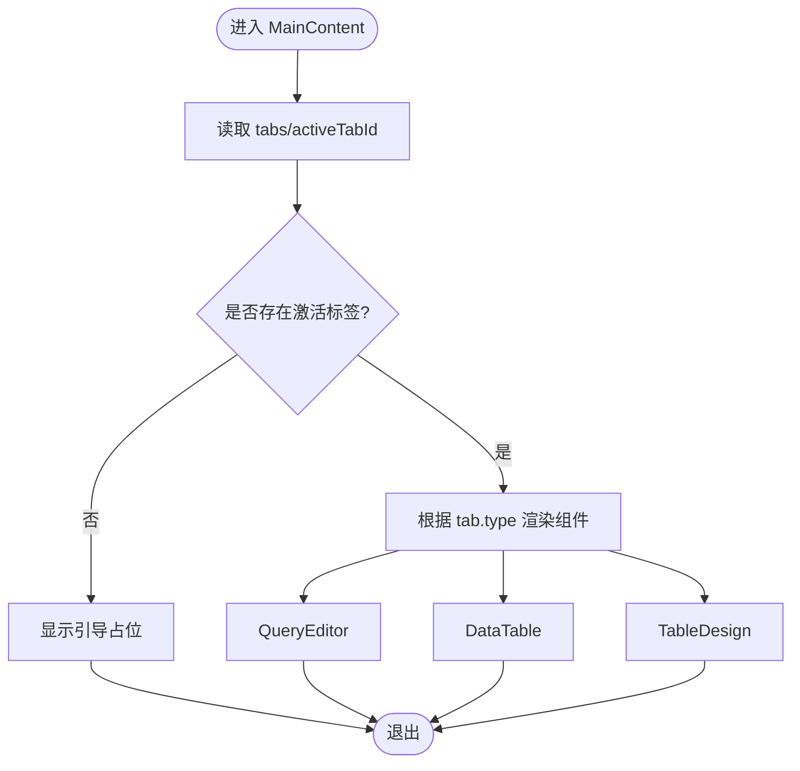
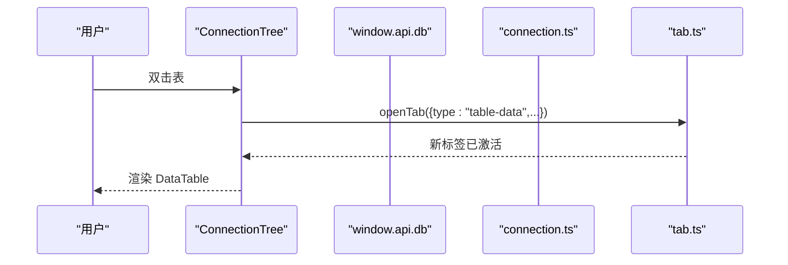
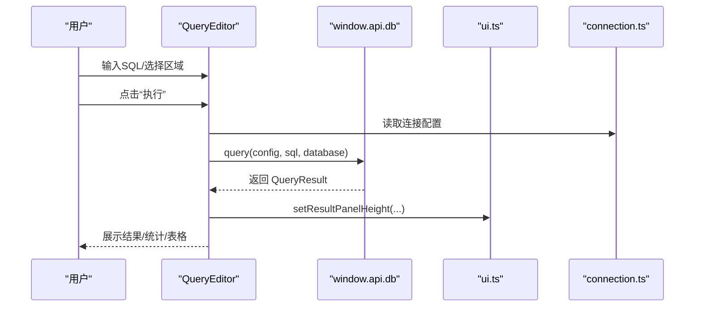
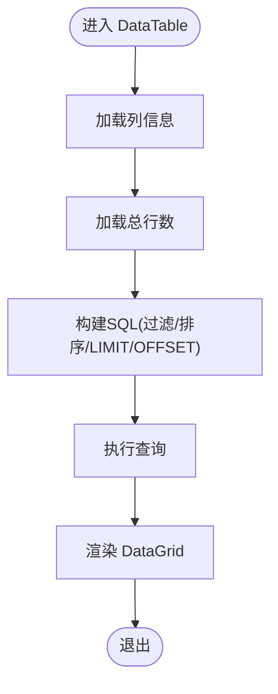
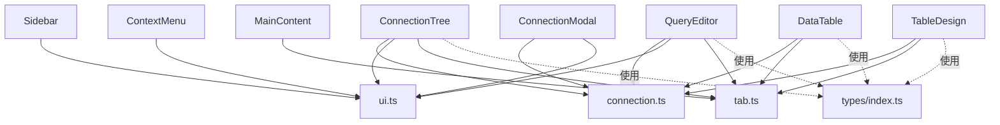

# 组件系统架构

<cite>
**本文引用的文件**
- [src/renderer/src/App.tsx](file://src/renderer/src/App.tsx)
- [src/renderer/src/main.tsx](file://src/renderer/src/main.tsx)
- [src/renderer/src/components/Sidebar.tsx](file://src/renderer/src/components/Sidebar.tsx)
- [src/renderer/src/components/MainContent.tsx](file://src/renderer/src/components/MainContent.tsx)
- [src/renderer/src/components/TabBar.tsx](file://src/renderer/src/components/TabBar.tsx)
- [src/renderer/src/components/ConnectionTree.tsx](file://src/renderer/src/components/ConnectionTree.tsx)
- [src/renderer/src/components/QueryEditor.tsx](file://src/renderer/src/components/QueryEditor.tsx)
- [src/renderer/src/components/DataTable.tsx](file://src/renderer/src/components/DataTable.tsx)
- [src/renderer/src/components/TableDesign.tsx](file://src/renderer/src/components/TableDesign.tsx)
- [src/renderer/src/components/ConnectionModal.tsx](file://src/renderer/src/components/ConnectionModal.tsx)
- [src/renderer/src/components/ContextMenu.tsx](file://src/renderer/src/components/ContextMenu.tsx)
- [src/renderer/src/stores/connection.ts](file://src/renderer/src/stores/connection.ts)
- [src/renderer/src/stores/tab.ts](file://src/renderer/src/stores/tab.ts)
- [src/renderer/src/stores/ui.ts](file://src/renderer/src/stores/ui.ts)
- [src/shared/types/index.ts](file://src/shared/types/index.ts)
</cite>

## 目录
1. [简介](#简介)
2. [项目结构](#项目结构)
3. [核心组件](#核心组件)
4. [架构总览](#架构总览)
5. [详细组件分析](#详细组件分析)
6. [依赖关系分析](#依赖关系分析)
7. [性能考量](#性能考量)
8. [故障排查指南](#故障排查指南)
9. [结论](#结论)
10. [附录](#附录)

## 简介
本文件系统性梳理了基于 React 的桌面应用组件系统架构，重点解释分层设计与职责划分（容器组件与展示组件）、核心布局组件（侧边栏、主内容区、标签栏）的架构模式、组件间通信与数据流、可复用性与扩展性设计，并给出最佳实践与性能优化建议。该系统采用 Electron + React 技术栈，使用 Zustand 状态管理，通过 IPC 与后端交互。

## 项目结构
- 渲染进程入口负责挂载根组件 App，并在 StrictMode 下渲染。
- App 作为顶层容器，组织标题栏、主布局（侧边栏 + 主内容区）、全局模态与上下文菜单。
- 组件按功能分层：容器组件负责状态与业务逻辑，展示组件专注 UI 呈现。
- 状态集中于 stores（Zustand），跨组件共享连接、标签页、UI 尺寸与上下文菜单。

图表来源
- [src/renderer/src/main.tsx:1-11](file://src/renderer/src/main.tsx#L1-L11)
- [src/renderer/src/App.tsx:1-35](file://src/renderer/src/App.tsx#L1-L35)
- [src/renderer/src/components/Sidebar.tsx:1-80](file://src/renderer/src/components/Sidebar.tsx#L1-L80)
- [src/renderer/src/components/MainContent.tsx:1-34](file://src/renderer/src/components/MainContent.tsx#L1-L34)
- [src/renderer/src/components/TabBar.tsx:1-53](file://src/renderer/src/components/TabBar.tsx#L1-L53)
- [src/renderer/src/components/ConnectionTree.tsx:1-313](file://src/renderer/src/components/ConnectionTree.tsx#L1-L313)
- [src/renderer/src/components/QueryEditor.tsx:1-329](file://src/renderer/src/components/QueryEditor.tsx#L1-L329)
- [src/renderer/src/components/DataTable.tsx:1-297](file://src/renderer/src/components/DataTable.tsx#L1-L297)
- [src/renderer/src/components/TableDesign.tsx:1-241](file://src/renderer/src/components/TableDesign.tsx#L1-L241)
- [src/renderer/src/components/ConnectionModal.tsx:1-232](file://src/renderer/src/components/ConnectionModal.tsx#L1-L232)
- [src/renderer/src/components/ContextMenu.tsx:1-79](file://src/renderer/src/components/ContextMenu.tsx#L1-L79)
- [src/renderer/src/stores/connection.ts:1-64](file://src/renderer/src/stores/connection.ts#L1-L64)
- [src/renderer/src/stores/tab.ts:1-65](file://src/renderer/src/stores/tab.ts#L1-L65)
- [src/renderer/src/stores/ui.ts:1-41](file://src/renderer/src/stores/ui.ts#L1-L41)
- [src/shared/types/index.ts:1-124](file://src/shared/types/index.ts#L1-L124)

章节来源
- [src/renderer/src/main.tsx:1-11](file://src/renderer/src/main.tsx#L1-L11)
- [src/renderer/src/App.tsx:1-35](file://src/renderer/src/App.tsx#L1-L35)

## 核心组件
- 容器组件（Container）
  - Sidebar：负责侧边栏宽度、连接树交互、拖拽调整等。
  - MainContent：根据当前激活标签动态渲染查询编辑器、数据表或表设计。
  - ConnectionTree：维护连接树展开状态、缓存节点数据、处理连接/数据库/表的上下文菜单与双击事件。
  - QueryEditor：管理 SQL 编辑、执行、结果面板尺寸拖拽、CSV 导出。
  - DataTable：分页、筛选、排序、加载表列与行数据。
  - TableDesign：加载并展示表结构、索引与基本信息。
  - ConnectionModal：连接配置的增删改查与连接测试。
  - ContextMenu：全局上下文菜单渲染与交互。
- 展示组件（Presentational）
  - TabBar：展示标签项、图标、脏点、关闭按钮。
- 状态存储（Zustand）
  - connection.ts：连接列表、状态、错误、展开集合。
  - tab.ts：标签页集合、激活标签、增删改查。
  - ui.ts：侧栏宽度、结果面板高度、连接模态、上下文菜单。

章节来源
- [src/renderer/src/components/Sidebar.tsx:1-80](file://src/renderer/src/components/Sidebar.tsx#L1-L80)
- [src/renderer/src/components/MainContent.tsx:1-34](file://src/renderer/src/components/MainContent.tsx#L1-L34)
- [src/renderer/src/components/ConnectionTree.tsx:1-313](file://src/renderer/src/components/ConnectionTree.tsx#L1-L313)
- [src/renderer/src/components/QueryEditor.tsx:1-329](file://src/renderer/src/components/QueryEditor.tsx#L1-L329)
- [src/renderer/src/components/DataTable.tsx:1-297](file://src/renderer/src/components/DataTable.tsx#L1-L297)
- [src/renderer/src/components/TableDesign.tsx:1-241](file://src/renderer/src/components/TableDesign.tsx#L1-L241)
- [src/renderer/src/components/ConnectionModal.tsx:1-232](file://src/renderer/src/components/ConnectionModal.tsx#L1-L232)
- [src/renderer/src/components/ContextMenu.tsx:1-79](file://src/renderer/src/components/ContextMenu.tsx#L1-L79)
- [src/renderer/src/stores/connection.ts:1-64](file://src/renderer/src/stores/connection.ts#L1-L64)
- [src/renderer/src/stores/tab.ts:1-65](file://src/renderer/src/stores/tab.ts#L1-L65)
- [src/renderer/src/stores/ui.ts:1-41](file://src/renderer/src/stores/ui.ts#L1-L41)

## 架构总览
系统采用“容器组件 + 展示组件 + 状态存储”的分层模式：
- 容器组件负责数据获取、状态变更与副作用（IPC、DOM 事件、缓存）。
- 展示组件仅负责 UI 呈现与用户交互回调（传入 props）。
- 状态存储集中管理跨组件共享的状态，避免深层 props 传递。
- 数据流自上而下（props 下发）、自下而上（回调更新状态）。

图表来源
- [src/renderer/src/App.tsx:1-35](file://src/renderer/src/App.tsx#L1-L35)
- [src/renderer/src/components/Sidebar.tsx:1-80](file://src/renderer/src/components/Sidebar.tsx#L1-L80)
- [src/renderer/src/components/MainContent.tsx:1-34](file://src/renderer/src/components/MainContent.tsx#L1-L34)
- [src/renderer/src/components/TabBar.tsx:1-53](file://src/renderer/src/components/TabBar.tsx#L1-L53)
- [src/renderer/src/components/ConnectionTree.tsx:1-313](file://src/renderer/src/components/ConnectionTree.tsx#L1-L313)
- [src/renderer/src/components/QueryEditor.tsx:1-329](file://src/renderer/src/components/QueryEditor.tsx#L1-L329)
- [src/renderer/src/components/DataTable.tsx:1-297](file://src/renderer/src/components/DataTable.tsx#L1-L297)
- [src/renderer/src/components/TableDesign.tsx:1-241](file://src/renderer/src/components/TableDesign.tsx#L1-L241)
- [src/renderer/src/components/ConnectionModal.tsx:1-232](file://src/renderer/src/components/ConnectionModal.tsx#L1-L232)
- [src/renderer/src/components/ContextMenu.tsx:1-79](file://src/renderer/src/components/ContextMenu.tsx#L1-L79)
- [src/renderer/src/stores/connection.ts:1-64](file://src/renderer/src/stores/connection.ts#L1-L64)
- [src/renderer/src/stores/tab.ts:1-65](file://src/renderer/src/stores/tab.ts#L1-L65)
- [src/renderer/src/stores/ui.ts:1-41](file://src/renderer/src/stores/ui.ts#L1-L41)
- [src/shared/types/index.ts:1-124](file://src/shared/types/index.ts#L1-L124)

## 详细组件分析

### 容器组件：Sidebar（侧边栏）
- 职责
  - 维护侧边栏宽度（拖拽调整）。
  - 提供“新建连接”入口，触发连接模态框。
  - 渲染连接树，承载连接管理与上下文菜单。
- 关键交互
  - 鼠标按下/移动/抬起控制列宽。
  - 全局事件监听，确保拖拽体验一致。
- 与状态存储的关系
  - 读取/设置 sidebarWidth。
  - 触发 openConnectionModal。
- 与子组件关系
  - 依赖 ConnectionTree 渲染连接树。

图表来源
- [src/renderer/src/components/Sidebar.tsx:13-41](file://src/renderer/src/components/Sidebar.tsx#L13-L41)

章节来源
- [src/renderer/src/components/Sidebar.tsx:1-80](file://src/renderer/src/components/Sidebar.tsx#L1-L80)

### 容器组件：MainContent（主内容区）
- 职责
  - 根据激活标签动态渲染不同内容页：查询编辑器、数据表、表设计。
  - 当无激活标签时，提示引导信息。
- 关键交互
  - 从 tab 存储读取 tabs/activeTabId。
  - 条件渲染对应组件。
- 与状态存储的关系
  - 依赖 tab 存储决定渲染分支。

图表来源
- [src/renderer/src/components/MainContent.tsx:8-33](file://src/renderer/src/components/MainContent.tsx#L8-L33)

章节来源
- [src/renderer/src/components/MainContent.tsx:1-34](file://src/renderer/src/components/MainContent.tsx#L1-L34)

### 容器组件：ConnectionTree（连接树）
- 职责
  - 展示连接、数据库、表的层级结构。
  - 管理连接状态（连接/断开/错误）、展开状态、节点缓存。
  - 提供上下文菜单（连接级/表级）。
- 关键交互
  - 连接/断开：调用 IPC 并更新状态。
  - 展开/折叠：切换 expandedConnections。
  - 加载数据库/表：按需请求并缓存。
  - 双击表：打开“表数据”标签。
  - 右键菜单：连接/表操作。
- 性能优化
  - 使用内存缓存 nodeCache，避免重复请求。
  - 仅在需要时加载表列表。

图表来源
- [src/renderer/src/components/ConnectionTree.tsx:100-125](file://src/renderer/src/components/ConnectionTree.tsx#L100-L125)
- [src/renderer/src/stores/tab.ts:19-34](file://src/renderer/src/stores/tab.ts#L19-L34)

章节来源
- [src/renderer/src/components/ConnectionTree.tsx:1-313](file://src/renderer/src/components/ConnectionTree.tsx#L1-L313)

### 容器组件：QueryEditor（查询编辑器）
- 职责
  - 提供 SQL 编辑、快捷键执行、结果面板控制。
  - 支持结果导出 CSV、结果面板拖拽调整高度。
- 关键交互
  - 编辑器挂载绑定 Ctrl/Cmd+Enter 执行。
  - 选择区域优先执行选中 SQL。
  - 调整结果面板高度（拖拽）。
- 与状态存储的关系
  - 读取连接配置、结果面板高度。
  - 通过 IPC 发起查询，更新结果/错误。

图表来源
- [src/renderer/src/components/QueryEditor.tsx:36-64](file://src/renderer/src/components/QueryEditor.tsx#L36-L64)
- [src/renderer/src/components/QueryEditor.tsx:108-138](file://src/renderer/src/components/QueryEditor.tsx#L108-L138)
- [src/renderer/src/stores/ui.ts:33-34](file://src/renderer/src/stores/ui.ts#L33-L34)
- [src/renderer/src/stores/connection.ts:30](file://src/renderer/src/stores/connection.ts#L30)

章节来源
- [src/renderer/src/components/QueryEditor.tsx:1-329](file://src/renderer/src/components/QueryEditor.tsx#L1-L329)

### 容器组件：DataTable（数据表格）
- 职责
  - 分页、筛选、排序、加载表列与行数据。
  - 使用 react-data-grid 呈现结果。
- 关键交互
  - 计算分页边界、构建查询 SQL（含过滤/排序/LIMIT/OFFSET）。
  - 处理 react-data-grid 的排序事件。
- 与状态存储的关系
  - 依赖连接配置与查询结果。

图表来源
- [src/renderer/src/components/DataTable.tsx:41-87](file://src/renderer/src/components/DataTable.tsx#L41-L87)
- [src/renderer/src/components/DataTable.tsx:121-145](file://src/renderer/src/components/DataTable.tsx#L121-L145)

章节来源
- [src/renderer/src/components/DataTable.tsx:1-297](file://src/renderer/src/components/DataTable.tsx#L1-L297)

### 容器组件：TableDesign（表设计）
- 职责
  - 展示表字段、索引与基本信息。
  - 通过并行请求加载列与索引。
- 关键交互
  - 三栏切换：字段/索引/信息。
  - 图标按类型分类展示。

章节来源
- [src/renderer/src/components/TableDesign.tsx:1-241](file://src/renderer/src/components/TableDesign.tsx#L1-L241)

### 展示组件：TabBar（标签栏）
- 职责
  - 展示标签项、图标、脏点、关闭按钮。
  - 点击切换激活标签，支持关闭标签。
- 关键交互
  - 根据 tab.type 显示不同图标。
  - 通过回调更新激活标签与关闭标签。

章节来源
- [src/renderer/src/components/TabBar.tsx:1-53](file://src/renderer/src/components/TabBar.tsx#L1-L53)

### 辅助容器：ConnectionModal（连接配置模态）
- 职责
  - 新建/编辑连接配置，支持连接测试。
- 关键交互
  - 表单校验、测试连接、保存并刷新连接列表。

章节来源
- [src/renderer/src/components/ConnectionModal.tsx:1-232](file://src/renderer/src/components/ConnectionModal.tsx#L1-L232)

### 辅助容器：ContextMenu（上下文菜单）
- 职责
  - 全局渲染上下文菜单，处理点击外部/ESC 关闭。
- 关键交互
  - 动态计算菜单位置，避免越界。

章节来源
- [src/renderer/src/components/ContextMenu.tsx:1-79](file://src/renderer/src/components/ContextMenu.tsx#L1-L79)

## 依赖关系分析
- 组件到存储
  - Sidebar → ui.ts（宽度、模态）
  - MainContent → tab.ts（标签）
  - ConnectionTree → connection.ts、ui.ts、tab.ts
  - QueryEditor → connection.ts、ui.ts、tab.ts
  - DataTable → connection.ts、tab.ts
  - TableDesign → connection.ts、tab.ts
  - ConnectionModal → connection.ts、ui.ts
  - ContextMenu → ui.ts
- 组件到类型
  - 各组件均引用 shared/types 中的接口（ConnectionConfig、Tab、QueryResult 等）。

图表来源
- [src/renderer/src/components/Sidebar.tsx:3-9](file://src/renderer/src/components/Sidebar.tsx#L3-L9)
- [src/renderer/src/components/MainContent.tsx:1-6](file://src/renderer/src/components/MainContent.tsx#L1-L6)
- [src/renderer/src/components/ConnectionTree.tsx:17-36](file://src/renderer/src/components/ConnectionTree.tsx#L17-L36)
- [src/renderer/src/components/QueryEditor.tsx:13-15](file://src/renderer/src/components/QueryEditor.tsx#L13-L15)
- [src/renderer/src/components/DataTable.tsx:16-17](file://src/renderer/src/components/DataTable.tsx#L16-L17)
- [src/renderer/src/components/TableDesign.tsx:3-4](file://src/renderer/src/components/TableDesign.tsx#L3-L4)
- [src/renderer/src/components/ConnectionModal.tsx:3-5](file://src/renderer/src/components/ConnectionModal.tsx#L3-L5)
- [src/renderer/src/components/ContextMenu.tsx:5-6](file://src/renderer/src/components/ContextMenu.tsx#L5-L6)
- [src/shared/types/index.ts:1-124](file://src/shared/types/index.ts#L1-L124)

章节来源
- [src/renderer/src/stores/connection.ts:1-64](file://src/renderer/src/stores/connection.ts#L1-L64)
- [src/renderer/src/stores/tab.ts:1-65](file://src/renderer/src/stores/tab.ts#L1-L65)
- [src/renderer/src/stores/ui.ts:1-41](file://src/renderer/src/stores/ui.ts#L1-L41)
- [src/shared/types/index.ts:1-124](file://src/shared/types/index.ts#L1-L124)

## 性能考量
- 状态粒度与订阅
  - 使用 Zustand 的选择器订阅（如 s => s.tabs）减少不必要重渲染。
- 计算与缓存
  - ConnectionTree 使用内存缓存 nodeCache，避免重复请求数据库/表列表。
  - DataTable 使用 useMemo 生成 gridColumns/gridRows，降低渲染成本。
- 事件与副作用
  - Sidebar/QueryEditor/ContextMenu 使用全局事件监听，注意在卸载时清理，避免内存泄漏。
- 渲染优化
  - QueryEditor/DataTable 的结果面板高度限制范围，防止极端尺寸影响布局。
- 异步与并发
  - TableDesign 对列与索引采用 Promise.all 并行加载，缩短等待时间。
- 可访问性与 UX
  - 拖拽条与键盘快捷键提升可用性；错误与加载状态明确反馈。

## 故障排查指南
- 连接问题
  - 检查 connection.ts 中 statuses/errors 是否正确更新。
  - 确认 IPC 层返回的 IpcResponse.success 字段。
- 标签页异常
  - 检查 tab.ts 的 openTab/closeTab/setActiveTab 逻辑，确认 activeTabId 与 tabs 一致性。
- 拖拽失效
  - 确保全局 mousemove/mouseup 事件在组件挂载期间注册并在卸载时移除。
- 结果面板高度异常
  - 检查 ui.ts 中 setResultPanelHeight 的范围限制是否生效。
- 上下文菜单不消失
  - 确认 ContextMenu 的点击外部/ESC 监听是否正确注册与清理。

章节来源
- [src/renderer/src/stores/connection.ts:47-51](file://src/renderer/src/stores/connection.ts#L47-L51)
- [src/renderer/src/stores/tab.ts:36-51](file://src/renderer/src/stores/tab.ts#L36-L51)
- [src/renderer/src/stores/ui.ts:33-34](file://src/renderer/src/stores/ui.ts#L33-L34)
- [src/renderer/src/components/ContextMenu.tsx:9-34](file://src/renderer/src/components/ContextMenu.tsx#L9-L34)

## 结论
该组件系统通过清晰的分层设计实现了高内聚低耦合：容器组件承担业务与状态，展示组件专注 UI，Zustand 提供简洁的状态管理，类型定义贯穿全链路保证一致性。布局组件（侧边栏、主内容区、标签栏）职责明确，配合 IPC 与缓存策略，兼顾易用性与性能。建议持续关注事件清理、状态订阅粒度与大型表格的虚拟化渲染，以进一步提升稳定性与用户体验。

## 附录
- 最佳实践
  - 保持容器组件与展示组件职责单一，尽量无副作用。
  - 使用选择器订阅最小状态片段，避免过度重渲染。
  - 对耗时操作（数据库请求）采用缓存与并发策略。
  - 为全局事件与定时器提供统一的注册/清理机制。
- 扩展性建议
  - 新增标签类型时，遵循现有 Tab 接口与 openTab 策略。
  - 新增容器组件时，优先考虑复用现有 IPC 与类型定义。
  - 对复杂交互（如拖拽、快捷键）抽象为可复用 Hook。