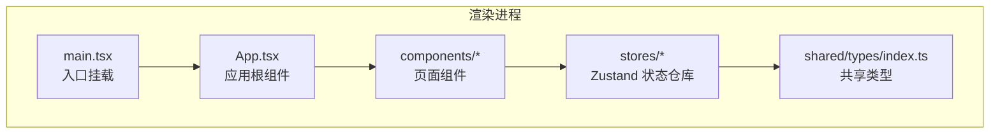
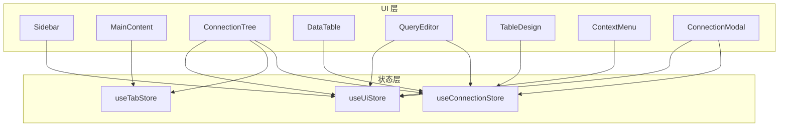
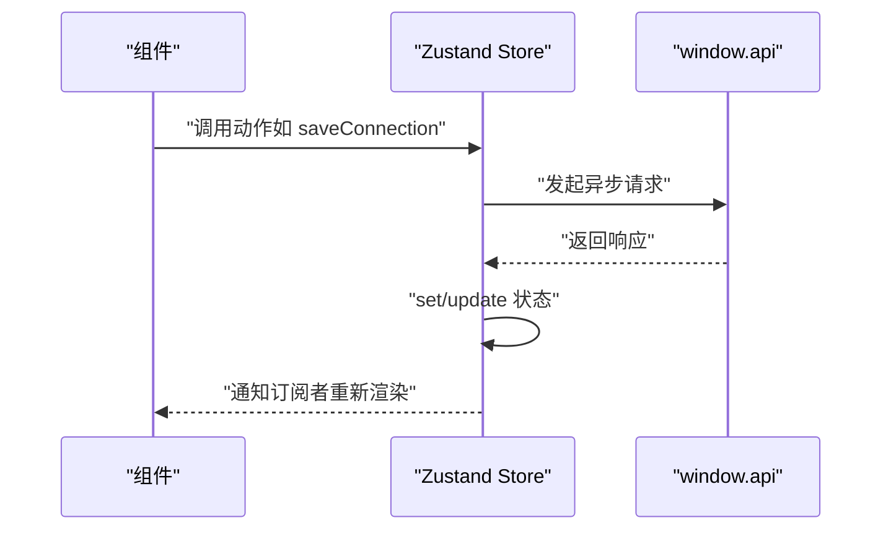
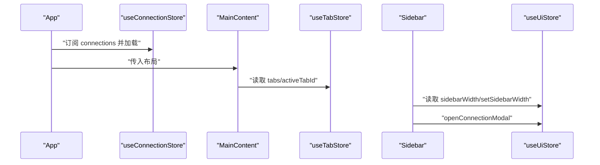
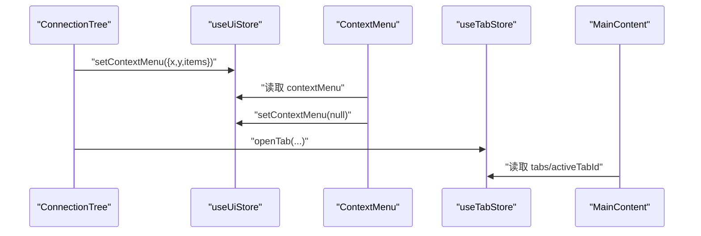
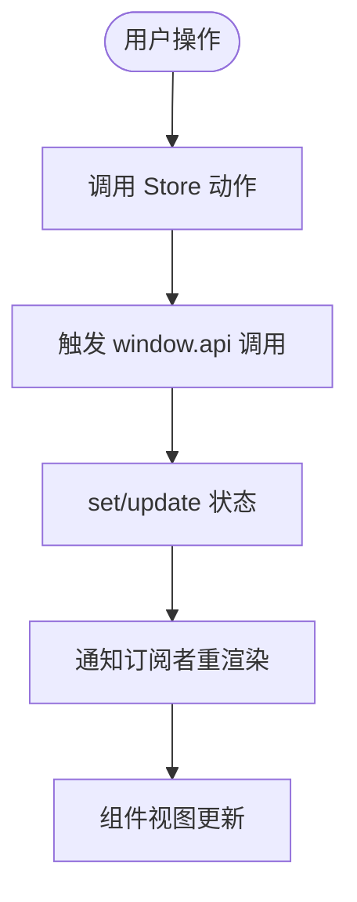
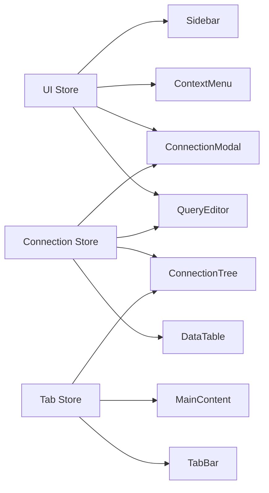

# 组件通信机制

<cite>
**本文引用的文件**
- [src/renderer/src/App.tsx](file://src/renderer/src/App.tsx)
- [src/renderer/src/main.tsx](file://src/renderer/src/main.tsx)
- [src/renderer/src/stores/connection.ts](file://src/renderer/src/stores/connection.ts)
- [src/renderer/src/stores/tab.ts](file://src/renderer/src/stores/tab.ts)
- [src/renderer/src/stores/ui.ts](file://src/renderer/src/stores/ui.ts)
- [src/renderer/src/components/Sidebar.tsx](file://src/renderer/src/components/Sidebar.tsx)
- [src/renderer/src/components/MainContent.tsx](file://src/renderer/src/components/MainContent.tsx)
- [src/renderer/src/components/ConnectionTree.tsx](file://src/renderer/src/components/ConnectionTree.tsx)
- [src/renderer/src/components/DataTable.tsx](file://src/renderer/src/components/DataTable.tsx)
- [src/renderer/src/components/QueryEditor.tsx](file://src/renderer/src/components/QueryEditor.tsx)
- [src/renderer/src/components/TableDesign.tsx](file://src/renderer/src/components/TableDesign.tsx)
- [src/renderer/src/components/ContextMenu.tsx](file://src/renderer/src/components/ContextMenu.tsx)
- [src/renderer/src/components/ConnectionModal.tsx](file://src/renderer/src/components/ConnectionModal.tsx)
- [src/shared/types/index.ts](file://src/shared/types/index.ts)
</cite>

## 目录
1. [简介](#简介)
2. [项目结构](#项目结构)
3. [核心组件](#核心组件)
4. [架构总览](#架构总览)
5. [详细组件分析](#详细组件分析)
6. [依赖关系分析](#依赖关系分析)
7. [性能考量](#性能考量)
8. [故障排查指南](#故障排查指南)
9. [结论](#结论)
10. [附录](#附录)

## 简介
本文件围绕组件系统的通信机制展开，重点解释以下方面：
- 组件间的数据传递、事件传播与状态同步
- Zustand 状态管理在组件通信中的角色与实现方式
- 父子组件、兄弟组件与跨层级通信的解决方案
- 组件解耦与通信优化的最佳实践

该应用采用 Electron + React 技术栈，渲染进程使用 Zustand 管理全局状态，通过 Store Hook 将状态与 UI 解耦，实现高效、可维护的组件通信。

## 项目结构
渲染层采用按功能模块组织的目录结构，核心包括：
- stores：Zustand 状态仓库（连接、标签页、UI）
- components：页面级组件（侧边栏、主内容区、上下文菜单等）
- shared/types：共享类型定义
- App.tsx/main.tsx：应用入口与根组件

图表来源
- [src/renderer/src/App.tsx:1-35](file://src/renderer/src/App.tsx#L1-L35)
- [src/renderer/src/main.tsx:1-11](file://src/renderer/src/main.tsx#L1-L11)
- [src/renderer/src/stores/connection.ts:1-64](file://src/renderer/src/stores/connection.ts#L1-L64)
- [src/renderer/src/stores/tab.ts:1-65](file://src/renderer/src/stores/tab.ts#L1-L65)
- [src/renderer/src/stores/ui.ts:1-41](file://src/renderer/src/stores/ui.ts#L1-L41)
- [src/shared/types/index.ts:1-124](file://src/shared/types/index.ts#L1-L124)

章节来源
- [src/renderer/src/App.tsx:1-35](file://src/renderer/src/App.tsx#L1-L35)
- [src/renderer/src/main.tsx:1-11](file://src/renderer/src/main.tsx#L1-L11)

## 核心组件
- Zustand 状态仓库
  - 连接状态仓库：管理连接配置、连接状态、错误信息、展开节点集合，并提供加载、保存、删除、状态更新、展开切换等动作
  - 标签页状态仓库：管理标签页集合、当前激活标签、打开/关闭/切换/更新标签页等
  - UI 状态仓库：管理侧边栏宽度、结果面板高度、连接弹窗开关、上下文菜单等
- 页面组件
  - Sidebar：侧边栏容器，负责拖拽调整宽度、打开连接弹窗
  - MainContent：主内容区，根据当前激活标签动态渲染查询编辑器、数据表、表设计
  - ConnectionTree：连接树，负责连接/数据库/表的展开/折叠、右键上下文菜单、双击打开标签页
  - DataTable：数据表展示，负责列信息、分页、筛选、排序、错误处理
  - QueryEditor：SQL 编辑器，负责执行查询、结果展示与导出、结果面板高度拖拽
  - TableDesign：表结构查看，负责字段与索引信息展示
  - ContextMenu：全局上下文菜单，负责菜单定位、点击外部关闭、Esc 关闭
  - ConnectionModal：连接配置弹窗，负责测试连接、保存连接、编辑连接

章节来源
- [src/renderer/src/stores/connection.ts:1-64](file://src/renderer/src/stores/connection.ts#L1-L64)
- [src/renderer/src/stores/tab.ts:1-65](file://src/renderer/src/stores/tab.ts#L1-L65)
- [src/renderer/src/stores/ui.ts:1-41](file://src/renderer/src/stores/ui.ts#L1-L41)
- [src/renderer/src/components/Sidebar.tsx:1-80](file://src/renderer/src/components/Sidebar.tsx#L1-L80)
- [src/renderer/src/components/MainContent.tsx:1-34](file://src/renderer/src/components/MainContent.tsx#L1-L34)
- [src/renderer/src/components/ConnectionTree.tsx:1-313](file://src/renderer/src/components/ConnectionTree.tsx#L1-L313)
- [src/renderer/src/components/DataTable.tsx:1-297](file://src/renderer/src/components/DataTable.tsx#L1-L297)
- [src/renderer/src/components/QueryEditor.tsx:1-329](file://src/renderer/src/components/QueryEditor.tsx#L1-L329)
- [src/renderer/src/components/TableDesign.tsx:1-241](file://src/renderer/src/components/TableDesign.tsx#L1-L241)
- [src/renderer/src/components/ContextMenu.tsx:1-79](file://src/renderer/src/components/ContextMenu.tsx#L1-L79)
- [src/renderer/src/components/ConnectionModal.tsx:1-231](file://src/renderer/src/components/ConnectionModal.tsx#L1-L231)

## 架构总览
应用采用“状态驱动视图”的架构模式：
- 渲染进程通过 Zustand Store 提供统一的状态源
- 组件通过订阅 Store 的部分状态进行局部更新
- 通过 Store 动作完成跨组件的状态同步与副作用调用（如调用 window.api）

图表来源
- [src/renderer/src/stores/connection.ts:1-64](file://src/renderer/src/stores/connection.ts#L1-L64)
- [src/renderer/src/stores/tab.ts:1-65](file://src/renderer/src/stores/tab.ts#L1-L65)
- [src/renderer/src/stores/ui.ts:1-41](file://src/renderer/src/stores/ui.ts#L1-L41)
- [src/renderer/src/components/Sidebar.tsx:1-80](file://src/renderer/src/components/Sidebar.tsx#L1-L80)
- [src/renderer/src/components/MainContent.tsx:1-34](file://src/renderer/src/components/MainContent.tsx#L1-L34)
- [src/renderer/src/components/ConnectionTree.tsx:1-313](file://src/renderer/src/components/ConnectionTree.tsx#L1-L313)
- [src/renderer/src/components/DataTable.tsx:1-297](file://src/renderer/src/components/DataTable.tsx#L1-L297)
- [src/renderer/src/components/QueryEditor.tsx:1-329](file://src/renderer/src/components/QueryEditor.tsx#L1-L329)
- [src/renderer/src/components/TableDesign.tsx:1-241](file://src/renderer/src/components/TableDesign.tsx#L1-L241)
- [src/renderer/src/components/ContextMenu.tsx:1-79](file://src/renderer/src/components/ContextMenu.tsx#L1-L79)
- [src/renderer/src/components/ConnectionModal.tsx:1-231](file://src/renderer/src/components/ConnectionModal.tsx#L1-L231)

## 详细组件分析

### Zustand 状态管理与通信模型
- 设计要点
  - 使用 create 创建独立 Store，每个 Store 聚焦单一职责域（连接、标签页、UI）
  - 通过选择器订阅部分状态，减少不必要重渲染
  - 动作函数内可组合异步操作（如调用 window.api），并在完成后触发状态更新
- 数据流
  - 组件读取状态：const connections = useConnectionStore(s => s.connections)
  - 组件写入状态：await saveConnection(config) 触发 set/update
  - 异步副作用：动作内部调用 window.api.* 完成外部交互后回写状态

图表来源
- [src/renderer/src/stores/connection.ts:28-31](file://src/renderer/src/stores/connection.ts#L28-L31)
- [src/renderer/src/stores/tab.ts:19-34](file://src/renderer/src/stores/tab.ts#L19-L34)
- [src/renderer/src/stores/ui.ts:35-39](file://src/renderer/src/stores/ui.ts#L35-L39)

章节来源
- [src/renderer/src/stores/connection.ts:1-64](file://src/renderer/src/stores/connection.ts#L1-L64)
- [src/renderer/src/stores/tab.ts:1-65](file://src/renderer/src/stores/tab.ts#L1-L65)
- [src/renderer/src/stores/ui.ts:1-41](file://src/renderer/src/stores/ui.ts#L1-L41)

### 父子组件通信
- 父组件 App
  - 通过 useConnectionStore 订阅连接列表并初始化加载
  - 作为根组件承载全局 UI 结构（标题栏、侧边栏、主内容区、弹窗、上下文菜单）
- 子组件 MainContent
  - 读取 useTabStore 获取 tabs/activeTabId 并根据类型渲染 QueryEditor/DataTable/TableDesign
- 子组件 Sidebar
  - 读取 useUiStore 控制侧边栏宽度；通过动作打开连接弹窗

图表来源
- [src/renderer/src/App.tsx:8-13](file://src/renderer/src/App.tsx#L8-L13)
- [src/renderer/src/components/MainContent.tsx:8-21](file://src/renderer/src/components/MainContent.tsx#L8-L21)
- [src/renderer/src/components/Sidebar.tsx:6-29](file://src/renderer/src/components/Sidebar.tsx#L6-L29)
- [src/renderer/src/stores/tab.ts:15-20](file://src/renderer/src/stores/tab.ts#L15-L20)
- [src/renderer/src/stores/ui.ts:26-40](file://src/renderer/src/stores/ui.ts#L26-L40)

章节来源
- [src/renderer/src/App.tsx:1-35](file://src/renderer/src/App.tsx#L1-L35)
- [src/renderer/src/components/MainContent.tsx:1-34](file://src/renderer/src/components/MainContent.tsx#L1-L34)
- [src/renderer/src/components/Sidebar.tsx:1-80](file://src/renderer/src/components/Sidebar.tsx#L1-L80)

### 兄弟组件通信
- ConnectionTree 与 ContextMenu
  - ConnectionTree 通过 useUiStore.setContextMenu 打开上下文菜单
  - ContextMenu 读取 useUiStore.contextMenu 并在点击外部或 Esc 时关闭
- ConnectionTree 与 TabBar/DataTable/QueryEditor
  - ConnectionTree 通过 useTabStore.openTab 在双击表或右键新建查询时创建新标签
  - MainContent 根据 activeTabId 渲染对应内容

图表来源
- [src/renderer/src/components/ConnectionTree.tsx:127-157](file://src/renderer/src/components/ConnectionTree.tsx#L127-L157)
- [src/renderer/src/components/ContextMenu.tsx:4-34](file://src/renderer/src/components/ContextMenu.tsx#L4-L34)
- [src/renderer/src/components/TabBar.tsx:5-11](file://src/renderer/src/components/TabBar.tsx#L5-L11)
- [src/renderer/src/components/MainContent.tsx:8-21](file://src/renderer/src/components/MainContent.tsx#L8-L21)

章节来源
- [src/renderer/src/components/ConnectionTree.tsx:1-313](file://src/renderer/src/components/ConnectionTree.tsx#L1-L313)
- [src/renderer/src/components/ContextMenu.tsx:1-79](file://src/renderer/src/components/ContextMenu.tsx#L1-L79)
- [src/renderer/src/components/TabBar.tsx:1-53](file://src/renderer/src/components/TabBar.tsx#L1-L53)
- [src/renderer/src/components/MainContent.tsx:1-34](file://src/renderer/src/components/MainContent.tsx#L1-L34)

### 跨层级通信
- 通过 Store 作为中介实现跨层级通信
  - ConnectionTree 与 DataTable/QueryEditor/ConnectionModal/UI 状态仓库之间无直接依赖，仅通过 Store 协同
  - UI 状态（如侧边栏宽度、结果面板高度、连接弹窗）由 useUiStore 统一管理，被多个组件读取/修改
- 示例流程：连接测试 -> 更新连接列表 -> 影响连接树与标签页

图表来源
- [src/renderer/src/stores/connection.ts:23-45](file://src/renderer/src/stores/connection.ts#L23-L45)
- [src/renderer/src/stores/ui.ts:33-39](file://src/renderer/src/stores/ui.ts#L33-L39)

章节来源
- [src/renderer/src/stores/connection.ts:1-64](file://src/renderer/src/stores/connection.ts#L1-L64)
- [src/renderer/src/stores/ui.ts:1-41](file://src/renderer/src/stores/ui.ts#L1-L41)

### 组件解耦与通信优化最佳实践
- 选择器订阅
  - 仅订阅需要的状态片段，避免无关状态变化导致的重渲染
  - 例如：Sidebar 仅订阅 sidebarWidth，ConnectionTree 仅订阅 connections/statuses
- 动作封装
  - 将异步副作用封装在 Store 动作中，保证状态更新原子性
- 事件与状态分离
  - 右键菜单等 UI 事件通过 UI Store 管理，避免在业务逻辑中混入 DOM 事件
- 缓存与懒加载
  - ConnectionTree 对节点数据进行缓存，减少重复请求
- 类型安全
  - 通过 shared/types 统一类型定义，确保跨组件数据结构一致

章节来源
- [src/renderer/src/components/Sidebar.tsx:6-29](file://src/renderer/src/components/Sidebar.tsx#L6-L29)
- [src/renderer/src/components/ConnectionTree.tsx:22-29](file://src/renderer/src/components/ConnectionTree.tsx#L22-L29)
- [src/shared/types/index.ts:1-124](file://src/shared/types/index.ts#L1-L124)

## 依赖关系分析
- 组件到 Store 的依赖
  - Sidebar/ContextMenu/ConnectionModal/QueryEditor/DataTable/TableDesign 均依赖 UI Store
  - ConnectionTree/DataTable/QueryEditor/ConnectionModal 依赖连接 Store
  - MainContent/TabBar/ConnectionTree 依赖标签页 Store
- Store 之间的弱耦合
  - 各 Store 独立维护自身状态，通过动作协调行为，避免相互直接依赖

图表来源
- [src/renderer/src/stores/ui.ts:1-41](file://src/renderer/src/stores/ui.ts#L1-L41)
- [src/renderer/src/stores/connection.ts:1-64](file://src/renderer/src/stores/connection.ts#L1-L64)
- [src/renderer/src/stores/tab.ts:1-65](file://src/renderer/src/stores/tab.ts#L1-L65)
- [src/renderer/src/components/Sidebar.tsx:1-80](file://src/renderer/src/components/Sidebar.tsx#L1-L80)
- [src/renderer/src/components/ConnectionTree.tsx:1-313](file://src/renderer/src/components/ConnectionTree.tsx#L1-L313)
- [src/renderer/src/components/DataTable.tsx:1-297](file://src/renderer/src/components/DataTable.tsx#L1-L297)
- [src/renderer/src/components/QueryEditor.tsx:1-329](file://src/renderer/src/components/QueryEditor.tsx#L1-L329)
- [src/renderer/src/components/TableDesign.tsx:1-241](file://src/renderer/src/components/TableDesign.tsx#L1-L241)
- [src/renderer/src/components/ContextMenu.tsx:1-79](file://src/renderer/src/components/ContextMenu.tsx#L1-L79)
- [src/renderer/src/components/ConnectionModal.tsx:1-231](file://src/renderer/src/components/ConnectionModal.tsx#L1-L231)
- [src/renderer/src/components/MainContent.tsx:1-34](file://src/renderer/src/components/MainContent.tsx#L1-L34)
- [src/renderer/src/components/TabBar.tsx:1-53](file://src/renderer/src/components/TabBar.tsx#L1-L53)

章节来源
- [src/renderer/src/stores/ui.ts:1-41](file://src/renderer/src/stores/ui.ts#L1-L41)
- [src/renderer/src/stores/connection.ts:1-64](file://src/renderer/src/stores/connection.ts#L1-L64)
- [src/renderer/src/stores/tab.ts:1-65](file://src/renderer/src/stores/tab.ts#L1-L65)

## 性能考量
- 渲染优化
  - 使用选择器订阅最小状态集，降低重渲染频率
  - 使用 useMemo/memo 优化复杂计算与列表渲染（如 DataTable 的列/行计算）
- 请求优化
  - ConnectionTree 使用内存缓存节点数据，避免重复拉取
  - 并行请求（如同时获取列与索引）提升加载速度
- 交互体验
  - 拖拽调整宽度/高度时限制范围，避免极端尺寸影响可用性
  - 分页与筛选减少一次性渲染大量数据的压力

章节来源
- [src/renderer/src/components/DataTable.tsx:89-119](file://src/renderer/src/components/DataTable.tsx#L89-L119)
- [src/renderer/src/components/ConnectionTree.tsx:22-29](file://src/renderer/src/components/ConnectionTree.tsx#L22-L29)
- [src/renderer/src/components/QueryEditor.tsx:108-138](file://src/renderer/src/components/QueryEditor.tsx#L108-L138)

## 故障排查指南
- 连接状态异常
  - 现象：连接状态未更新或错误未显示
  - 排查：确认 setStatus 动作是否正确调用；检查 window.api 返回值
- 标签页无法关闭或切换
  - 现象：关闭标签后焦点未切换或 activeTabId 不变
  - 排查：确认 closeTab 动作的索引计算逻辑；确保 activeTabId 更新分支覆盖所有场景
- 上下文菜单不消失
  - 现象：点击外部或 Esc 后菜单仍显示
  - 排查：确认 ContextMenu 是否正确注册 mousedown/keydown 监听；避免事件冒泡导致立即关闭
- 结果面板高度异常
  - 现象：拖拽后高度超出可视区域
  - 排查：确认边界检测逻辑与窗口尺寸计算

章节来源
- [src/renderer/src/stores/connection.ts:47-51](file://src/renderer/src/stores/connection.ts#L47-L51)
- [src/renderer/src/stores/tab.ts:36-51](file://src/renderer/src/stores/tab.ts#L36-L51)
- [src/renderer/src/components/ContextMenu.tsx:9-34](file://src/renderer/src/components/ContextMenu.tsx#L9-L34)
- [src/renderer/src/components/QueryEditor.tsx:108-138](file://src/renderer/src/components/QueryEditor.tsx#L108-L138)

## 结论
本应用通过 Zustand 实现了清晰、可维护的组件通信机制：
- 以 Store 为中心的状态管理模式，使组件间通信解耦且可追踪
- 通过动作封装异步副作用，保证状态一致性
- 通过类型系统与选择器订阅，兼顾性能与可维护性
- 针对不同通信场景（父子、兄弟、跨层级）提供了明确的实现路径与优化策略

## 附录
- 共享类型定义
  - 连接配置、连接状态、数据库/表/列信息、查询结果、Tab 类型、IPC 响应等
- 开发建议
  - 新增组件时优先考虑是否需要引入新的 Store 或复用现有 Store
  - 对于高频交互（拖拽、滚动、输入）使用节流/防抖与选择器优化
  - 对于复杂 UI 交互（右键菜单、弹窗）集中通过 UI Store 管理，保持组件简洁

章节来源
- [src/shared/types/index.ts:1-124](file://src/shared/types/index.ts#L1-L124)