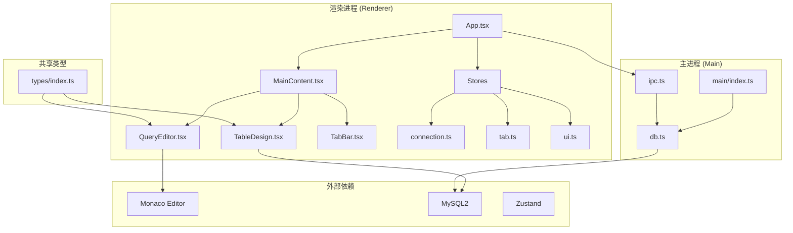
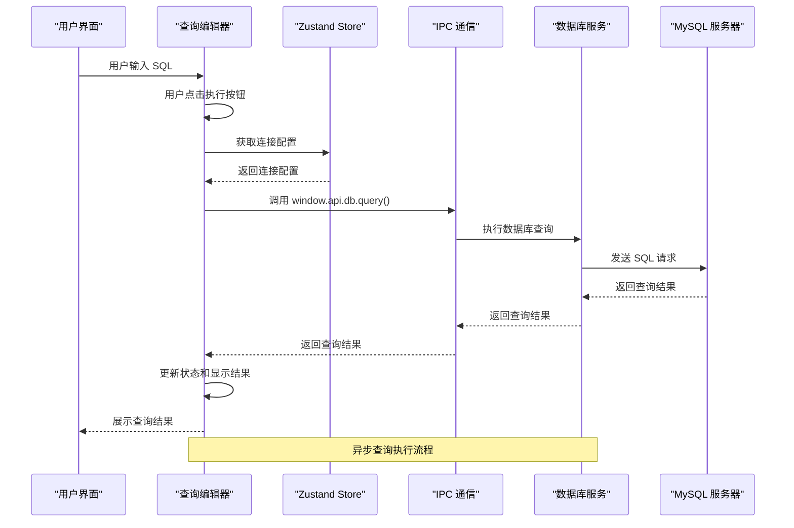
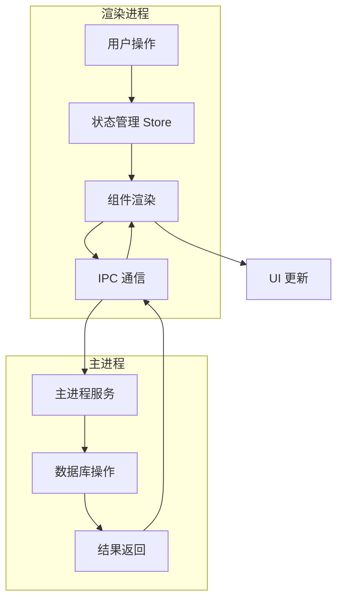
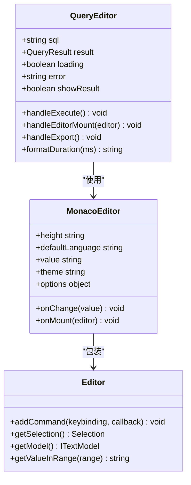
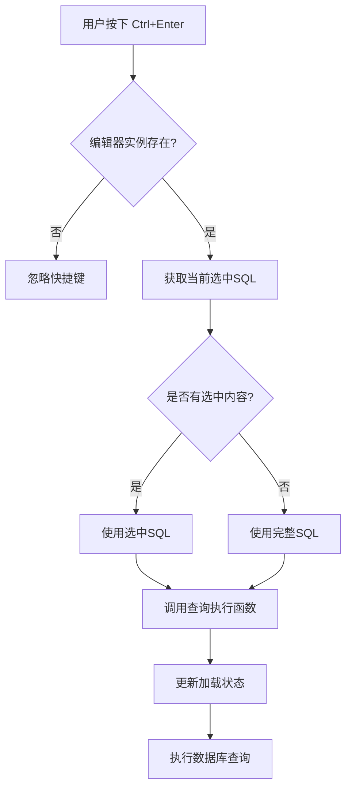
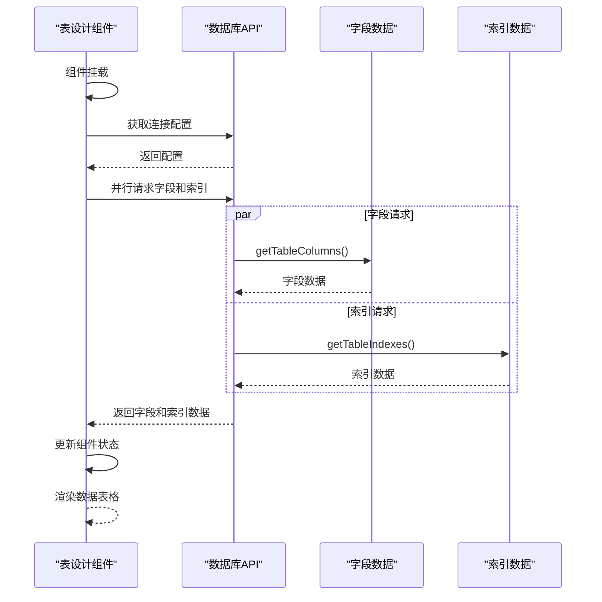
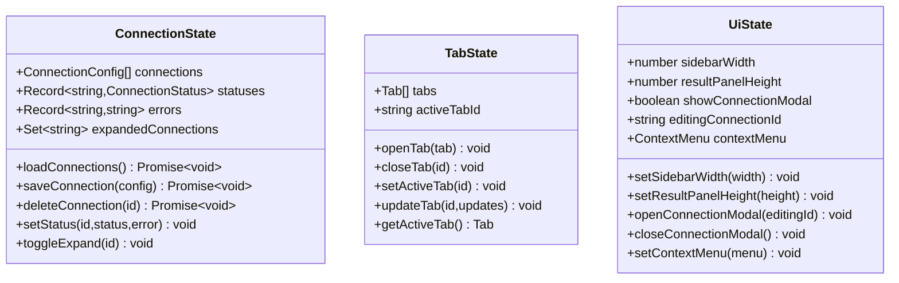

# 编辑器组件

<cite>
**本文档引用的文件**
- [QueryEditor.tsx](file://src/renderer/src/components/QueryEditor.tsx)
- [TableDesign.tsx](file://src/renderer/src/components/TableDesign.tsx)
- [db.ts](file://src/main/services/db.ts)
- [index.ts](file://src/main/index.ts)
- [ipc.ts](file://src/main/ipc.ts)
- [types/index.ts](file://src/shared/types/index.ts)
- [connection.ts](file://src/renderer/src/stores/connection.ts)
- [tab.ts](file://src/renderer/src/stores/tab.ts)
- [ui.ts](file://src/renderer/src/stores/ui.ts)
- [App.tsx](file://src/renderer/src/App.tsx)
- [MainContent.tsx](file://src/renderer/src/components/MainContent.tsx)
- [TabBar.tsx](file://src/renderer/src/components/TabBar.tsx)
- [index.css](file://src/renderer/src/index.css)
- [package.json](file://package.json)
</cite>

## 目录
1. [简介](#简介)
2. [项目结构](#项目结构)
3. [核心组件](#核心组件)
4. [架构概览](#架构概览)
5. [详细组件分析](#详细组件分析)
6. [依赖关系分析](#依赖关系分析)
7. [性能考虑](#性能考虑)
8. [故障排除指南](#故障排除指南)
9. [结论](#结论)

## 简介

nexSql 是一个现代化的数据库管理工具，专注于提供高效的 SQL 编辑体验和直观的表设计功能。本项目采用 Electron + React 架构，集成了 Monaco Editor 提供专业的代码编辑能力，并通过 MySQL 连接池实现高性能的数据访问。

系统的核心特色包括：
- 基于 Monaco Editor 的专业 SQL 编辑器
- 实时查询执行和结果展示
- 可拖拽的结果面板布局
- 完整的表结构设计和管理功能
- 响应式 UI 设计和深色主题支持

## 项目结构

项目采用清晰的分层架构，主要分为渲染进程（renderer）和主进程（main）两个部分：



**图表来源**
- [App.tsx:1-35](file://src/renderer/src/App.tsx#L1-L35)
- [MainContent.tsx:1-34](file://src/renderer/src/components/MainContent.tsx#L1-L34)
- [QueryEditor.tsx:1-329](file://src/renderer/src/components/QueryEditor.tsx#L1-L329)
- [TableDesign.tsx:1-241](file://src/renderer/src/components/TableDesign.tsx#L1-L241)

**章节来源**
- [package.json:1-42](file://package.json#L1-L42)
- [App.tsx:1-35](file://src/renderer/src/App.tsx#L1-L35)

## 核心组件

### 查询编辑器组件 (QueryEditor)

查询编辑器是系统的核心交互组件，提供了完整的 SQL 编写、执行和结果显示功能。该组件集成了 Monaco Editor，支持语法高亮、智能补全和多种编辑特性。

#### 主要功能特性

- **SQL 编辑功能**：基于 Monaco Editor 的专业 SQL 编辑体验
- **实时查询执行**：支持 Ctrl+Enter 快捷键执行选中或全部 SQL
- **结果面板管理**：可拖拽调整结果面板高度，支持 CSV 导出
- **错误处理**：完善的错误捕获和用户友好的错误提示
- **性能监控**：显示查询执行时间和受影响行数

#### 技术实现要点

组件使用 React Hooks 实现状态管理，包括：
- `useState` 管理 SQL 文本、查询结果、加载状态等
- `useCallback` 优化函数性能，避免不必要的重渲染
- `useEffect` 处理鼠标事件监听器的添加和清理
- `useRef` 存储 Monaco Editor 实例引用

**章节来源**
- [QueryEditor.tsx:1-329](file://src/renderer/src/components/QueryEditor.tsx#L1-L329)

### 表设计组件 (TableDesign)

表设计组件提供了数据库表结构的可视化管理界面，支持字段列表查看、索引信息展示和表基本信息汇总。

#### 核心功能

- **字段管理**：显示表的所有字段及其属性（名称、类型、是否为空、默认值等）
- **索引查看**：展示表的索引信息，包括唯一性、类型等
- **表信息汇总**：显示数据库名、表名、字段数、索引数等基本信息
- **响应式布局**：支持不同屏幕尺寸下的良好显示效果

#### 数据结构设计

组件使用 `ColumnInfo` 和 `IndexInfo` 类型来描述表结构信息，这些类型在共享类型模块中定义，确保前后端数据一致性。

**章节来源**
- [TableDesign.tsx:1-241](file://src/renderer/src/components/TableDesign.tsx#L1-L241)
- [types/index.ts:49-70](file://src/shared/types/index.ts#L49-L70)

## 架构概览

系统采用客户端-服务器架构，通过 Electron 的 IPC 机制实现渲染进程与主进程的通信。



**图表来源**
- [QueryEditor.tsx:36-64](file://src/renderer/src/components/QueryEditor.tsx#L36-L64)
- [db.ts:73-135](file://src/main/services/db.ts#L73-L135)

### 数据流架构



**图表来源**
- [tab.ts:15-64](file://src/renderer/src/stores/tab.ts#L15-L64)
- [connection.ts:17-63](file://src/renderer/src/stores/connection.ts#L17-L63)

## 详细组件分析

### Monaco Editor 集成分析

#### 集成方式

查询编辑器通过 `@monaco-editor/react` 包集成 Monaco Editor，该包提供了 React 组件封装，简化了集成过程。



**图表来源**
- [QueryEditor.tsx:171-194](file://src/renderer/src/components/QueryEditor.tsx#L171-L194)
- [QueryEditor.tsx:66-74](file://src/renderer/src/components/QueryEditor.tsx#L66-L74)

#### 语法高亮配置

Monaco Editor 使用内置的 SQL 语言支持，通过以下配置实现最佳的编辑体验：

- **主题设置**：使用 `vs-dark` 深色主题，适配应用的整体视觉风格
- **字体配置**：采用 JetBrains Mono 等等宽字体，提升代码可读性
- **编辑器选项**：启用行号、代码折叠、智能缩进等功能
- **性能优化**：禁用小地图，启用自动布局适应窗口变化

#### 自定义快捷键

组件实现了自定义快捷键绑定，特别是 Ctrl+Enter/Cmd+Enter 组合键用于执行查询：



**图表来源**
- [QueryEditor.tsx:36-64](file://src/renderer/src/components/QueryEditor.tsx#L36-L64)

**章节来源**
- [QueryEditor.tsx:171-194](file://src/renderer/src/components/QueryEditor.tsx#L171-L194)
- [QueryEditor.tsx:66-74](file://src/renderer/src/components/QueryEditor.tsx#L66-L74)

### 表设计组件技术实现

#### 数据绑定机制

表设计组件通过异步数据加载实现数据绑定，使用 `Promise.all` 并行获取字段和索引信息：



**图表来源**
- [TableDesign.tsx:20-42](file://src/renderer/src/components/TableDesign.tsx#L20-L42)

#### 字段管理功能

组件实现了完整的字段信息展示功能，包括：

- **字段图标分类**：根据数据类型自动分配图标（数字、文本、日期、布尔等）
- **主键标识**：突出显示主键字段
- **类型显示**：格式化显示字段类型信息
- **约束信息**：显示是否允许为空、默认值等约束条件

#### 变更追踪机制

虽然当前版本主要提供只读功能，但组件设计考虑了未来扩展的可能性：

- **状态管理**：使用 React 状态管理字段和索引数据
- **错误处理**：统一的错误捕获和用户提示机制
- **加载状态**：清晰的加载指示和空状态处理

**章节来源**
- [TableDesign.tsx:14-46](file://src/renderer/src/components/TableDesign.tsx#L14-L46)
- [TableDesign.tsx:112-164](file://src/renderer/src/components/TableDesign.tsx#L112-L164)

### 状态管理系统

系统采用 Zustand 作为轻量级状态管理解决方案，提供了跨组件的状态共享能力。

#### 连接状态管理



**图表来源**
- [connection.ts:4-15](file://src/renderer/src/stores/connection.ts#L4-L15)
- [tab.ts:4-13](file://src/renderer/src/stores/tab.ts#L4-L13)
- [ui.ts:3-15](file://src/renderer/src/stores/ui.ts#L3-L15)

**章节来源**
- [connection.ts:17-63](file://src/renderer/src/stores/connection.ts#L17-L63)
- [tab.ts:15-64](file://src/renderer/src/stores/tab.ts#L15-L64)
- [ui.ts:26-40](file://src/renderer/src/stores/ui.ts#L26-L40)

## 依赖关系分析

系统的主要依赖关系如下：

```mermaid
graph TB
subgraph "前端依赖"
A[React 18.2.0]
B[@monaco-editor/react 4.6.0]
C[monaco-editor 0.46.0]
D[zustand 4.5.2]
E[lucide-react 0.344.0]
F[mysql2 3.9.2]
end
subgraph "构建工具"
G[Electron 29.1.5]
H[electron-vite 2.0.0]
I[TailwindCSS 3.4.1]
J[TypeScript 5.3.3]
end
subgraph "应用组件"
K[QueryEditor]
L[TableDesign]
M[MainContent]
N[TabBar]
end
A --> K
A --> L
A --> M
A --> N
B --> K
C --> B
D --> K
D --> L
D --> M
D --> N
F --> K
F --> L
```

**图表来源**
- [package.json:16-26](file://package.json#L16-L26)
- [package.json:27-40](file://package.json#L27-L40)

### 外部接口依赖

系统通过 Electron 的 IPC 机制与主进程通信，主要接口包括：

- `window.api.db.query()` - 执行 SQL 查询
- `window.api.db.getTableColumns()` - 获取表字段信息
- `window.api.db.getTableIndexes()` - 获取表索引信息
- `window.api.config.getConnections()` - 获取连接配置

**章节来源**
- [QueryEditor.tsx:55](file://src/renderer/src/components/QueryEditor.tsx#L55)
- [TableDesign.tsx:27](file://src/renderer/src/components/TableDesign.tsx#L27)
- [TableDesign.tsx:28](file://src/renderer/src/components/TableDesign.tsx#L28)

## 性能考虑

### 编辑器性能优化

1. **懒加载配置**：Monaco Editor 仅在需要时加载，减少初始启动时间
2. **内存管理**：正确清理鼠标事件监听器，防止内存泄漏
3. **渲染优化**：使用 useCallback 优化函数引用，减少不必要的重新渲染
4. **滚动性能**：启用平滑滚动和适当的滚动边界设置

### 数据库连接优化

1. **连接池管理**：使用 MySQL 连接池，限制最大连接数为 5
2. **连接复用**：通过连接 ID 复用现有连接，避免重复建立连接
3. **超时控制**：设置合理的连接超时时间（默认 10 秒）
4. **资源清理**：查询完成后及时释放数据库连接

### UI 性能优化

1. **虚拟滚动**：对于大量数据的表格，考虑实现虚拟滚动
2. **防抖处理**：对频繁触发的操作（如搜索、过滤）添加防抖
3. **增量更新**：只更新发生变化的部分 DOM 元素
4. **CSS 优化**：使用 TailwindCSS 的原子化类，减少 CSS 文件大小

## 故障排除指南

### 常见问题及解决方案

#### 编辑器无法加载

**症状**：编辑器显示加载状态但无法正常显示

**可能原因**：
- Monaco Editor 依赖未正确安装
- 网络问题导致资源加载失败
- 浏览器兼容性问题

**解决方法**：
1. 检查网络连接和代理设置
2. 清除浏览器缓存
3. 确认 Electron 版本兼容性

#### 查询执行失败

**症状**：执行 SQL 时出现错误提示

**可能原因**：
- 数据库连接配置错误
- SQL 语法错误
- 权限不足

**解决方法**：
1. 验证数据库连接参数
2. 检查 SQL 语法和权限
3. 查看详细的错误信息

#### 性能问题

**症状**：应用运行缓慢或内存占用过高

**可能原因**：
- 连接池配置不当
- 大量数据未分页
- 事件监听器未正确清理

**解决方法**：
1. 调整连接池大小
2. 实现数据分页加载
3. 检查组件生命周期钩子

**章节来源**
- [QueryEditor.tsx:219-224](file://src/renderer/src/components/QueryEditor.tsx#L219-L224)
- [TableDesign.tsx:74-81](file://src/renderer/src/components/TableDesign.tsx#L74-L81)

## 结论

nexSql 的编辑器组件系统展现了现代数据库管理工具的设计理念，通过精心设计的架构和丰富的功能特性，为用户提供了高效、直观的数据库操作体验。

### 主要优势

1. **专业编辑体验**：基于 Monaco Editor 的专业 SQL 编辑功能
2. **响应式设计**：良好的移动端和桌面端适配
3. **性能优化**：合理的状态管理和资源控制
4. **扩展性强**：模块化的架构便于功能扩展

### 改进建议

1. **增强自动补全**：集成数据库元数据的智能补全功能
2. **语法验证**：实现实时的 SQL 语法检查
3. **历史记录**：添加查询历史管理和书签功能
4. **主题定制**：提供更多编辑器主题选择

该系统为数据库开发和管理提供了一个坚实的基础，通过持续的功能增强和技术优化，可以满足各种复杂的数据库管理需求。