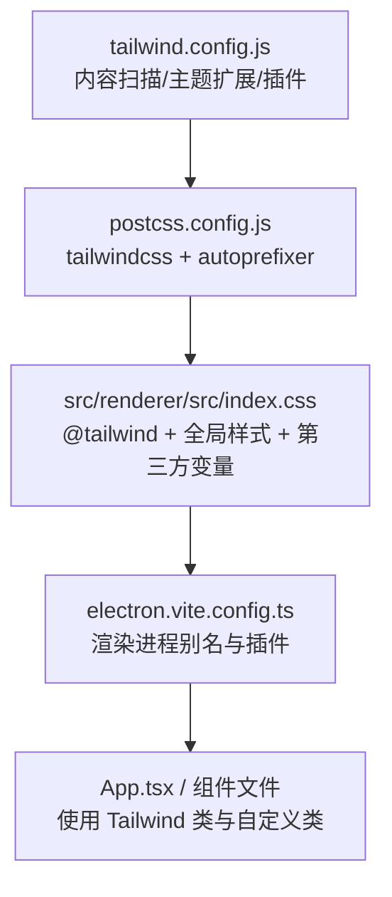
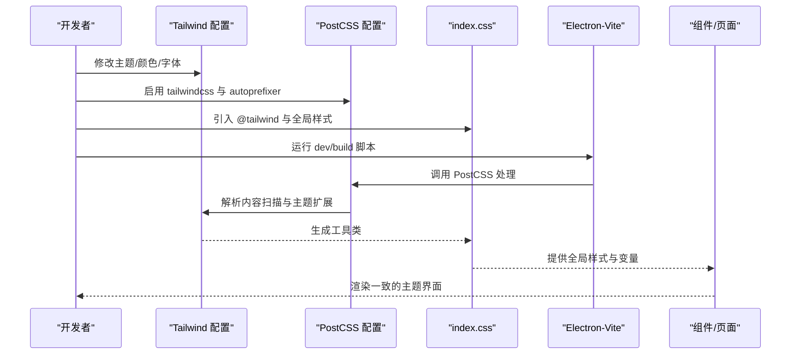
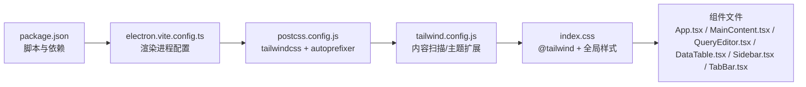

# 样式与主题

<cite>
**本文引用的文件**
- [tailwind.config.js](file://tailwind.config.js)
- [postcss.config.js](file://postcss.config.js)
- [index.css](file://src/renderer/src/index.css)
- [package.json](file://package.json)
- [App.tsx](file://src/renderer/src/App.tsx)
- [MainContent.tsx](file://src/renderer/src/components/MainContent.tsx)
- [QueryEditor.tsx](file://src/renderer/src/components/QueryEditor.tsx)
- [DataTable.tsx](file://src/renderer/src/components/DataTable.tsx)
- [Sidebar.tsx](file://src/renderer/src/components/Sidebar.tsx)
- [TabBar.tsx](file://src/renderer/src/components/TabBar.tsx)
- [electron.vite.config.ts](file://electron.vite.config.ts)
</cite>

## 目录
1. [简介](#简介)
2. [项目结构](#项目结构)
3. [核心组件](#核心组件)
4. [架构总览](#架构总览)
5. [详细组件分析](#详细组件分析)
6. [依赖关系分析](#依赖关系分析)
7. [性能考量](#性能考量)
8. [故障排查指南](#故障排查指南)
9. [结论](#结论)
10. [附录](#附录)

## 简介
本文件系统性梳理 nexSql 的样式与主题体系，覆盖 Tailwind CSS 配置、颜色与字体主题、PostCSS 集成与构建流程、组件级样式规范与最佳实践、响应式与移动端适配策略、以及样式调试与维护建议。目标是帮助开发者快速理解并高效扩展界面风格与交互体验。

## 项目结构
样式与主题相关的关键文件分布如下：
- Tailwind 配置：用于定义内容扫描范围、主题扩展（颜色、字体等）与插件。
- PostCSS 配置：启用 Tailwind 与 Autoprefixer 插件，统一处理 CSS。
- 全局样式入口：引入 Tailwind 基础、组件与工具类，并补充全局重置与第三方组件样式变量。
- 组件样式：通过 Tailwind 工具类与自定义 CSS 类组合实现一致的主题风格。
- 构建配置：Vite/Electron-Vite 环境下的别名与渲染进程样式打包。

图表来源
- [tailwind.config.js:1-38](file://tailwind.config.js#L1-L38)
- [postcss.config.js:1-7](file://postcss.config.js#L1-L7)
- [index.css:1-130](file://src/renderer/src/index.css#L1-L130)
- [electron.vite.config.ts:1-31](file://electron.vite.config.ts#L1-L31)

章节来源
- [tailwind.config.js:1-38](file://tailwind.config.js#L1-L38)
- [postcss.config.js:1-7](file://postcss.config.js#L1-L7)
- [index.css:1-130](file://src/renderer/src/index.css#L1-L130)
- [electron.vite.config.ts:1-31](file://electron.vite.config.ts#L1-L31)

## 核心组件
- 主题与颜色系统
  - 深色主题主色板：背景、边框、强调色、文本层级。
  - 字体族：无衬线体与等宽体，满足代码与正文场景。
- 全局样式与第三方组件
  - 重置与滚动条、选中高亮。
  - Monaco 编辑器容器与行内输入区域的深色背景覆盖。
  - react-data-grid 的 CSS 变量与主题色映射。
- 组件样式规范
  - 使用语义化背景/边框/强调色类，配合 hover/active 状态类。
  - 文本颜色按主/次/柔和/禁用层级使用，确保可读性与对比度。
  - 间距与尺寸使用 Tailwind 间距与尺寸工具类，避免硬编码像素值。

章节来源
- [tailwind.config.js:4-34](file://tailwind.config.js#L4-L34)
- [index.css:5-130](file://src/renderer/src/index.css#L5-L130)
- [App.tsx:16](file://src/renderer/src/App.tsx#L16)
- [MainContent.tsx:15-32](file://src/renderer/src/components/MainContent.tsx#L15-L32)

## 架构总览
Tailwind 与 PostCSS 在构建阶段将源样式转换为最终 CSS；渲染进程通过 Vite 别名解析组件与样式模块，确保主题一致性贯穿全局与组件层。

图表来源
- [tailwind.config.js:1-38](file://tailwind.config.js#L1-L38)
- [postcss.config.js:1-7](file://postcss.config.js#L1-L7)
- [index.css:1-3](file://src/renderer/src/index.css#L1-L3)
- [electron.vite.config.ts:18-29](file://electron.vite.config.ts#L18-L29)

## 详细组件分析

### 主题与颜色系统
- 颜色命名空间
  - 背景：primary/secondary/tertiary/hover/active，用于容器、面板与悬停态。
  - 边框：默认与浅色边框，用于分割线与聚焦态。
  - 强调色：默认/悬停/浅色，作为按钮、选中与高亮主色。
  - 文本：主/次/柔和，用于不同重要级与禁用态。
- 字体族
  - 无衬线体用于正文与界面文字，保证可读性。
  - 等宽体用于代码编辑与数据表格，提升技术内容的清晰度。
- 使用示例路径
  - 背景色与文本色：[MainContent.tsx:15-16](file://src/renderer/src/components/MainContent.tsx#L15-L16)
  - 强调色按钮与边框：[QueryEditor.tsx:144-156](file://src/renderer/src/components/QueryEditor.tsx#L144-L156), [DataTable.tsx:154-162](file://src/renderer/src/components/DataTable.tsx#L154-L162)
  - 侧边栏与分隔条：[Sidebar.tsx:47](file://src/renderer/src/components/Sidebar.tsx#L47), [index.css:95-123](file://src/renderer/src/index.css#L95-L123)

章节来源
- [tailwind.config.js:6-33](file://tailwind.config.js#L6-L33)
- [index.css:30-123](file://src/renderer/src/index.css#L30-L123)
- [MainContent.tsx:15-32](file://src/renderer/src/components/MainContent.tsx#L15-L32)
- [QueryEditor.tsx:144-167](file://src/renderer/src/components/QueryEditor.tsx#L144-L167)
- [DataTable.tsx:154-162](file://src/renderer/src/components/DataTable.tsx#L154-L162)
- [Sidebar.tsx:47](file://src/renderer/src/components/Sidebar.tsx#L47)

### 全局样式与第三方组件
- 全局重置与滚动条
  - 重置盒模型与滚动条宽度、轨道与滑块颜色。
  - 选中高亮采用强调色半透明覆盖。
- Monaco 编辑器
  - 对容器与输入区域强制深色背景，避免编辑器覆盖时出现浅色底。
- react-data-grid
  - 通过 CSS 变量映射主题色，包括背景、表头、悬停、选中、边框与字体族。
  - 冻结列阴影与动画类增强交互反馈。
- 使用示例路径
  - 全局重置与滚动条：[index.css:5-42](file://src/renderer/src/index.css#L5-L42)
  - Monaco 覆盖：[index.css:45-50](file://src/renderer/src/index.css#L45-L50)
  - RDG 变量与动画：[index.css:53-64](file://src/renderer/src/index.css#L53-L64), [index.css:71-92](file://src/renderer/src/index.css#L71-L92)

章节来源
- [index.css:5-130](file://src/renderer/src/index.css#L5-L130)

### 组件样式规范与最佳实践
- 通用规范
  - 使用语义化背景/边框/强调色类，避免直接写死颜色值。
  - 文本颜色按层级使用，保持对比度与可读性。
  - 间距与尺寸优先使用工具类，减少自定义样式。
- 工具栏与面板
  - 使用“背景次级 + 浅边框”作为工具栏背景，突出内容区。
  - 悬停态使用“背景悬停”，保持一致的过渡动画。
- 表格与数据网格
  - 表头与行悬停态使用“背景次级/悬停”，选中态使用“强调色浅色”。
  - 冻结列与边框阴影确保视觉分隔清晰。
- 使用示例路径
  - 工具栏与面板：[QueryEditor.tsx:143-167](file://src/renderer/src/components/QueryEditor.tsx#L143-L167), [DataTable.tsx:154-226](file://src/renderer/src/components/DataTable.tsx#L154-L226)
  - 表格行与选中态：[QueryEditor.tsx:293-304](file://src/renderer/src/components/QueryEditor.tsx#L293-L304), [index.css:53-64](file://src/renderer/src/index.css#L53-L64)

章节来源
- [QueryEditor.tsx:143-226](file://src/renderer/src/components/QueryEditor.tsx#L143-L226)
- [DataTable.tsx:154-294](file://src/renderer/src/components/DataTable.tsx#L154-L294)
- [index.css:53-64](file://src/renderer/src/index.css#L53-L64)

### 响应式设计与移动端适配
- 当前实现
  - 使用 Tailwind 的基础响应式断点与 flex 布局，保证窗口尺寸变化时的布局稳定性。
  - 未显式声明移动端专用断点，但通过相对单位与弹性布局具备一定自适应能力。
- 建议
  - 在需要时引入自定义断点或媒体查询，针对小屏设备优化交互元素尺寸与间距。
  - 对触摸设备优化按钮与可点击区域大小，确保操作可达性。

章节来源
- [index.css:11-18](file://src/renderer/src/index.css#L11-L18)
- [App.tsx:16](file://src/renderer/src/App.tsx#L16)

### 自定义样式实现与扩展方法
- 扩展 Tailwind 主题
  - 在配置中新增颜色、字体族或动画，确保内容扫描路径包含新增组件目录。
  - 新增自定义 CSS 类时，优先考虑工具类组合；必要时在全局样式中补充。
- 组件内扩展
  - 通过组合工具类实现状态态（hover/focus/active/disabled），避免重复定义。
  - 对第三方组件（如编辑器、数据网格）通过 CSS 变量或覆盖类进行主题化。
- 使用示例路径
  - 主题扩展：[tailwind.config.js:4-34](file://tailwind.config.js#L4-L34)
  - 全局变量覆盖：[index.css:53-64](file://src/renderer/src/index.css#L53-L64)

章节来源
- [tailwind.config.js:4-34](file://tailwind.config.js#L4-L34)
- [index.css:53-64](file://src/renderer/src/index.css#L53-L64)

### 组件交互与状态样式
- 拖拽分隔条
  - 使用自定义类实现垂直/水平拖拽手柄，悬停时高亮强调色。
- 上下文菜单与标签页
  - 悬停态统一使用强调色背景与白色文本，确保高对比度。
- 使用示例路径
  - 拖拽手柄：[index.css:95-123](file://src/renderer/src/index.css#L95-L123), [Sidebar.tsx:72-76](file://src/renderer/src/components/Sidebar.tsx#L72-L76)
  - 标签页激活态：[TabBar.tsx:30-33](file://src/renderer/src/components/TabBar.tsx#L30-L33)

章节来源
- [index.css:95-123](file://src/renderer/src/index.css#L95-L123)
- [Sidebar.tsx:72-76](file://src/renderer/src/components/Sidebar.tsx#L72-L76)
- [TabBar.tsx:30-33](file://src/renderer/src/components/TabBar.tsx#L30-L33)

## 依赖关系分析
- 构建链路
  - Tailwind 配置决定内容扫描与主题扩展。
  - PostCSS 在构建时注入 Tailwind 与 Autoprefixer。
  - Electron-Vite 渲染进程启用 React 插件与路径别名，确保组件与样式正确解析。
- 组件与样式耦合
  - 组件通过工具类与全局变量实现主题一致性，降低耦合度。
  - 第三方组件通过 CSS 变量或覆盖类进行主题化，便于集中管理。

图表来源
- [package.json:8-14](file://package.json#L8-L14)
- [electron.vite.config.ts:18-29](file://electron.vite.config.ts#L18-L29)
- [postcss.config.js:1-7](file://postcss.config.js#L1-L7)
- [tailwind.config.js:1-38](file://tailwind.config.js#L1-L38)
- [index.css:1-3](file://src/renderer/src/index.css#L1-L3)
- [App.tsx:16](file://src/renderer/src/App.tsx#L16)

章节来源
- [package.json:8-14](file://package.json#L8-L14)
- [electron.vite.config.ts:18-29](file://electron.vite.config.ts#L18-L29)
- [postcss.config.js:1-7](file://postcss.config.js#L1-L7)
- [tailwind.config.js:1-38](file://tailwind.config.js#L1-L38)
- [index.css:1-3](file://src/renderer/src/index.css#L1-L3)

## 性能考量
- 构建体积
  - 仅扫描指定目录与 HTML/TSX 文件，避免无关资源进入构建，控制 CSS 体积。
- 运行时性能
  - 使用工具类减少内联样式与动态计算，提升渲染效率。
  - 对第三方组件使用 CSS 变量与预设类，避免频繁重排与重绘。
- 建议
  - 合理拆分样式模块，按需引入；对不常用功能延迟加载。
  - 在开发阶段开启 Tree Shaking，移除未使用的工具类。

章节来源
- [tailwind.config.js:3](file://tailwind.config.js#L3)

## 故障排查指南
- 样式未生效
  - 检查 Tailwind 内容扫描路径是否包含当前组件目录。
  - 确认 PostCSS 插件顺序与版本兼容。
- 颜色/字体异常
  - 核对主题扩展是否正确命名与使用；确认全局样式未被覆盖。
- 第三方组件样式冲突
  - 通过 CSS 变量或更高优先级的选择器进行覆盖；避免使用 !important。
- 构建错误
  - 查看构建日志中 PostCSS/Tailwind 报错信息，定位配置问题。

章节来源
- [tailwind.config.js:3](file://tailwind.config.js#L3)
- [postcss.config.js:1-7](file://postcss.config.js#L1-L7)
- [index.css:53-64](file://src/renderer/src/index.css#L53-L64)

## 结论
本项目采用 Tailwind CSS + PostCSS 的现代化样式方案，结合深色主题与明确的颜色/字体体系，在组件层面通过工具类与全局变量实现一致的视觉语言。通过合理的配置与最佳实践，可在保证开发效率的同时，获得良好的可维护性与扩展性。建议在后续迭代中进一步完善移动端断点与交互细节，持续优化构建与运行时性能。

## 附录
- 主题定制与品牌化示例
  - 背景色板：将 primary/secondary/tertiary 与强调色替换为品牌色，确保 hover/active 有足够对比度。
  - 字体族：将 sans 与 mono 替换为品牌字体，注意跨平台可用性与回退方案。
  - 动画与过渡：统一按钮与面板的过渡时长与缓动函数，提升交互质感。
- 响应式与移动端建议
  - 引入 sm/md/lg 断点，针对小屏优化工具栏与面板布局。
  - 提升触摸目标尺寸，改善移动端操作体验。
- 调试与维护清单
  - 开发期定期清理未使用工具类，保持 CSS 精简。
  - 对第三方组件建立样式覆盖清单，统一命名与优先级。