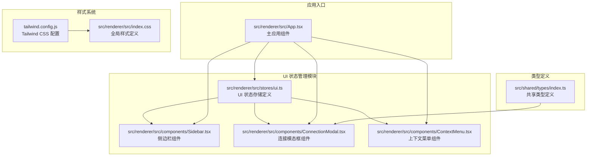
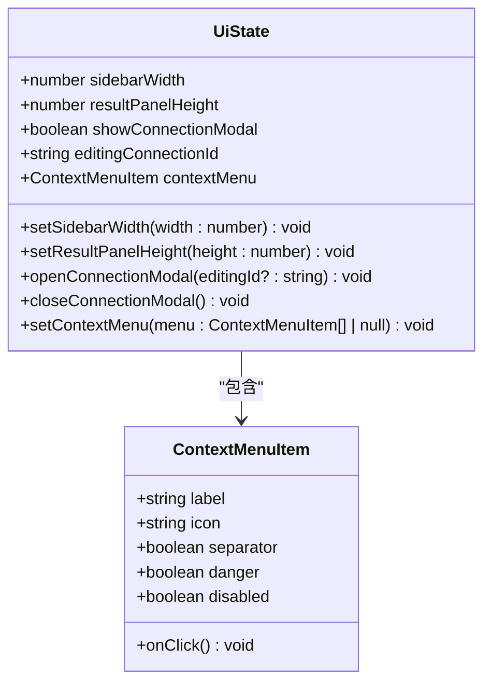
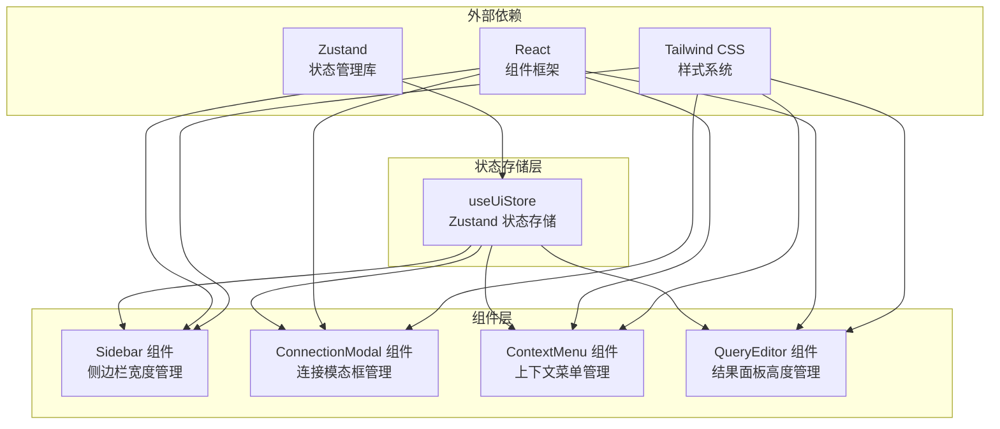
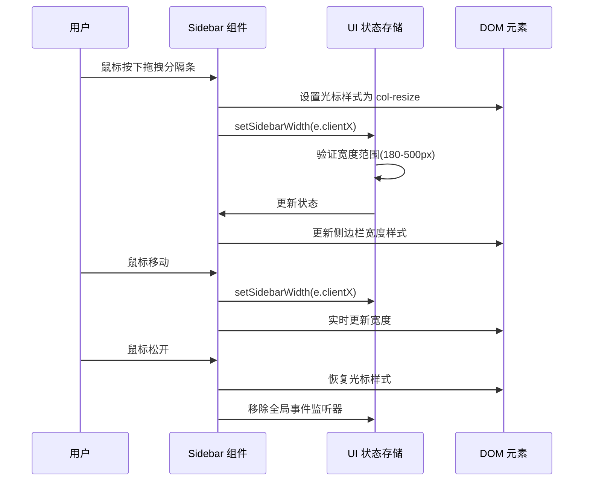
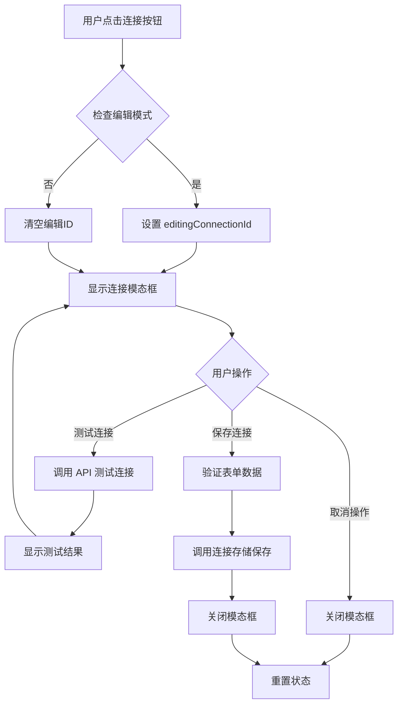
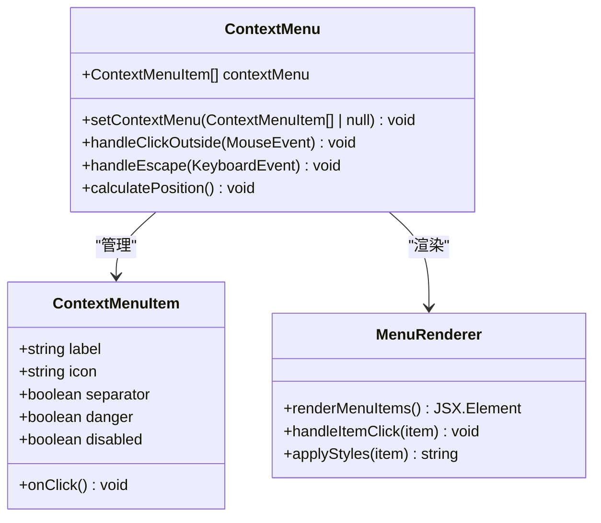
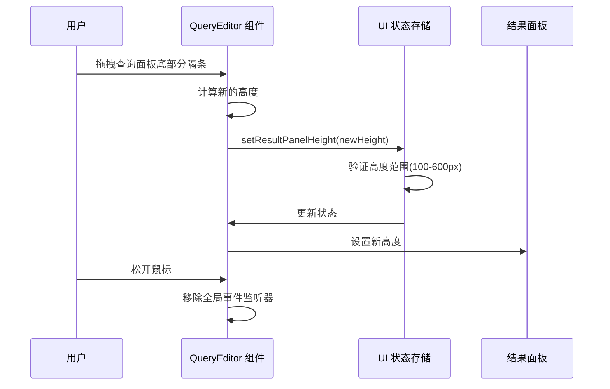
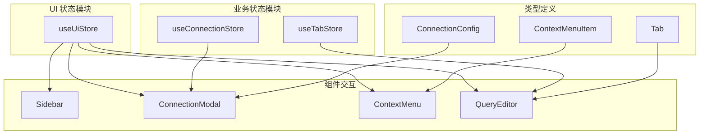

# UI 状态管理

<cite>
**本文档引用的文件**
- [ui.ts](file://src/renderer/src/stores/ui.ts)
- [Sidebar.tsx](file://src/renderer/src/components/Sidebar.tsx)
- [ConnectionModal.tsx](file://src/renderer/src/components/ConnectionModal.tsx)
- [ContextMenu.tsx](file://src/renderer/src/components/ContextMenu.tsx)
- [App.tsx](file://src/renderer/src/App.tsx)
- [types/index.ts](file://src/shared/types/index.ts)
- [connection.ts](file://src/renderer/src/stores/connection.ts)
- [tab.ts](file://src/renderer/src/stores/tab.ts)
- [tailwind.config.js](file://tailwind.config.js)
- [index.css](file://src/renderer/src/index.css)
</cite>

## 目录
1. [简介](#简介)
2. [项目结构](#项目结构)
3. [核心组件](#核心组件)
4. [架构概览](#架构概览)
5. [详细组件分析](#详细组件分析)
6. [依赖关系分析](#依赖关系分析)
7. [性能考虑](#性能考虑)
8. [故障排除指南](#故障排除指南)
9. [结论](#结论)

## 简介

UI 状态管理模块是 nexSql 应用程序的核心状态管理系统之一，专门负责管理用户界面的各种状态和行为。该模块基于 Zustand 状态管理库构建，提供了响应式的状态更新机制，支持模态框状态、侧边栏宽度、上下文菜单、结果面板高度等 UI 相关的状态管理。

该模块的设计遵循单一职责原则，将 UI 状态与业务逻辑状态分离，确保了代码的可维护性和可测试性。通过集中化的状态管理，实现了跨组件的状态共享和同步，为用户提供一致的界面体验。

## 项目结构

UI 状态管理模块主要分布在以下目录结构中：

**图表来源**
- [ui.ts:1-41](file://src/renderer/src/stores/ui.ts#L1-L41)
- [Sidebar.tsx:1-80](file://src/renderer/src/components/Sidebar.tsx#L1-L80)
- [ConnectionModal.tsx:1-230](file://src/renderer/src/components/ConnectionModal.tsx#L1-L230)
- [ContextMenu.tsx:1-79](file://src/renderer/src/components/ContextMenu.tsx#L1-L79)

**章节来源**
- [ui.ts:1-41](file://src/renderer/src/stores/ui.ts#L1-L41)
- [App.tsx:1-24](file://src/renderer/src/App.tsx#L1-L24)

## 核心组件

UI 状态管理模块的核心是基于 Zustand 的状态存储，提供了以下关键功能：

### 状态接口定义

UI 状态接口定义了所有可用的 UI 状态属性和操作方法：

**图表来源**
- [ui.ts:3-24](file://src/renderer/src/stores/ui.ts#L3-L24)

### 状态初始化配置

UI 状态存储提供了合理的默认值和边界约束：

| 状态属性 | 默认值 | 最小值 | 最大值 | 描述 |
|---------|--------|--------|--------|------|
| sidebarWidth | 280 | 180 | 500 | 侧边栏宽度（像素） |
| resultPanelHeight | 260 | 100 | 600 | 结果面板高度（像素） |
| showConnectionModal | false | - | - | 连接模态框显示状态 |
| editingConnectionId | null | - | - | 编辑中的连接 ID |
| contextMenu | null | - | - | 上下文菜单状态 |

**章节来源**
- [ui.ts:26-40](file://src/renderer/src/stores/ui.ts#L26-L40)

## 架构概览

UI 状态管理模块采用集中式状态管理模式，通过 Zustand 提供轻量级的状态管理解决方案：

**图表来源**
- [ui.ts:1-41](file://src/renderer/src/stores/ui.ts#L1-L41)
- [Sidebar.tsx:1-80](file://src/renderer/src/components/Sidebar.tsx#L1-L80)
- [ConnectionModal.tsx:1-230](file://src/renderer/src/components/ConnectionModal.tsx#L1-L230)
- [ContextMenu.tsx:1-79](file://src/renderer/src/components/ContextMenu.tsx#L1-L79)

## 详细组件分析

### 侧边栏宽度管理

侧边栏组件实现了拖拽调整宽度的功能，通过全局鼠标事件监听实现平滑的用户体验：

**图表来源**
- [Sidebar.tsx:13-41](file://src/renderer/src/components/Sidebar.tsx#L13-L41)
- [ui.ts:33-33](file://src/renderer/src/stores/ui.ts#L33-L33)

#### 关键特性

1. **边界约束**: 自动限制侧边栏宽度在 180px 到 500px 之间
2. **全局事件处理**: 使用全局鼠标事件确保拖拽体验流畅
3. **样式实时更新**: 通过内联样式实时更新组件宽度
4. **资源清理**: 组件卸载时自动移除事件监听器

**章节来源**
- [Sidebar.tsx:1-80](file://src/renderer/src/components/Sidebar.tsx#L1-L80)

### 连接模态框管理

连接模态框组件提供了数据库连接的创建和编辑功能，通过 UI 状态存储控制显示和隐藏：

**图表来源**
- [ConnectionModal.tsx:21-65](file://src/renderer/src/components/ConnectionModal.tsx#L21-L65)
- [ui.ts:35-38](file://src/renderer/src/stores/ui.ts#L35-L38)

#### 状态管理流程

1. **打开模态框**: `openConnectionModal(editingId?)` 方法设置显示状态和编辑ID
2. **表单数据绑定**: 使用本地状态管理表单字段
3. **连接测试**: 调用后端 API 验证连接有效性
4. **数据保存**: 通过连接存储保存配置到持久化存储
5. **状态重置**: 关闭模态框时自动重置相关状态

**章节来源**
- [ConnectionModal.tsx:1-230](file://src/renderer/src/components/ConnectionModal.tsx#L1-L230)

### 上下文菜单管理

上下文菜单组件实现了全局的右键菜单功能，支持多种菜单项类型和交互行为：

**图表来源**
- [ContextMenu.tsx:1-79](file://src/renderer/src/components/ContextMenu.tsx#L1-L79)
- [ui.ts:17-24](file://src/renderer/src/stores/ui.ts#L17-L24)

#### 菜单项类型

| 属性 | 类型 | 描述 | 示例 |
|------|------|------|------|
| label | string | 菜单项文本 | "删除连接" |
| icon | string | 图标名称 | "trash-2" |
| onClick | function | 点击回调函数 | `() => {}` |
| separator | boolean | 是否显示分隔线 | `true` |
| danger | boolean | 是否为危险操作 | `false` |
| disabled | boolean | 是否禁用 | `false` |

**章节来源**
- [ContextMenu.tsx:1-79](file://src/renderer/src/components/ContextMenu.tsx#L1-L79)

### 结果面板高度管理

查询编辑器组件实现了动态调整结果面板高度的功能，通过拖拽分隔条实现灵活的布局控制：

**图表来源**
- [QueryEditor.tsx:116-138](file://src/renderer/src/components/QueryEditor.tsx#L116-L138)
- [ui.ts:34-34](file://src/renderer/src/stores/ui.ts#L34-L34)

**章节来源**
- [QueryEditor.tsx:116-138](file://src/renderer/src/components/QueryEditor.tsx#L116-L138)

## 依赖关系分析

UI 状态管理模块与其他状态模块存在紧密的协作关系：

**图表来源**
- [ui.ts:1-41](file://src/renderer/src/stores/ui.ts#L1-L41)
- [connection.ts:1-64](file://src/renderer/src/stores/connection.ts#L1-L64)
- [tab.ts:1-64](file://src/renderer/src/stores/tab.ts#L1-L64)
- [types/index.ts:3-22](file://src/shared/types/index.ts#L3-L22)

### 状态交互模式

1. **UI 控制业务**: UI 状态存储控制模态框显示，间接影响连接存储的操作
2. **业务反馈 UI**: 连接状态的变化可能触发 UI 状态的更新
3. **组件间通信**: 通过共享的状态存储实现组件间的解耦通信

**章节来源**
- [connection.ts:1-64](file://src/renderer/src/stores/connection.ts#L1-L64)
- [tab.ts:1-64](file://src/renderer/src/stores/tab.ts#L1-L64)

## 性能考虑

UI 状态管理模块在设计时充分考虑了性能优化：

### 状态选择优化

- **精确的状态订阅**: 组件只订阅需要的状态，避免不必要的重渲染
- **状态分割**: 将 UI 状态与业务状态分离，减少无关状态变更的影响

### 内存管理

- **自动清理**: 组件卸载时自动清理全局事件监听器
- **状态重置**: 模态框关闭时自动重置相关状态

### 渲染优化

- **最小化重渲染**: 使用 Zustand 的选择器函数避免全状态重渲染
- **防抖处理**: 对频繁的状态更新进行必要的防抖处理

## 故障排除指南

### 常见问题及解决方案

#### 侧边栏宽度异常

**问题**: 侧边栏宽度超出预期范围
**原因**: 边界检查逻辑未正确执行
**解决方案**: 检查 `setSidebarWidth` 方法的边界约束

#### 模态框无法关闭

**问题**: 连接模态框无法正常关闭
**原因**: 状态重置逻辑缺失或事件监听器未正确移除
**解决方案**: 确保调用 `closeConnectionModal` 方法并检查事件清理

#### 上下文菜单位置错误

**问题**: 上下文菜单显示位置超出屏幕边界
**原因**: 位置计算逻辑未正确处理边界情况
**解决方案**: 检查 `ContextMenu` 组件的位置计算和边界检测

**章节来源**
- [Sidebar.tsx:34-41](file://src/renderer/src/components/Sidebar.tsx#L34-L41)
- [ConnectionModal.tsx:64-65](file://src/renderer/src/components/ConnectionModal.tsx#L64-L65)
- [ContextMenu.tsx:38-48](file://src/renderer/src/components/ContextMenu.tsx#L38-L48)

## 结论

UI 状态管理模块通过精心设计的状态结构和组件交互，为 nexSql 应用提供了灵活且高效的用户界面管理能力。该模块的主要优势包括：

1. **清晰的状态分离**: 将 UI 状态与业务状态明确分离，提高了代码的可维护性
2. **直观的 API 设计**: 简洁的方法命名和明确的职责分工
3. **良好的性能表现**: 通过精确的状态订阅和内存管理优化性能
4. **完善的边界处理**: 对各种边界情况进行了充分的考虑和处理

该模块为后续的功能扩展奠定了坚实的基础，任何新增的 UI 功能都可以在此基础上进行扩展和集成。