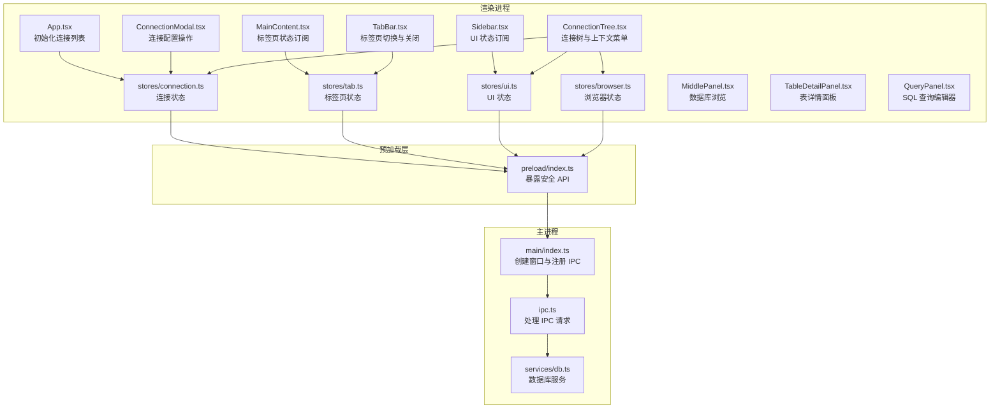
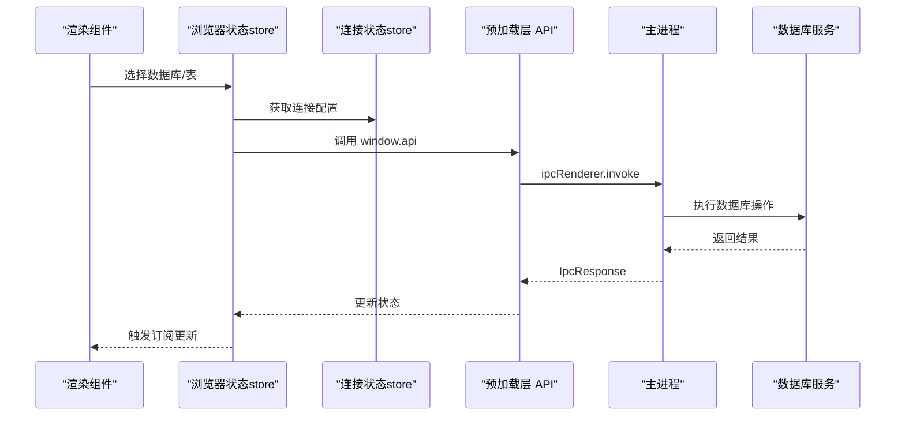
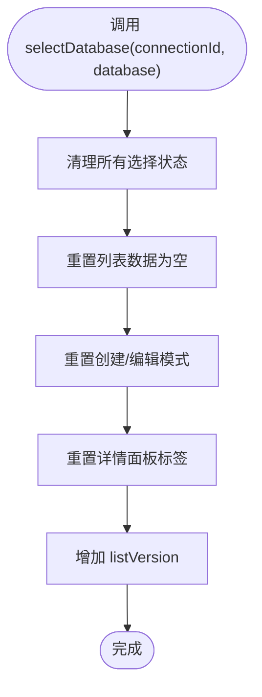
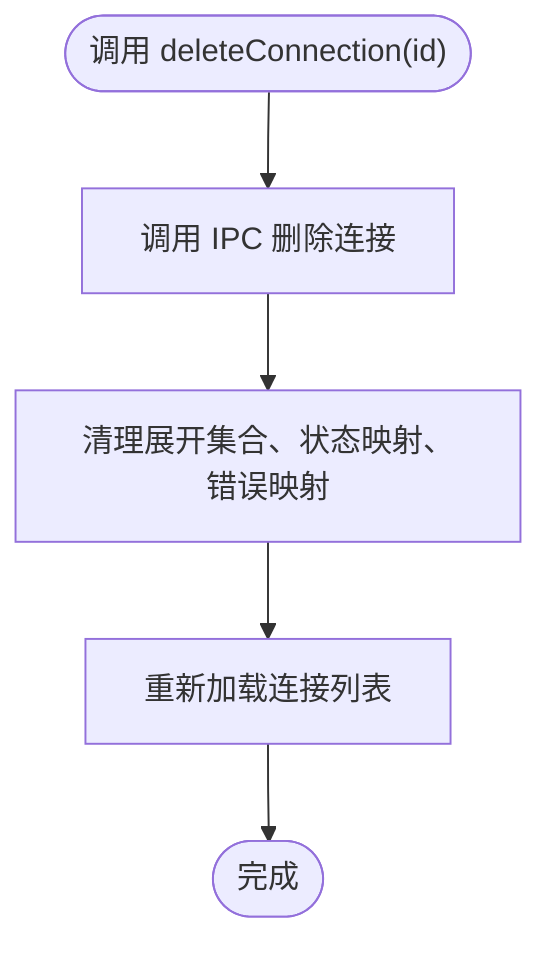
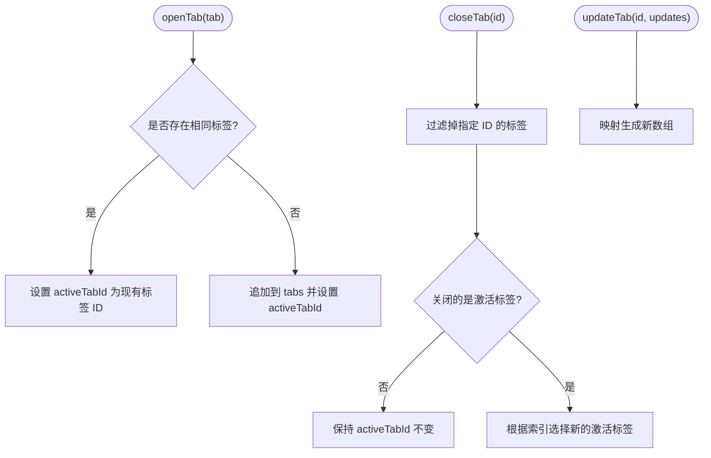
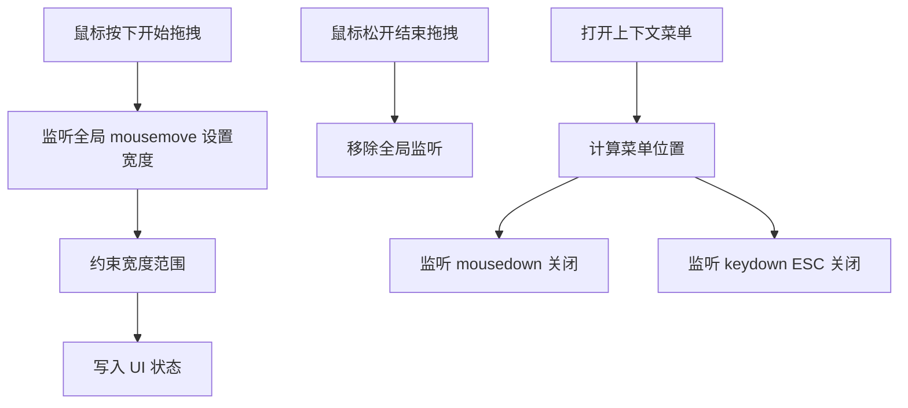
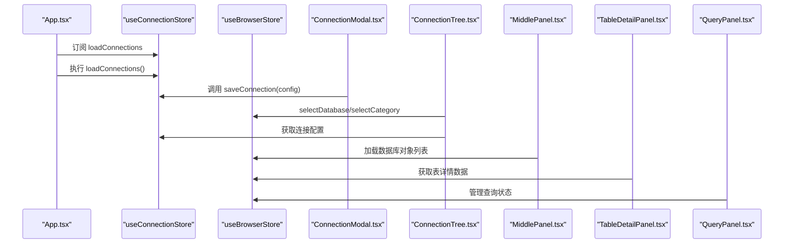
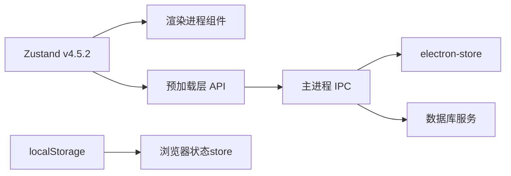

# Zustand 集成与最佳实践

<cite>
**本文档引用的文件**
- [package.json](file://package.json)
- [browser.ts](file://src/renderer/src/stores/browser.ts)
- [connection.ts](file://src/renderer/src/stores/connection.ts)
- [tab.ts](file://src/renderer/src/stores/tab.ts)
- [ui.ts](file://src/renderer/src/stores/ui.ts)
- [App.tsx](file://src/renderer/src/App.tsx)
- [main.tsx](file://src/renderer/src/main.tsx)
- [types/index.ts](file://src/shared/types/index.ts)
- [Sidebar.tsx](file://src/renderer/src/components/Sidebar.tsx)
- [MainContent.tsx](file://src/renderer/src/components/MainContent.tsx)
- [ConnectionModal.tsx](file://src/renderer/src/components/ConnectionModal.tsx)
- [ContextMenu.tsx](file://src/renderer/src/components/ContextMenu.tsx)
- [ConnectionTree.tsx](file://src/renderer/src/components/ConnectionTree.tsx)
- [TabBar.tsx](file://src/renderer/src/components/TabBar.tsx)
- [MiddlePanel.tsx](file://src/renderer/src/components/MiddlePanel.tsx)
- [TableDetailPanel.tsx](file://src/renderer/src/components/TableDetailPanel.tsx)
- [QueryPanel.tsx](file://src/renderer/src/components/QueryPanel.tsx)
- [EventDetailPanel.tsx](file://src/renderer/src/components/EventDetailPanel.tsx)
- [RoutineDetailPanel.tsx](file://src/renderer/src/components/RoutineDetailPanel.tsx)
- [db.ts](file://src/main/services/db.ts)
- [ipc.ts](file://src/main/ipc.ts)
- [main/index.ts](file://src/main/index.ts)
- [preload/index.ts](file://src/preload/index.ts)
- [electron.vite.config.ts](file://electron.vite.config.ts)
</cite>

## 更新摘要
**变更内容**
- 新增浏览器状态管理store（browser.ts）的完整集成
- 扩展Zustand在复杂场景下的最佳实践和性能优化建议
- 增强状态持久化和缓存策略的实现方案
- 完善多组件协作和状态同步的架构设计

## 目录
1. [简介](#简介)
2. [项目结构](#项目结构)
3. [核心组件](#核心组件)
4. [架构总览](#架构总览)
5. [详细组件分析](#详细组件分析)
6. [依赖关系分析](#依赖关系分析)
7. [性能考虑](#性能考虑)
8. [故障排查指南](#故障排查指南)
9. [结论](#结论)
10. [附录](#附录)

## 简介
本项目采用 Electron + React 技术栈构建桌面数据库管理工具，状态管理统一使用 Zustand。Zustand 在本项目中承担以下职责：
- **连接配置与状态管理**：维护连接列表、连接状态、错误信息以及展开状态
- **标签页管理**：维护打开的标签页集合、当前激活标签页及标签页更新
- **UI 状态管理**：维护侧边栏宽度、结果面板高度、连接模态框显示状态、上下文菜单等
- **浏览器状态管理**：维护数据库浏览状态、查询历史、表详情面板状态等复杂业务状态

Zustand 的优势在于其极简 API、无需 Provider 包装、按需订阅与细粒度更新，非常适合本项目中多组件共享状态、频繁交互的场景。

## 项目结构
项目采用"主进程-预加载-渲染进程"三层架构，Zustand 状态位于渲染进程，通过 IPC 与主进程通信以完成持久化与数据库操作。

**图表来源**
- [App.tsx:1-35](file://src/renderer/src/App.tsx#L1-L35)
- [Sidebar.tsx:1-80](file://src/renderer/src/components/Sidebar.tsx#L1-L80)
- [MainContent.tsx:1-34](file://src/renderer/src/components/MainContent.tsx#L1-L34)
- [ConnectionModal.tsx:1-232](file://src/renderer/src/components/ConnectionModal.tsx#L1-L232)
- [ConnectionTree.tsx:1-313](file://src/renderer/src/components/ConnectionTree.tsx#L1-L313)
- [TabBar.tsx:1-53](file://src/renderer/src/components/TabBar.tsx#L1-L53)
- [browser.ts:1-179](file://src/renderer/src/stores/browser.ts#L1-L179)
- [connection.ts:1-64](file://src/renderer/src/stores/connection.ts#L1-L64)
- [tab.ts:1-65](file://src/renderer/src/stores/tab.ts#L1-L65)
- [ui.ts:1-41](file://src/renderer/src/stores/ui.ts#L1-L41)
- [MiddlePanel.tsx:1-770](file://src/renderer/src/components/MiddlePanel.tsx#L1-L770)
- [TableDetailPanel.tsx:1-359](file://src/renderer/src/components/TableDetailPanel.tsx#L1-L359)
- [QueryPanel.tsx:1-567](file://src/renderer/src/components/QueryPanel.tsx#L1-L567)
- [preload/index.ts:1-23](file://src/preload/index.ts#L1-L23)
- [main/index.ts:1-63](file://src/main/index.ts#L1-L63)
- [ipc.ts:1-182](file://src/main/ipc.ts#L1-L182)
- [db.ts:1-277](file://src/main/services/db.ts#L1-L277)

**章节来源**
- [electron.vite.config.ts:1-30](file://electron.vite.config.ts#L1-L30)
- [main/index.ts:1-63](file://src/main/index.ts#L1-L63)
- [preload/index.ts:1-23](file://src/preload/index.ts#L1-L23)
- [ipc.ts:1-182](file://src/main/ipc.ts#L1-L182)
- [db.ts:1-277](file://src/main/services/db.ts#L1-L277)

## 核心组件
本节聚焦 Zustand 在项目中的四大状态域：连接状态、标签页状态、UI 状态、浏览器状态，并说明它们如何被组件订阅与更新。

### 浏览器状态管理（browser.ts）
**新增** 本项目新增了专门的浏览器状态管理store，用于处理复杂的数据库浏览和查询场景。

- **状态字段**：
  - 选择状态：selectedConnectionId、selectedDatabase、selectedTable、selectedCategory
  - 列表数据：tables、views、routines、events
  - 加载状态：listLoading、listVersion
  - 模式状态：isCreating、isEditing
  - 详情面板：preferredDetailTab
  - 查询管理：savedQueries、activeQuerySql、selectedQueryId

- **动作函数**：
  - 数据库选择：selectDatabase、selectCategory、selectTable
  - 查询管理：setActiveQuerySql、selectQuery、saveQuery、deleteQuery
  - 列表管理：setTables、setViews、setRoutines、setEvents、setListLoading、refreshList
  - 模式控制：startCreating、stopCreating、startEditing、stopEditing、clearSelection

- **设计要点**：
  - 使用 localStorage 持久化保存的查询
  - 通过 listVersion 实现列表数据的强制刷新
  - 支持多种数据库对象类型的统一管理
  - 提供创建、编辑模式的完整生命周期管理

### 连接状态（connection.ts）
- **状态字段**：连接列表、连接状态映射、错误映射、展开集合
- **动作函数**：加载连接、保存连接、删除连接、设置状态、切换展开
- **设计要点**：使用记录映射（Record）快速定位连接状态；使用 Set 管理展开节点；异步动作通过 window.api 调用 IPC 完成持久化与刷新

### 标签页状态（tab.ts）
- **状态字段**：标签页数组、当前激活标签页 ID
- **动作函数**：打开标签页、关闭标签页、设置激活标签页、更新标签页、获取当前激活标签页
- **设计要点**：去重逻辑避免重复打开相同连接/数据库/表的标签；关闭标签时智能选择新的激活标签页；使用部分更新减少不必要的重渲染

### UI 状态（ui.ts）
- **状态字段**：侧边栏宽度、结果面板高度、连接模态框开关、上下文菜单
- **动作函数**：设置宽度、设置高度、打开/关闭模态框、设置上下文菜单
- **设计要点**：对宽度/高度进行边界约束，保证 UI 体验；上下文菜单通过全局事件关闭，提升可用性

**章节来源**
- [browser.ts:1-179](file://src/renderer/src/stores/browser.ts#L1-L179)
- [connection.ts:1-64](file://src/renderer/src/stores/connection.ts#L1-L64)
- [tab.ts:1-65](file://src/renderer/src/stores/tab.ts#L1-L65)
- [ui.ts:1-41](file://src/renderer/src/stores/ui.ts#L1-L41)
- [types/index.ts:1-203](file://src/shared/types/index.ts#L1-L203)

## 架构总览
Zustand 状态在渲染进程中被组件直接订阅，通过预加载层暴露的安全 API 与主进程通信，主进程负责持久化与数据库操作。

**图表来源**
- [ConnectionTree.tsx:93-132](file://src/renderer/src/components/ConnectionTree.tsx#L93-L132)
- [MiddlePanel.tsx:68-101](file://src/renderer/src/components/MiddlePanel.tsx#L68-L101)
- [TableDetailPanel.tsx:33-50](file://src/renderer/src/components/TableDetailPanel.tsx#L33-L50)
- [QueryPanel.tsx:38-46](file://src/renderer/src/components/QueryPanel.tsx#L38-L46)
- [preload/index.ts:14-23](file://src/preload/index.ts#L14-L23)
- [ipc.ts:49-72](file://src/main/ipc.ts#L49-L72)
- [db.ts:58-63](file://src/main/services/db.ts#L58-L63)

## 详细组件分析

### 浏览器状态管理（browser.ts）
**新增** 浏览器状态管理store是本项目的核心状态管理模块，负责处理复杂的数据库浏览和查询场景。

#### 创建模式
- 使用 create 函数创建带状态与动作的 store，类型安全地声明状态接口
- 通过泛型参数明确状态类型，确保类型安全
- 使用 get() 函数访问当前状态，实现复杂的条件更新逻辑

#### 动作设计原则
- **异步动作**：loadData/selectDatabase 通过 window.api 调用 IPC，完成后刷新状态
- **同步动作**：selectTable/selectCategory 使用函数式 set，确保原子性与不可变更新
- **复合动作**：saveQuery/deleteQuery 结合 localStorage 和状态更新
- **边界清理**：clearSelection 同步清理所有相关状态，避免脏数据

#### 状态管理策略
- **本地持久化**：使用 localStorage 存储保存的查询，实现跨会话的数据持久化
- **版本控制**：通过 listVersion 实现列表数据的强制刷新机制
- **模式管理**：isCreating/isEditing 状态机管理创建和编辑模式
- **缓存策略**：结合组件级缓存和状态级缓存，优化性能

**图表来源**
- [browser.ts:94-108](file://src/renderer/src/stores/browser.ts#L94-L108)

**章节来源**
- [browser.ts:1-179](file://src/renderer/src/stores/browser.ts#L1-L179)

### 连接状态管理（connection.ts）
- **创建模式**：使用 create 函数创建带状态与动作的 store，类型安全地声明状态接口
- **动作设计原则**：
  - 异步动作：loadConnections/saveConnection/deleteConnection 通过 window.api 调用 IPC，完成后刷新状态
  - 同步动作：setStatus/toggleExpand 使用函数式 set，确保原子性与不可变更新
  - 边界清理：删除连接后同步清理对应的状态与错误映射，避免脏数据
- **订阅与更新**：组件通过选择器订阅所需字段，仅在相关状态变化时重渲染

**图表来源**
- [connection.ts:33-45](file://src/renderer/src/stores/connection.ts#L33-L45)

**章节来源**
- [connection.ts:1-64](file://src/renderer/src/stores/connection.ts#L1-L64)

### 标签页状态管理（tab.ts）
- **打开标签页**：先查找是否已存在相同标签，若存在则激活；否则新增并激活
- **关闭标签页**：计算索引并移除对应标签，若关闭的是激活标签，则根据索引规则选择新的激活标签
- **更新标签页**：使用映射生成新数组，避免直接修改原数组引用
- **获取当前激活标签页**：通过选择器从 store 中读取，避免在组件内重复计算

**图表来源**
- [tab.ts:19-63](file://src/renderer/src/stores/tab.ts#L19-L63)

**章节来源**
- [tab.ts:1-65](file://src/renderer/src/stores/tab.ts#L1-L65)

### UI 状态管理（ui.ts）
- **尺寸约束**：对侧边栏宽度与结果面板高度进行最小最大值限制，防止 UI 异常
- **模态框控制**：打开/关闭模态框时同时设置编辑中的连接 ID，便于表单初始化
- **上下文菜单**：集中管理菜单项与位置计算，支持点击外部与 ESC 快捷键关闭

**图表来源**
- [ui.ts:26-40](file://src/renderer/src/stores/ui.ts#L26-L40)
- [Sidebar.tsx:13-41](file://src/renderer/src/components/Sidebar.tsx#L13-L41)
- [ContextMenu.tsx:9-34](file://src/renderer/src/components/ContextMenu.tsx#L9-L34)

**章节来源**
- [ui.ts:1-41](file://src/renderer/src/stores/ui.ts#L1-L41)
- [Sidebar.tsx:1-80](file://src/renderer/src/components/Sidebar.tsx#L1-L80)
- [ContextMenu.tsx:1-79](file://src/renderer/src/components/ContextMenu.tsx#L1-L79)

### 组件与 Zustand 的集成模式
**增强** 新增浏览器状态管理store后，组件间的协作更加紧密和复杂。

- **App 初始化**：在 App 中订阅连接加载动作并在挂载时执行，确保应用启动即加载连接配置
- **Sidebar**：订阅 UI 状态用于宽度调整与打开连接模态框
- **MainContent**：订阅标签页状态以决定当前展示内容
- **ConnectionModal**：订阅连接与 UI 状态，实现连接测试、保存与模态框控制
- **ConnectionTree**：聚合连接、UI、标签页、浏览器状态，处理连接/数据库/表的展开、上下文菜单与标签页打开
- **MiddlePanel**：订阅浏览器状态，实现数据库对象列表的加载、筛选、排序和操作
- **TableDetailPanel**：订阅浏览器状态，实现表详情面板的动态切换和内容加载
- **QueryPanel**：订阅浏览器状态，实现查询编辑器的自动补全、执行和结果展示
- **TabBar**：订阅标签页状态，实现标签页切换与关闭

**图表来源**
- [App.tsx:8-13](file://src/renderer/src/App.tsx#L8-L13)
- [ConnectionModal.tsx:25-65](file://src/renderer/src/components/ConnectionModal.tsx#L25-L65)
- [ConnectionTree.tsx:32-36](file://src/renderer/src/components/ConnectionTree.tsx#L32-L36)
- [MiddlePanel.tsx:49-66](file://src/renderer/src/components/MiddlePanel.tsx#L49-L66)
- [TableDetailPanel.tsx:33-50](file://src/renderer/src/components/TableDetailPanel.tsx#L33-L50)
- [QueryPanel.tsx:38-46](file://src/renderer/src/components/QueryPanel.tsx#L38-L46)
- [TabBar.tsx:6-9](file://src/renderer/src/components/TabBar.tsx#L6-L9)
- [Sidebar.tsx:7-9](file://src/renderer/src/components/Sidebar.tsx#L7-L9)

**章节来源**
- [App.tsx:1-136](file://src/renderer/src/App.tsx#L1-L136)
- [ConnectionModal.tsx:1-232](file://src/renderer/src/components/ConnectionModal.tsx#L1-L232)
- [ConnectionTree.tsx:1-506](file://src/renderer/src/components/ConnectionTree.tsx#L1-L506)
- [MiddlePanel.tsx:1-770](file://src/renderer/src/components/MiddlePanel.tsx#L1-L770)
- [TableDetailPanel.tsx:1-359](file://src/renderer/src/components/TableDetailPanel.tsx#L1-L359)
- [QueryPanel.tsx:1-567](file://src/renderer/src/components/QueryPanel.tsx#L1-L567)
- [TabBar.tsx:1-53](file://src/renderer/src/components/TabBar.tsx#L1-L53)
- [Sidebar.tsx:1-80](file://src/renderer/src/components/Sidebar.tsx#L1-L80)

## 依赖关系分析
- **Zustand 版本**：项目依赖 zustand@^4.5.2，具备 v4 的全部能力（包括中间件、插件扩展等）
- **类型系统**：所有状态与动作均通过 TypeScript 接口约束，确保类型安全
- **IPC 通信**：通过预加载层桥接安全 API，渲染进程仅能访问白名单方法
- **主进程持久化**：使用 electron-store 存储连接配置，主进程统一处理 CRUD
- **本地存储**：浏览器状态store使用 localStorage 存储保存的查询，实现跨会话持久化

**图表来源**
- [package.json:25](file://package.json#L25)
- [browser.ts:17-35](file://src/renderer/src/stores/browser.ts#L17-L35)
- [preload/index.ts:14-23](file://src/preload/index.ts#L14-L23)
- [ipc.ts:7-14](file://src/main/ipc.ts#L7-L14)
- [db.ts:1-277](file://src/main/services/db.ts#L1-L277)

**章节来源**
- [package.json:1-42](file://package.json#L1-L42)
- [browser.ts:1-179](file://src/renderer/src/stores/browser.ts#L1-L179)
- [ipc.ts:1-182](file://src/main/ipc.ts#L1-L182)

## 性能考虑
**增强** 新增浏览器状态管理store后，性能优化策略更加重要和复杂。

### 细粒度订阅
- **组件级订阅**：每个组件仅订阅所需的字段，避免因全局状态变更导致的不必要重渲染
- **选择器优化**：使用选择器函数避免不必要的状态比较
- **状态拆分**：将大状态拆分为多个小状态，提高订阅精度

### 函数式更新
- **原子性更新**：使用 set((state) => ...) 与不可变更新策略，减少对象深拷贝成本
- **批量更新**：合理使用批量状态更新，避免多次重渲染
- **条件更新**：在动作函数中进行条件判断，避免无意义的状态变更

### 缓存与懒加载
- **组件级缓存**：ConnectionTree 对节点数据进行缓存，首次展开时才请求数据库元数据
- **状态级缓存**：浏览器状态store维护列表版本控制，实现精确的缓存失效
- **本地存储**：使用 localStorage 缓存保存的查询，减少网络请求

### 边界约束
- **UI 状态的尺寸约束**：避免极端值引发布局抖动
- **查询结果限制**：对大量数据的查询结果进行分页或限制显示数量

### 连接池
- **主进程连接池**：使用连接池管理数据库连接，降低频繁建立/销毁连接的开销
- **状态同步**：浏览器状态store与连接状态store的协调，避免重复连接

### 复杂场景优化
- **列表刷新机制**：通过 listVersion 实现精确的列表数据刷新
- **模式状态管理**：isCreating/isEditing 状态机避免不必要的状态切换
- **查询缓存**：QueryPanel 对表字段进行缓存，避免重复查询

## 故障排查指南
**增强** 新增浏览器状态管理store后，故障排查范围扩大。

### 浏览器状态相关问题
- **现象**：数据库对象列表不更新或显示错误
- **排查**：检查 listVersion 是否正确递增；确认 selectDatabase 是否正确清理状态
- **参考路径**：[browser.ts:153](file://src/renderer/src/stores/browser.ts#L153), [browser.ts:94-108](file://src/renderer/src/stores/browser.ts#L94-L108)

- **现象**：保存的查询无法加载或丢失
- **排查**：检查 localStorage 是否正常工作；确认 STORAGE_KEY 是否一致
- **参考路径**：[browser.ts:19-35](file://src/renderer/src/stores/browser.ts#L19-L35)

### 连接状态异常
- **现象**：连接状态未更新或错误信息未清除
- **排查**：确认 actions 是否正确调用 window.api 并在完成后刷新；检查删除连接后是否清理了对应映射
- **参考路径**：[connection.ts:33-45](file://src/renderer/src/stores/connection.ts#L33-L45)

### 标签页切换失效
- **现象**：切换标签页无效或关闭后无法正确选择新标签
- **排查**：检查 closeTab 的索引计算逻辑；确认 activeTabId 与 tabs 的一致性
- **参考路径**：[tab.ts:36-51](file://src/renderer/src/stores/tab.ts#L36-L51)

### 上下文菜单不消失
- **现象**：点击外部或 ESC 后菜单仍显示
- **排查**：确认全局监听器的添加/移除时机；检查延迟添加监听器的逻辑
- **参考路径**：[ContextMenu.tsx:9-34](file://src/renderer/src/components/ContextMenu.tsx#L9-L34)

### IPC 调用失败
- **现象**：保存/删除连接或数据库操作返回错误
- **排查**：检查预加载层 API 是否正确导出；确认主进程 IPC 处理函数是否抛出异常并记录日志
- **参考路径**：[preload/index.ts:14-23](file://src/preload/index.ts#L14-L23), [ipc.ts:76-84](file://src/main/ipc.ts#L76-L84)

### 组件状态不同步
- **现象**：浏览器状态与组件显示不一致
- **排查**：检查组件是否正确订阅了浏览器状态；确认状态更新的顺序和时机
- **参考路径**：[ConnectionTree.tsx:93-132](file://src/renderer/src/components/ConnectionTree.tsx#L93-L132), [MiddlePanel.tsx:68-101](file://src/renderer/src/components/MiddlePanel.tsx#L68-L101)

## 结论
**增强** 新增浏览器状态管理store后，本项目通过 Zustand 实现了更加完善和可维护的状态管理方案：

### 状态管理架构
- **多维度状态划分**：以功能域划分状态（连接、标签页、UI、浏览器），职责单一、易于扩展
- **状态间协调**：浏览器状态store与连接状态store的协同工作，实现复杂业务场景的状态管理
- **类型安全保证**：通过 TypeScript 接口约束，确保状态结构和动作函数的类型安全

### 技术实现优势
- **通过 IPC 与主进程解耦**，保证渲染进程的纯净与安全
- **组件按需订阅**，结合不可变更新策略，获得良好的性能表现
- **本地存储集成**，实现查询历史等数据的持久化
- **版本控制机制**，实现精确的状态刷新和缓存管理

### 开发体验提升
- **复杂场景支持**：浏览器状态store支持数据库浏览、查询管理等复杂业务场景
- **状态持久化**：localStorage 持久化保存的查询，提升用户体验
- **模式管理**：创建/编辑模式的状态机，简化复杂操作流程
- **性能优化**：多层次的缓存和优化策略，确保应用响应速度

## 附录
**增强** 新增浏览器状态管理store后的最佳实践清单。

### 状态设计最佳实践
- **动作函数尽量保持幂等与原子性**，优先使用函数式 set
- **对外暴露的 API 通过预加载层统一收敛**，避免直接调用 Node API
- **对于昂贵操作（数据库元数据、查询）采用缓存与懒加载策略**
- **在组件中使用选择器订阅**，避免订阅无关状态
- **对用户可调节的 UI 参数进行边界约束**，提升稳定性
- **合理使用状态版本控制**，实现精确的状态刷新

### 复杂场景处理
- **浏览器状态store**：使用 listVersion 实现精确的列表刷新；通过 localStorage 实现查询持久化
- **状态间协调**：确保浏览器状态与连接状态的一致性；避免状态竞争和冲突
- **错误处理**：在异步操作中妥善处理错误，提供友好的用户反馈
- **性能监控**：定期检查状态更新频率，识别潜在的性能问题

### 新增功能开发指导
- **遵循现有状态管理模式**：新功能应遵循现有的状态设计模式和命名规范
- **状态持久化考虑**：重要的用户数据应考虑持久化存储
- **版本控制策略**：对于可能需要刷新的列表数据，使用版本控制机制
- **缓存策略设计**：合理设计缓存策略，平衡内存使用和性能需求