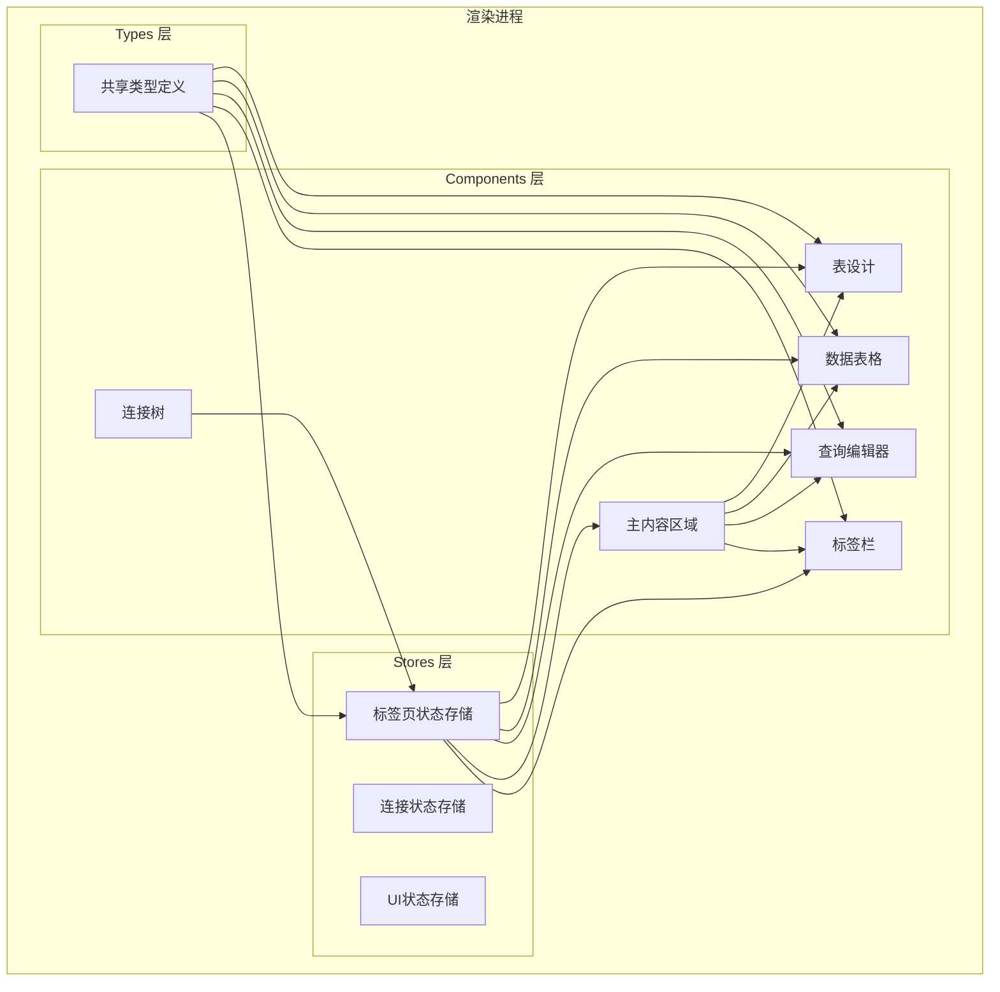
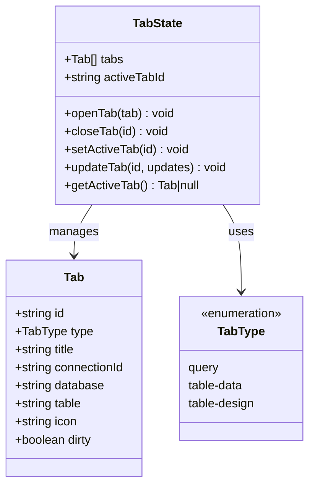
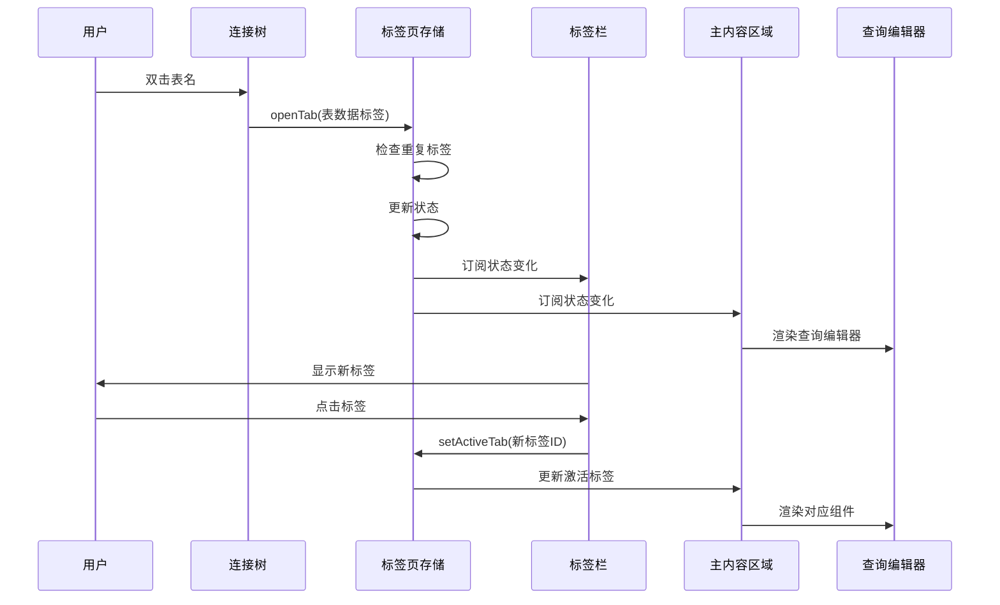
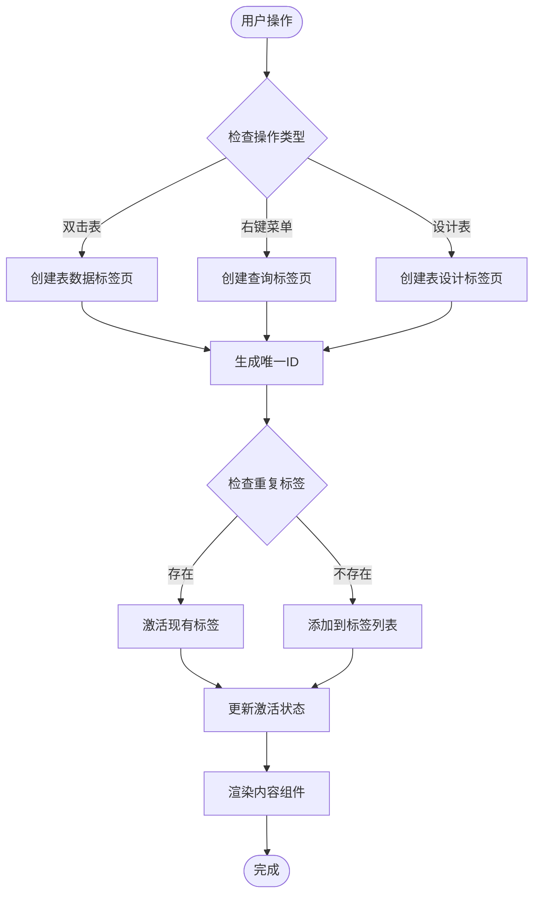
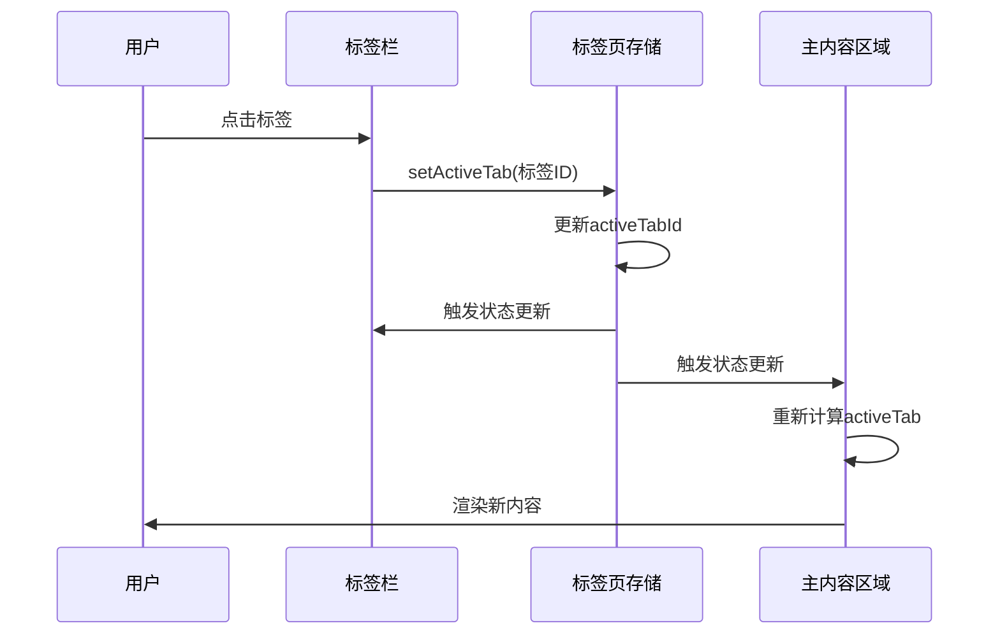
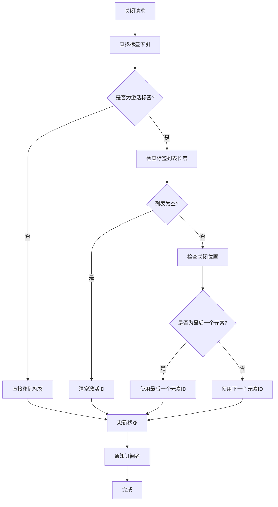
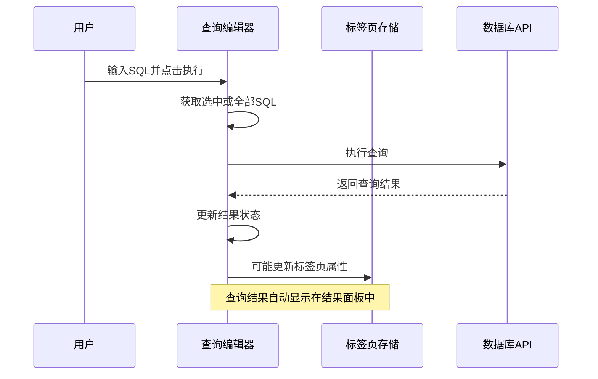
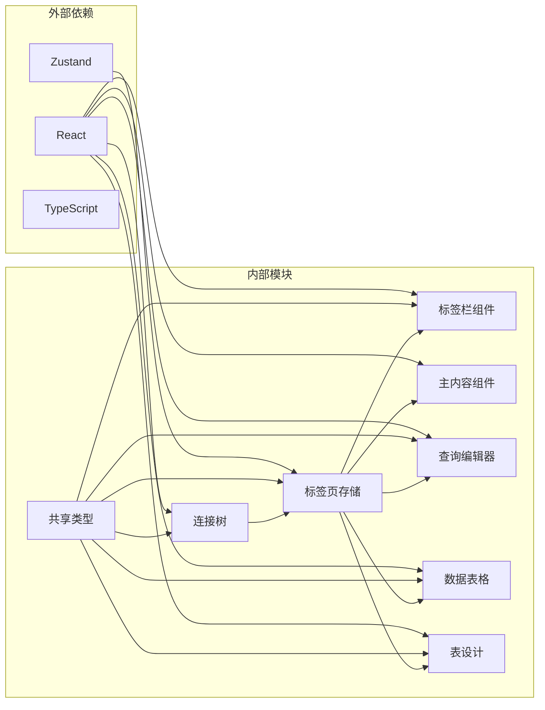

# 标签页状态管理

<cite>
**本文档引用的文件**
- [src/renderer/src/stores/tab.ts](file://src/renderer/src/stores/tab.ts)
- [src/renderer/src/components/TabBar.tsx](file://src/renderer/src/components/TabBar.tsx)
- [src/renderer/src/components/MainContent.tsx](file://src/renderer/src/components/MainContent.tsx)
- [src/renderer/src/components/QueryEditor.tsx](file://src/renderer/src/components/QueryEditor.tsx)
- [src/renderer/src/components/DataTable.tsx](file://src/renderer/src/components/DataTable.tsx)
- [src/renderer/src/components/TableDesign.tsx](file://src/renderer/src/components/TableDesign.tsx)
- [src/renderer/src/components/ConnectionTree.tsx](file://src/renderer/src/components/ConnectionTree.tsx)
- [src/shared/types/index.ts](file://src/shared/types/index.ts)
</cite>

## 目录
1. [简介](#简介)
2. [项目结构](#项目结构)
3. [核心组件](#核心组件)
4. [架构概览](#架构概览)
5. [详细组件分析](#详细组件分析)
6. [依赖分析](#依赖分析)
7. [性能考虑](#性能考虑)
8. [故障排除指南](#故障排除指南)
9. [结论](#结论)

## 简介

标签页状态管理模块是 nexSql 应用程序的核心功能之一，负责管理多标签页工作区的状态。该模块实现了完整的标签页生命周期管理，包括标签页的创建、切换、关闭和更新操作。通过统一的状态管理，用户可以在同一个应用程序中同时处理多个数据库查询、表数据浏览和表结构设计任务。

该模块采用现代前端架构模式，结合 Zustand 状态管理库和 React 组件系统，提供了高效、响应式的标签页管理体验。每个标签页都代表一个独立的工作任务，可以包含不同的内容类型（查询编辑器、数据表格、表设计视图）。

## 项目结构

nexSql 项目采用清晰的分层架构组织，标签页状态管理位于渲染进程的组件层次中：

**图表来源**
- [src/renderer/src/stores/tab.ts:1-65](file://src/renderer/src/stores/tab.ts#L1-L65)
- [src/renderer/src/components/TabBar.tsx:1-53](file://src/renderer/src/components/TabBar.tsx#L1-L53)
- [src/renderer/src/components/MainContent.tsx:1-34](file://src/renderer/src/components/MainContent.tsx#L1-L34)

**章节来源**
- [src/renderer/src/stores/tab.ts:1-65](file://src/renderer/src/stores/tab.ts#L1-L65)
- [src/renderer/src/components/TabBar.tsx:1-53](file://src/renderer/src/components/TabBar.tsx#L1-L53)
- [src/renderer/src/components/MainContent.tsx:1-34](file://src/renderer/src/components/MainContent.tsx#L1-L34)

## 核心组件

### 标签页状态存储（Zustand）

标签页状态存储使用 Zustand 库实现，提供了轻量级但功能强大的状态管理能力。状态存储包含了标签页列表、当前激活的标签页 ID 以及各种操作方法。

#### 状态结构

**图表来源**
- [src/renderer/src/stores/tab.ts:4-13](file://src/renderer/src/stores/tab.ts#L4-L13)
- [src/shared/types/index.ts:114-124](file://src/shared/types/index.ts#L114-L124)

#### 关键操作方法

1. **openTab**: 创建新标签页或激活现有标签页
2. **closeTab**: 关闭指定标签页并处理激活状态切换
3. **setActiveTab**: 设置当前激活的标签页
4. **updateTab**: 更新标签页属性
5. **getActiveTab**: 获取当前激活的标签页

**章节来源**
- [src/renderer/src/stores/tab.ts:15-64](file://src/renderer/src/stores/tab.ts#L15-L64)

### 标签栏组件

标签栏组件负责显示所有打开的标签页，并提供标签页切换和关闭功能。组件根据标签页类型显示不同的图标，并支持悬停时显示关闭按钮。

#### 标签页类型映射

| 标签页类型 | 图标 | 颜色 |
|-----------|------|------|
| query | Terminal | 默认 |
| table-data | Table | 蓝色 |
| table-design | Eye | 紫色 |

**章节来源**
- [src/renderer/src/components/TabBar.tsx:13-19](file://src/renderer/src/components/TabBar.tsx#L13-L19)

### 主内容区域

主内容区域根据当前激活的标签页动态渲染对应的内容组件。当没有激活的标签页时，显示欢迎界面。

**章节来源**
- [src/renderer/src/components/MainContent.tsx:8-33](file://src/renderer/src/components/MainContent.tsx#L8-L33)

## 架构概览

标签页状态管理系统采用分层架构设计，确保了良好的关注点分离和可维护性：

**图表来源**
- [src/renderer/src/components/ConnectionTree.tsx:100-125](file://src/renderer/src/components/ConnectionTree.tsx#L100-L125)
- [src/renderer/src/stores/tab.ts:19-34](file://src/renderer/src/stores/tab.ts#L19-L34)
- [src/renderer/src/components/TabBar.tsx:23-49](file://src/renderer/src/components/TabBar.tsx#L23-L49)

## 详细组件分析

### 标签页创建流程

标签页的创建过程涉及多个组件的协作，从连接树到标签页存储再到内容渲染：

**图表来源**
- [src/renderer/src/components/ConnectionTree.tsx:100-125](file://src/renderer/src/components/ConnectionTree.tsx#L100-L125)
- [src/renderer/src/stores/tab.ts:19-34](file://src/renderer/src/stores/tab.ts#L19-L34)

#### 标签页类型详解

1. **查询标签页 (query)**: 提供 SQL 编辑器，支持查询执行、结果展示和 CSV 导出
2. **表数据标签页 (table-data)**: 显示表的分页数据，支持筛选、排序和刷新
3. **表设计标签页 (table-design)**: 展示表的结构信息，包括字段定义和索引信息

**章节来源**
- [src/shared/types/index.ts:114-124](file://src/shared/types/index.ts#L114-L124)
- [src/renderer/src/components/QueryEditor.tsx:21-64](file://src/renderer/src/components/QueryEditor.tsx#L21-L64)

### 标签页切换机制

标签页切换采用事件驱动的方式，通过 Zustand 的订阅机制实现响应式更新：

**图表来源**
- [src/renderer/src/components/TabBar.tsx:28-33](file://src/renderer/src/components/TabBar.tsx#L28-L33)
- [src/renderer/src/stores/tab.ts:53-53](file://src/renderer/src/stores/tab.ts#L53-L53)

### 标签页关闭流程

标签页关闭需要处理复杂的边界情况，确保用户界面的正确性和用户体验的一致性：

**图表来源**
- [src/renderer/src/stores/tab.ts:36-51](file://src/renderer/src/stores/tab.ts#L36-L51)

**章节来源**
- [src/renderer/src/stores/tab.ts:36-51](file://src/renderer/src/stores/tab.ts#L36-L51)

### 查询执行集成

查询编辑器与标签页状态管理紧密集成，实现了完整的查询生命周期管理：

**图表来源**
- [src/renderer/src/components/QueryEditor.tsx:36-64](file://src/renderer/src/components/QueryEditor.tsx#L36-L64)

**章节来源**
- [src/renderer/src/components/QueryEditor.tsx:36-64](file://src/renderer/src/components/QueryEditor.tsx#L36-L64)

## 依赖分析

标签页状态管理模块的依赖关系相对简单，主要依赖于 Zustand 状态管理和 React 组件系统：

**图表来源**
- [src/renderer/src/stores/tab.ts:1-2](file://src/renderer/src/stores/tab.ts#L1-L2)
- [src/renderer/src/components/TabBar.tsx:1-3](file://src/renderer/src/components/TabBar.tsx#L1-L3)

### 关键依赖关系

1. **Zustand**: 提供轻量级状态管理，替代 Redux 的复杂性
2. **React**: 组件化 UI 架构，支持状态驱动的渲染
3. **共享类型**: 定义了标签页、连接配置等核心数据结构

**章节来源**
- [src/renderer/src/stores/tab.ts:1-2](file://src/renderer/src/stores/tab.ts#L1-L2)
- [src/shared/types/index.ts:114-124](file://src/shared/types/index.ts#L114-L124)

## 性能考虑

标签页状态管理模块在设计时充分考虑了性能优化：

### 状态更新优化

1. **局部状态更新**: 使用 Zustand 的原子状态更新，避免不必要的重渲染
2. **选择性订阅**: 组件只订阅需要的状态部分，减少渲染次数
3. **状态合并**: 批量状态更新，提高性能效率

### 内存管理

1. **标签页缓存**: 仅保持必要的标签页状态，避免内存泄漏
2. **事件清理**: 正确清理事件监听器和定时器
3. **资源释放**: 关闭标签页时释放相关资源

### 渲染优化

1. **条件渲染**: 仅渲染当前激活的标签页内容
2. **虚拟滚动**: 对大量数据使用虚拟滚动技术
3. **懒加载**: 延迟加载非关键资源

## 故障排除指南

### 常见问题及解决方案

#### 标签页无法创建

**症状**: 双击表名或右键菜单无法创建新标签页

**可能原因**:
1. 连接状态异常
2. 标签页存储初始化失败
3. 权限问题

**解决步骤**:
1. 检查连接状态是否正常
2. 查看控制台错误日志
3. 重启应用尝试恢复

#### 标签页切换失效

**症状**: 点击标签页无法切换激活状态

**可能原因**:
1. 状态存储损坏
2. 组件订阅异常
3. 事件冒泡问题

**解决步骤**:
1. 强制刷新页面
2. 检查网络连接
3. 清除应用缓存

#### 标签页关闭异常

**症状**: 关闭标签页后界面卡死或显示异常

**可能原因**:
1. 激活标签页 ID 不一致
2. 状态更新顺序错误
3. 组件卸载时机问题

**解决步骤**:
1. 重新启动应用
2. 检查是否有未保存的更改
3. 查看错误日志

**章节来源**
- [src/renderer/src/stores/tab.ts:36-51](file://src/renderer/src/stores/tab.ts#L36-L51)

## 结论

标签页状态管理模块成功实现了多标签页工作区的核心功能，提供了用户友好的数据库管理体验。通过合理的架构设计和状态管理策略，该模块具备了以下优势：

### 技术优势

1. **简洁高效**: 使用 Zustand 实现轻量级状态管理
2. **类型安全**: 完整的 TypeScript 类型定义
3. **响应式更新**: 自动化的状态变更通知机制
4. **扩展性强**: 支持新的标签页类型和操作

### 用户体验优势

1. **直观的操作**: 符合用户预期的标签页管理方式
2. **快速响应**: 流畅的切换和关闭体验
3. **一致性**: 统一的界面风格和交互模式
4. **可靠性**: 稳定的状态管理和错误处理

### 发展前景

该模块为 nexSql 应用的进一步发展奠定了坚实基础，未来可以考虑的功能增强包括：
- 标签页分组和排序
- 标签页搜索和过滤
- 自定义标签页主题
- 标签页快捷键支持
- 多窗口标签页同步

通过持续的优化和改进，标签页状态管理模块将继续为用户提供优秀的数据库管理体验。