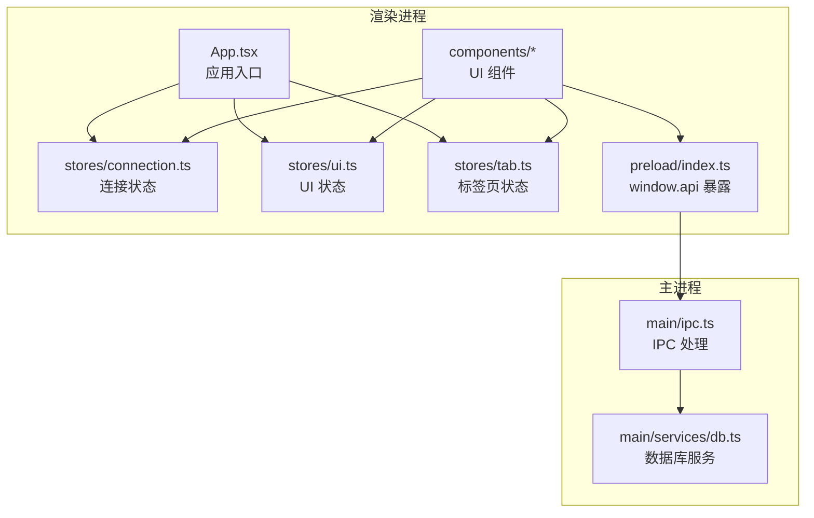
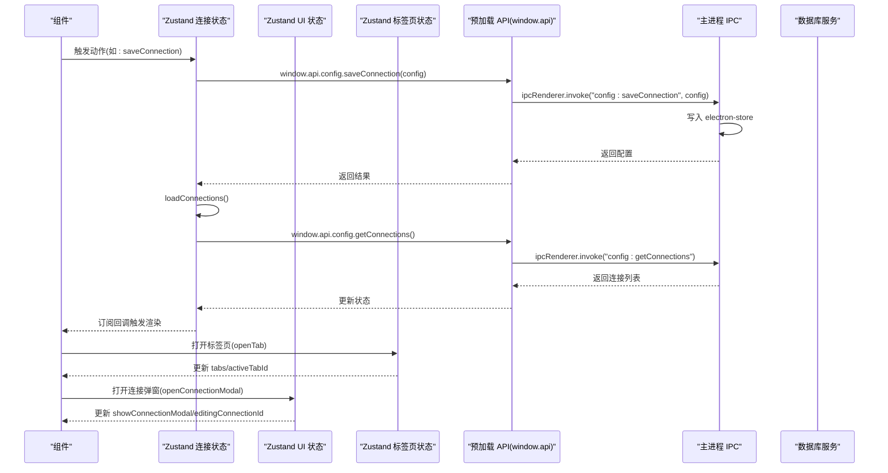
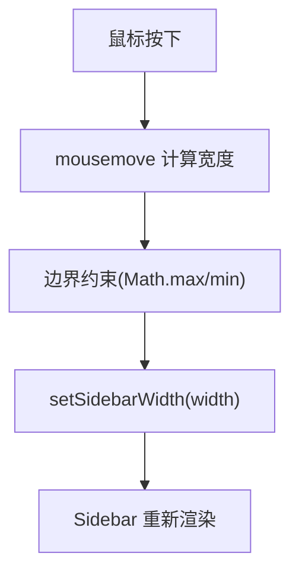
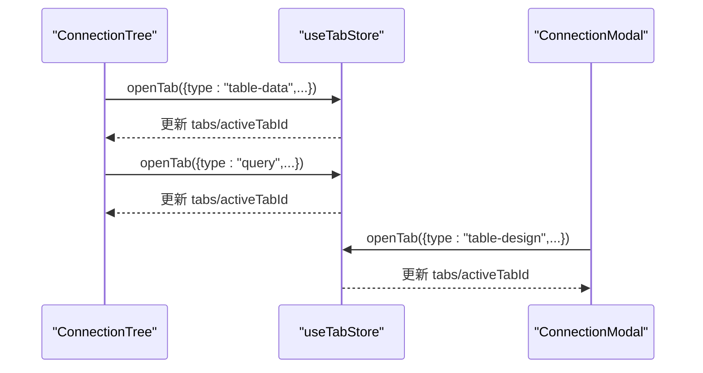
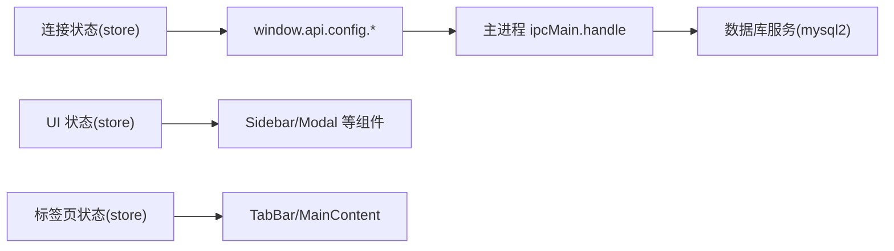

# 状态管理

<cite>
**本文引用的文件**
- [src/renderer/src/stores/connection.ts](file://src/renderer/src/stores/connection.ts)
- [src/renderer/src/stores/ui.ts](file://src/renderer/src/stores/ui.ts)
- [src/renderer/src/stores/tab.ts](file://src/renderer/src/stores/tab.ts)
- [src/main/ipc.ts](file://src/main/ipc.ts)
- [src/preload/index.ts](file://src/preload/index.ts)
- [src/shared/types/index.ts](file://src/shared/types/index.ts)
- [src/renderer/src/App.tsx](file://src/renderer/src/App.tsx)
- [src/renderer/src/components/ConnectionModal.tsx](file://src/renderer/src/components/ConnectionModal.tsx)
- [src/renderer/src/components/TabBar.tsx](file://src/renderer/src/components/TabBar.tsx)
- [src/renderer/src/components/Sidebar.tsx](file://src/renderer/src/components/Sidebar.tsx)
- [src/renderer/src/components/MainContent.tsx](file://src/renderer/src/components/MainContent.tsx)
- [src/renderer/src/components/ConnectionTree.tsx](file://src/renderer/src/components/ConnectionTree.tsx)
- [src/main/services/db.ts](file://src/main/services/db.ts)
- [package.json](file://package.json)
</cite>

## 目录
1. [简介](#简介)
2. [项目结构](#项目结构)
3. [核心组件](#核心组件)
4. [架构总览](#架构总览)
5. [详细组件分析](#详细组件分析)
6. [依赖分析](#依赖分析)
7. [性能考虑](#性能考虑)
8. [故障排查指南](#故障排查指南)
9. [结论](#结论)
10. [附录](#附录)

## 简介
本文件系统性梳理并文档化本项目的状态管理方案，基于 Zustand 实现的多模块状态存储（连接状态、UI 状态、标签页状态），结合 IPC 通信完成与主进程的配置与数据库操作交互。文档覆盖状态的数据结构、更新机制与订阅模式，提供最佳实践、性能优化建议与使用示例路径，帮助开发者快速理解与扩展状态管理。

## 项目结构
状态管理相关代码主要分布在以下位置：
- 渲染进程状态存储：src/renderer/src/stores/*.ts
- 渲染进程组件：src/renderer/src/components/*.tsx
- 预加载层 API 暴露：src/preload/index.ts
- 主进程 IPC 处理与数据库服务：src/main/ipc.ts、src/main/services/db.ts
- 共享类型定义：src/shared/types/index.ts
- 应用入口与初始化：src/renderer/src/App.tsx
- 依赖声明：package.json

图表来源
- [src/renderer/src/App.tsx:1-24](file://src/renderer/src/App.tsx#L1-L24)
- [src/renderer/src/stores/connection.ts:1-64](file://src/renderer/src/stores/connection.ts#L1-L64)
- [src/renderer/src/stores/ui.ts:1-41](file://src/renderer/src/stores/ui.ts#L1-L41)
- [src/renderer/src/stores/tab.ts:1-65](file://src/renderer/src/stores/tab.ts#L1-L65)
- [src/preload/index.ts:1-60](file://src/preload/index.ts#L1-L60)
- [src/main/ipc.ts:1-132](file://src/main/ipc.ts#L1-L132)
- [src/main/services/db.ts:1-277](file://src/main/services/db.ts#L1-L277)

章节来源
- [src/renderer/src/App.tsx:1-24](file://src/renderer/src/App.tsx#L1-L24)
- [package.json:16-26](file://package.json#L16-L26)

## 核心组件
本项目采用 Zustand 将状态按功能域拆分为三个模块：
- 连接状态模块：维护连接配置、连接状态与错误信息、展开状态等，负责与配置存储与数据库服务交互。
- UI 状态模块：维护侧边栏宽度、结果面板高度、连接弹窗显示与上下文菜单等。
- 标签页状态模块：维护打开的标签页集合、当前激活标签页、标签页更新与关闭逻辑。

每个模块均通过 create 函数创建，内部包含状态字段与动作函数，动作函数内使用 set 或 get 访问/更新状态，支持异步操作并通过 window.api 调用主进程能力。

章节来源
- [src/renderer/src/stores/connection.ts:1-64](file://src/renderer/src/stores/connection.ts#L1-L64)
- [src/renderer/src/stores/ui.ts:1-41](file://src/renderer/src/stores/ui.ts#L1-L41)
- [src/renderer/src/stores/tab.ts:1-65](file://src/renderer/src/stores/tab.ts#L1-L65)

## 架构总览
渲染进程通过 window.api 与主进程进行 IPC 通信，主进程处理配置读写与数据库操作，Zustand 状态在渲染进程中响应式更新 UI。

图表来源
- [src/renderer/src/stores/connection.ts:23-31](file://src/renderer/src/stores/connection.ts#L23-L31)
- [src/preload/index.ts:14-23](file://src/preload/index.ts#L14-L23)
- [src/main/ipc.ts:19-34](file://src/main/ipc.ts#L19-L34)
- [src/renderer/src/stores/tab.ts:19-34](file://src/renderer/src/stores/tab.ts#L19-L34)
- [src/renderer/src/stores/ui.ts:35-38](file://src/renderer/src/stores/ui.ts#L35-L38)

## 详细组件分析

### 连接状态模块(connection.ts)
- 数据结构
  - connections: 连接配置数组
  - statuses: 以连接 id 为键的状态映射
  - errors: 以连接 id 为键的错误信息映射
  - expandedConnections: 展开的节点 id 集合(Set)
- 动作函数
  - loadConnections: 从主进程读取连接列表并更新状态
  - saveConnection: 保存连接配置后刷新列表
  - deleteConnection: 删除连接并清理对应状态与展开状态
  - setStatus: 设置连接状态与错误信息
  - toggleExpand: 切换连接或数据库/表节点的展开状态
- 订阅模式
  - 组件通过选择器订阅部分状态，仅在相关状态变化时重渲染
- 异步流程
  - 通过 window.api.config.* 与主进程交互，主进程使用 electron-store 存储配置

图表来源
- [src/renderer/src/stores/connection.ts:28-31](file://src/renderer/src/stores/connection.ts#L28-L31)
- [src/preload/index.ts:19](file://src/preload/index.ts#L19)
- [src/main/ipc.ts:23-34](file://src/main/ipc.ts#L23-L34)

章节来源
- [src/renderer/src/stores/connection.ts:1-64](file://src/renderer/src/stores/connection.ts#L1-L64)
- [src/main/ipc.ts:19-43](file://src/main/ipc.ts#L19-L43)
- [src/preload/index.ts:14-23](file://src/preload/index.ts#L14-L23)

### UI 状态模块(ui.ts)
- 数据结构
  - sidebarWidth: 侧边栏宽度
  - resultPanelHeight: 结果面板高度
  - showConnectionModal: 是否显示连接弹窗
  - editingConnectionId: 当前编辑的连接 id
  - contextMenu: 上下文菜单配置
- 动作函数
  - setSidebarWidth/setResultPanelHeight: 设置尺寸并做边界约束
  - openConnectionModal/closeConnectionModal: 控制弹窗显示与编辑 id
  - setContextMenu: 设置上下文菜单
- 使用场景
  - Sidebar 拖拽调整宽度
  - ConnectionModal 显示/隐藏与编辑

图表来源
- [src/renderer/src/components/Sidebar.tsx:13-31](file://src/renderer/src/components/Sidebar.tsx#L13-L31)
- [src/renderer/src/stores/ui.ts:33-34](file://src/renderer/src/stores/ui.ts#L33-L34)

章节来源
- [src/renderer/src/stores/ui.ts:1-41](file://src/renderer/src/stores/ui.ts#L1-L41)
- [src/renderer/src/components/Sidebar.tsx:1-80](file://src/renderer/src/components/Sidebar.tsx#L1-L80)

### 标签页状态模块(tab.ts)
- 数据结构
  - tabs: 打开的标签页数组
  - activeTabId: 当前激活的标签页 id
- 动作函数
  - openTab: 去重后打开新标签页并设为激活
  - closeTab: 关闭指定标签页并维护激活状态
  - setActiveTab: 切换激活标签页
  - updateTab: 更新指定标签页属性
  - getActiveTab: 获取当前激活标签页
- 使用场景
  - TabBar 渲染标签项与关闭按钮
  - MainContent 根据激活标签页渲染不同内容

图表来源
- [src/renderer/src/components/ConnectionTree.tsx:100-125](file://src/renderer/src/components/ConnectionTree.tsx#L100-L125)
- [src/renderer/src/stores/tab.ts:19-34](file://src/renderer/src/stores/tab.ts#L19-L34)

章节来源
- [src/renderer/src/stores/tab.ts:1-65](file://src/renderer/src/stores/tab.ts#L1-L65)
- [src/renderer/src/components/TabBar.tsx:1-53](file://src/renderer/src/components/TabBar.tsx#L1-L53)
- [src/renderer/src/components/MainContent.tsx:1-34](file://src/renderer/src/components/MainContent.tsx#L1-L34)

### 组件与状态的交互示例
- 应用启动时加载连接列表
  - App.tsx 在首次挂载时调用连接状态的动作加载配置
  - 示例路径: [src/renderer/src/App.tsx:9-13](file://src/renderer/src/App.tsx#L9-L13)
- 连接弹窗保存连接
  - ConnectionModal 调用 saveConnection 并关闭弹窗
  - 示例路径: [src/renderer/src/components/ConnectionModal.tsx:52-65](file://src/renderer/src/components/ConnectionModal.tsx#L52-L65)
- 侧边栏拖拽调整宽度
  - Sidebar 监听全局 mousemove/mouseup，调用 setSidebarWidth
  - 示例路径: [src/renderer/src/components/Sidebar.tsx:13-41](file://src/renderer/src/components/Sidebar.tsx#L13-L41)
- 标签页切换与关闭
  - TabBar 根据状态渲染并调用 setActiveTab/closeTab
  - 示例路径: [src/renderer/src/components/TabBar.tsx:6-49](file://src/renderer/src/components/TabBar.tsx#L6-L49)

章节来源
- [src/renderer/src/App.tsx:1-24](file://src/renderer/src/App.tsx#L1-L24)
- [src/renderer/src/components/ConnectionModal.tsx:1-230](file://src/renderer/src/components/ConnectionModal.tsx#L1-L230)
- [src/renderer/src/components/Sidebar.tsx:1-80](file://src/renderer/src/components/Sidebar.tsx#L1-L80)
- [src/renderer/src/components/TabBar.tsx:1-53](file://src/renderer/src/components/TabBar.tsx#L1-L53)

## 依赖分析
- Zustand 版本与安装
  - 依赖声明中包含 zustand，用于状态管理
  - 示例路径: [package.json:25](file://package.json#L25)
- IPC 通信链路
  - 预加载层暴露统一 API 接口，渲染进程通过 window.api 调用
  - 主进程注册 handle 方法，处理配置与数据库操作
  - 示例路径: [src/preload/index.ts:14-46](file://src/preload/index.ts#L14-L46), [src/main/ipc.ts:16-127](file://src/main/ipc.ts#L16-L127)
- 数据库服务
  - 主进程数据库服务封装 mysql2/promise，提供连接测试、查询、元数据获取等
  - 示例路径: [src/main/services/db.ts:38-135](file://src/main/services/db.ts#L38-L135)

图表来源
- [src/renderer/src/stores/connection.ts:23-31](file://src/renderer/src/stores/connection.ts#L23-L31)
- [src/preload/index.ts:14-46](file://src/preload/index.ts#L14-L46)
- [src/main/ipc.ts:16-127](file://src/main/ipc.ts#L16-L127)
- [src/main/services/db.ts:1-277](file://src/main/services/db.ts#L1-L277)

章节来源
- [package.json:16-26](file://package.json#L16-L26)
- [src/preload/index.ts:1-60](file://src/preload/index.ts#L1-L60)
- [src/main/ipc.ts:1-132](file://src/main/ipc.ts#L1-L132)
- [src/main/services/db.ts:1-277](file://src/main/services/db.ts#L1-L277)

## 性能考虑
- 状态粒度与订阅
  - 使用选择器订阅部分状态，避免无关状态变更导致的重渲染
  - 示例路径: [src/renderer/src/components/TabBar.tsx:6-7](file://src/renderer/src/components/TabBar.tsx#L6-L7)
- 异步操作批处理
  - saveConnection 后统一调用 loadConnections，减少多次请求
  - 示例路径: [src/renderer/src/stores/connection.ts:28-31](file://src/renderer/src/stores/connection.ts#L28-L31)
- 缓存与懒加载
  - ConnectionTree 对节点数据进行缓存，避免重复拉取数据库/表列表
  - 示例路径: [src/renderer/src/components/ConnectionTree.tsx:22-29](file://src/renderer/src/components/ConnectionTree.tsx#L22-L29), [src/renderer/src/components/ConnectionTree.tsx:84-94](file://src/renderer/src/components/ConnectionTree.tsx#L84-L94)
- 边界约束与防抖
  - UI 宽度/高度设置时进行边界约束，避免异常值
  - 示例路径: [src/renderer/src/stores/ui.ts:33-34](file://src/renderer/src/stores/ui.ts#L33-L34)
- 连接池与资源释放
  - 主进程使用连接池管理数据库连接，断开连接时及时释放
  - 示例路径: [src/main/services/db.ts:5-36](file://src/main/services/db.ts#L5-L36), [src/main/services/db.ts:65-71](file://src/main/services/db.ts#L65-L71)

## 故障排查指南
- 连接状态未更新
  - 确认是否调用了 loadConnections 刷新状态
  - 检查 window.api.config.getConnections 的返回值
  - 示例路径: [src/renderer/src/stores/connection.ts:23-26](file://src/renderer/src/stores/connection.ts#L23-L26), [src/preload/index.ts:17-21](file://src/preload/index.ts#L17-L21)
- 无法保存连接
  - 检查主进程 ipcMain.handle('config:saveConnection') 是否正确写入存储
  - 示例路径: [src/main/ipc.ts:23-34](file://src/main/ipc.ts#L23-L34)
- 标签页不显示或无法切换
  - 检查 openTab 是否去重与设置 activeTabId
  - 示例路径: [src/renderer/src/stores/tab.ts:19-34](file://src/renderer/src/stores/tab.ts#L19-L34)
- 上下文菜单不显示
  - 检查 setContextMenu 的调用与 UI 状态 showConnectionModal
  - 示例路径: [src/renderer/src/stores/ui.ts:39](file://src/renderer/src/stores/ui.ts#L39), [src/renderer/src/components/ConnectionTree.tsx:154](file://src/renderer/src/components/ConnectionTree.tsx#L154)
- 数据库操作失败
  - 查看主进程 db.* 的返回结果，确认连接状态与错误信息
  - 示例路径: [src/main/ipc.ts:47-81](file://src/main/ipc.ts#L47-L81), [src/renderer/src/stores/connection.ts:47-51](file://src/renderer/src/stores/connection.ts#L47-L51)

章节来源
- [src/renderer/src/stores/connection.ts:23-51](file://src/renderer/src/stores/connection.ts#L23-L51)
- [src/preload/index.ts:17-21](file://src/preload/index.ts#L17-L21)
- [src/main/ipc.ts:23-81](file://src/main/ipc.ts#L23-L81)
- [src/renderer/src/stores/tab.ts:19-34](file://src/renderer/src/stores/tab.ts#L19-L34)
- [src/renderer/src/stores/ui.ts:39](file://src/renderer/src/stores/ui.ts#L39)
- [src/renderer/src/components/ConnectionTree.tsx:154](file://src/renderer/src/components/ConnectionTree.tsx#L154)

## 结论
本项目以 Zustand 为核心，将状态按领域拆分，配合预加载层与主进程 IPC，实现了配置持久化、数据库连接与元数据查询的完整闭环。通过选择器订阅、缓存与连接池等手段，在保证易用性的同时兼顾了性能与可维护性。后续可在以下方面持续优化：
- 将连接状态与 UI 状态进一步解耦，避免跨模块副作用
- 引入状态持久化插件或本地存储同步策略
- 对高频状态更新进行节流/防抖处理

## 附录
- 共享类型定义
  - 包含连接配置、数据库元数据、查询结果、标签页类型等
  - 示例路径: [src/shared/types/index.ts:1-124](file://src/shared/types/index.ts#L1-L124)
- IPC 通信类型
  - 统一响应结构 IpcResponse，便于错误处理与状态反馈
  - 示例路径: [src/shared/types/index.ts:104-108](file://src/shared/types/index.ts#L104-L108)