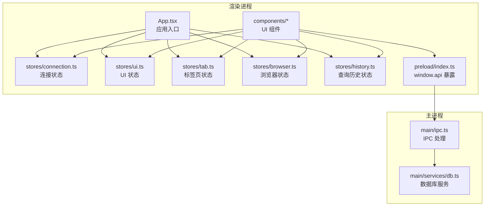
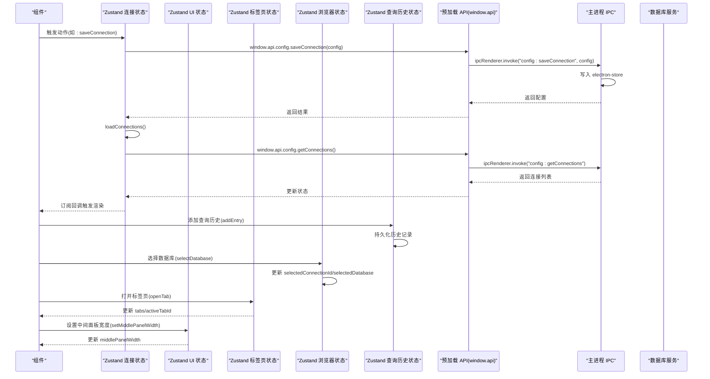
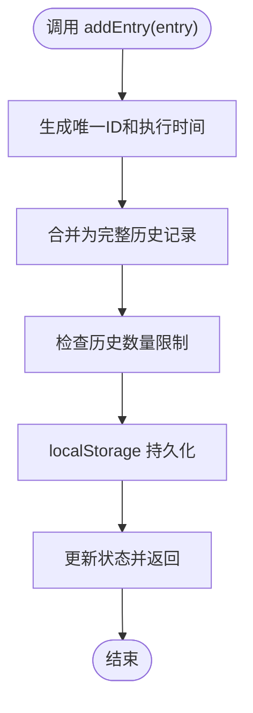
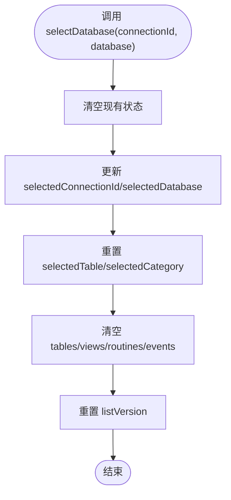
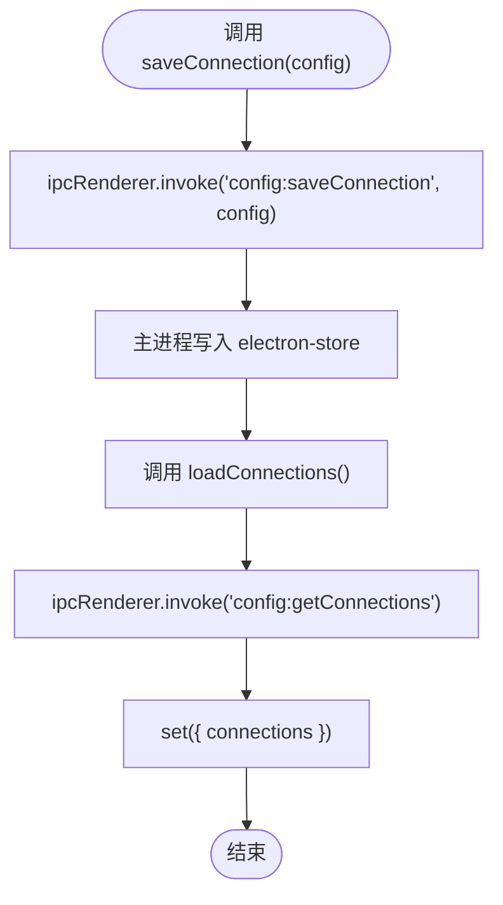
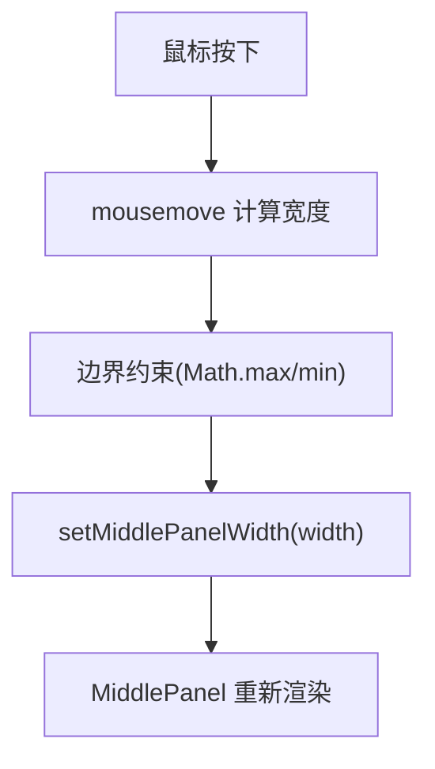
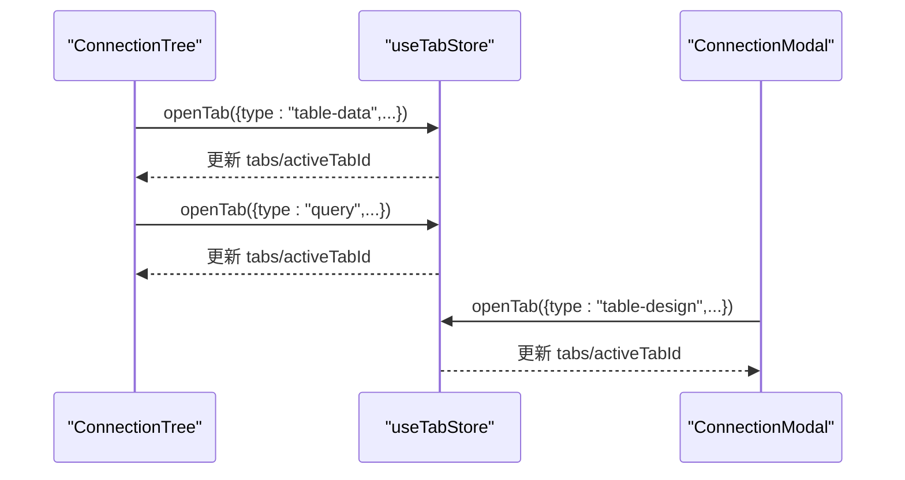
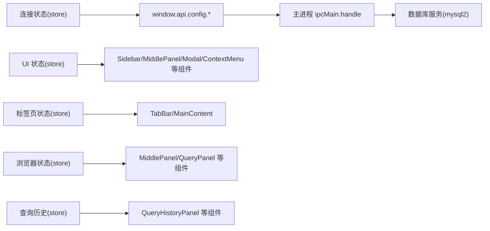

# 状态管理

<cite>
**本文引用的文件**
- [src/renderer/src/stores/browser.ts](file://src/renderer/src/stores/browser.ts)
- [src/renderer/src/stores/connection.ts](file://src/renderer/src/stores/connection.ts)
- [src/renderer/src/stores/ui.ts](file://src/renderer/src/stores/ui.ts)
- [src/renderer/src/stores/tab.ts](file://src/renderer/src/stores/tab.ts)
- [src/renderer/src/stores/history.ts](file://src/renderer/src/stores/history.ts)
- [src/main/ipc.ts](file://src/main/ipc.ts)
- [src/preload/index.ts](file://src/preload/index.ts)
- [src/shared/types/index.ts](file://src/shared/types/index.ts)
- [src/renderer/src/App.tsx](file://src/renderer/src/App.tsx)
- [src/renderer/src/components/ConnectionModal.tsx](file://src/renderer/src/components/ConnectionModal.tsx)
- [src/renderer/src/components/TabBar.tsx](file://src/renderer/src/components/TabBar.tsx)
- [src/renderer/src/components/Sidebar.tsx](file://src/renderer/src/components/Sidebar.tsx)
- [src/renderer/src/components/MainContent.tsx](file://src/renderer/src/components/MainContent.tsx)
- [src/renderer/src/components/ConnectionTree.tsx](file://src/renderer/src/components/ConnectionTree.tsx)
- [src/renderer/src/components/MiddlePanel.tsx](file://src/renderer/src/components/MiddlePanel.tsx)
- [src/renderer/src/components/QueryPanel.tsx](file://src/renderer/src/components/QueryPanel.tsx)
- [src/renderer/src/components/QueryHistoryPanel.tsx](file://src/renderer/src/components/QueryHistoryPanel.tsx)
- [src/renderer/src/components/ContextMenu.tsx](file://src/renderer/src/components/ContextMenu.tsx)
- [src/renderer/src/components/ERDiagramView.tsx](file://src/renderer/src/components/ERDiagramView.tsx)
- [src/renderer/src/components/SnippetPanel.tsx](file://src/renderer/src/components/SnippetPanel.tsx)
- [src/main/services/db.ts](file://src/main/services/db.ts)
- [package.json](file://package.json)
</cite>

## 更新摘要
**变更内容**
- 新增查询历史存储模块，实现查询执行历史的持久化管理
- 新增代码片段管理功能，支持SQL片段的创建、编辑和组织
- 增强UI状态管理，优化上下文菜单和面板宽度控制
- 完善Zustand集成最佳实践，提升状态管理性能和可维护性

## 目录
1. [简介](#简介)
2. [项目结构](#项目结构)
3. [核心组件](#核心组件)
4. [架构总览](#架构总览)
5. [详细组件分析](#详细组件分析)
6. [Zustand集成最佳实践](#zustand集成最佳实践)
7. [依赖分析](#依赖分析)
8. [性能考虑](#性能考虑)
9. [故障排查指南](#故障排查指南)
10. [结论](#结论)
11. [附录](#附录)

## 简介
本文件系统性梳理并文档化本项目的状态管理方案，基于 Zustand 实现的多模块状态存储（连接状态、UI状态、标签页状态、浏览器状态、查询历史状态），结合 IPC 通信完成与主进程的配置与数据库操作交互。文档覆盖状态的数据结构、更新机制与订阅模式，提供最佳实践、性能优化建议与使用示例路径，帮助开发者快速理解与扩展状态管理。

## 项目结构
状态管理相关代码主要分布在以下位置：
- 渲染进程状态存储：src/renderer/src/stores/*.ts
- 渲染进程组件：src/renderer/src/components/*.tsx
- 预加载层 API 暴露：src/preload/index.ts
- 主进程 IPC 处理与数据库服务：src/main/ipc.ts、src/main/services/db.ts
- 共享类型定义：src/shared/types/index.ts
- 应用入口与初始化：src/renderer/src/App.tsx
- 依赖声明：package.json

**图表来源**
- [src/renderer/src/App.tsx:1-24](file://src/renderer/src/App.tsx#L1-L24)
- [src/renderer/src/stores/connection.ts:1-64](file://src/renderer/src/stores/connection.ts#L1-L64)
- [src/renderer/src/stores/ui.ts:1-45](file://src/renderer/src/stores/ui.ts#L1-L45)
- [src/renderer/src/stores/tab.ts:1-99](file://src/renderer/src/stores/tab.ts#L1-L99)
- [src/renderer/src/stores/browser.ts:1-184](file://src/renderer/src/stores/browser.ts#L1-L184)
- [src/renderer/src/stores/history.ts:1-76](file://src/renderer/src/stores/history.ts#L1-L76)
- [src/preload/index.ts:1-60](file://src/preload/index.ts#L1-L60)
- [src/main/ipc.ts:1-132](file://src/main/ipc.ts#L1-L132)
- [src/main/services/db.ts:1-277](file://src/main/services/db.ts#L1-L277)

**章节来源**
- [src/renderer/src/App.tsx:1-24](file://src/renderer/src/App.tsx#L1-L24)
- [package.json:16-28](file://package.json#L16-L28)

## 核心组件
本项目采用 Zustand 将状态按功能域拆分为五个模块：
- 连接状态模块：维护连接配置、连接状态与错误信息、展开状态等，负责与配置存储与数据库服务交互。
- UI 状态模块：维护侧边栏宽度、中间面板宽度、结果面板高度、连接弹窗显示与上下文菜单等。
- 标签页状态模块：维护打开的标签页集合、当前激活标签页、标签页更新与关闭逻辑。
- 浏览器状态模块：维护数据库浏览状态、表/视图/函数/事件列表、查询历史、创建/编辑模式等。
- 查询历史状态模块：维护查询执行历史、搜索过滤、持久化存储等。

每个模块均通过 create 函数创建，内部包含状态字段与动作函数，动作函数内使用 set 或 get 访问/更新状态，支持异步操作并通过 window.api 调用主进程能力。

**章节来源**
- [src/renderer/src/stores/connection.ts:1-64](file://src/renderer/src/stores/connection.ts#L1-L64)
- [src/renderer/src/stores/ui.ts:1-45](file://src/renderer/src/stores/ui.ts#L1-L45)
- [src/renderer/src/stores/tab.ts:1-99](file://src/renderer/src/stores/tab.ts#L1-L99)
- [src/renderer/src/stores/browser.ts:1-184](file://src/renderer/src/stores/browser.ts#L1-L184)
- [src/renderer/src/stores/history.ts:1-76](file://src/renderer/src/stores/history.ts#L1-L76)

## 架构总览
渲染进程通过 window.api 与主进程进行 IPC 通信，主进程处理配置读写与数据库操作，Zustand 状态在渲染进程中响应式更新 UI。

**图表来源**
- [src/renderer/src/stores/connection.ts:28-31](file://src/renderer/src/stores/connection.ts#L28-L31)
- [src/preload/index.ts:14-23](file://src/preload/index.ts#L14-L23)
- [src/main/ipc.ts:19-34](file://src/main/ipc.ts#L19-L34)
- [src/renderer/src/stores/tab.ts:19-34](file://src/renderer/src/stores/tab.ts#L19-L34)
- [src/renderer/src/stores/ui.ts:36-38](file://src/renderer/src/stores/ui.ts#L36-L38)
- [src/renderer/src/stores/browser.ts:94-108](file://src/renderer/src/stores/browser.ts#L94-L108)
- [src/renderer/src/stores/history.ts:40-49](file://src/renderer/src/stores/history.ts#L40-L49)

## 详细组件分析

### 查询历史状态模块(history.ts)
**新增** 本模块专门处理查询执行历史的持久化管理，提供查询历史的存储、检索和过滤功能。

- 数据结构
  - history: 查询历史数组，包含SQL语句、执行时间、连接信息等
  - searchQuery: 历史记录搜索关键词
  - STORAGE_KEY: 本地存储键名
  - MAX_HISTORY: 最大历史记录数量限制
- 动作函数
  - addEntry: 添加新的查询历史记录，自动设置ID和执行时间
  - clearHistory: 清空所有历史记录
  - removeEntry: 删除指定ID的历史记录
  - setSearchQuery: 设置搜索关键词
  - getFilteredHistory: 获取过滤后的历史记录列表
- 特殊功能
  - 使用 localStorage 持久化查询历史
  - 限制最大历史记录数量（200条）
  - 支持SQL内容、数据库名、错误信息的多字段搜索
  - 自动去重和截断机制

**图表来源**
- [src/renderer/src/stores/history.ts:40-49](file://src/renderer/src/stores/history.ts#L40-L49)

**章节来源**
- [src/renderer/src/stores/history.ts:1-76](file://src/renderer/src/stores/history.ts#L1-L76)

### 浏览器状态模块(browser.ts)
**更新** 新增代码片段管理功能，支持SQL片段的创建、编辑和组织。

- 数据结构
  - selectedConnectionId/selectedDatabase/selectedTable：当前选中的连接、数据库和对象
  - selectedCategory：当前浏览的数据库对象类别（tables/views/functions/events/query/snippets）
  - tables/views/routines/events：各类数据库对象的列表
  - listLoading/listVersion：列表加载状态和版本控制
  - isCreating/isEditing：创建/编辑模式状态
  - preferredDetailTab：首选详情标签页
  - savedQueries：保存的查询历史
  - activeQuerySql/selectedQueryId：当前活动查询和选中的查询
  - compareSource：比较源配置
- 动作函数
  - selectDatabase/selectCategory/selectTable：选择数据库对象
  - setActiveQuerySql/selectQuery：管理查询内容和选中状态
  - saveQuery/deleteQuery：保存和删除查询历史
  - setTables/setViews/setRoutines/setEvents：设置各类对象列表
  - setListLoading/refreshList：管理列表加载状态
  - startCreating/stopCreating/startEditing/stopEditing：管理创建/编辑模式
  - setCompareSource：设置比较源
  - clearSelection：清空所有选择状态
- 特殊功能
  - 使用 localStorage 持久化查询历史
  - 支持查询版本控制和刷新机制
  - 集成创建/编辑模式管理
  - 新增代码片段管理功能

**图表来源**
- [src/renderer/src/stores/browser.ts:94-108](file://src/renderer/src/stores/browser.ts#L94-L108)

**章节来源**
- [src/renderer/src/stores/browser.ts:1-184](file://src/renderer/src/stores/browser.ts#L1-L184)

### 连接状态模块(connection.ts)
- 数据结构
  - connections: 连接配置数组
  - statuses: 以连接 id 为键的状态映射
  - errors: 以连接 id 为键的错误信息映射
  - expandedConnections: 展开的节点 id 集合(Set)
- 动作函数
  - loadConnections: 从主进程读取连接列表并更新状态
  - saveConnection: 保存连接配置后刷新列表
  - deleteConnection: 删除连接并清理对应状态与展开状态
  - setStatus: 设置连接状态与错误信息
  - toggleExpand: 切换连接或数据库/表节点的展开状态
- 订阅模式
  - 组件通过选择器订阅部分状态，仅在相关状态变化时重渲染
- 异步流程
  - 通过 window.api.config.* 与主进程交互，主进程使用 electron-store 存储配置

**图表来源**
- [src/renderer/src/stores/connection.ts:28-31](file://src/renderer/src/stores/connection.ts#L28-L31)
- [src/preload/index.ts:19](file://src/preload/index.ts#L19)
- [src/main/ipc.ts:23-34](file://src/main/ipc.ts#L23-L34)

**章节来源**
- [src/renderer/src/stores/connection.ts:1-64](file://src/renderer/src/stores/connection.ts#L1-L64)
- [src/main/ipc.ts:19-43](file://src/main/ipc.ts#L19-L43)
- [src/preload/index.ts:14-23](file://src/preload/index.ts#L14-L23)

### UI 状态模块(ui.ts)
**更新** 增强上下文菜单功能，优化面板宽度控制范围。

- 数据结构
  - sidebarWidth: 侧边栏宽度
  - middlePanelWidth: 中间面板宽度（范围：200-500px）
  - resultPanelHeight: 结果面板高度（范围：100-600px）
  - showConnectionModal: 是否显示连接弹窗
  - editingConnectionId: 当前编辑的连接 id
  - contextMenu: 上下文菜单配置
- 动作函数
  - setSidebarWidth/setMiddlePanelWidth/setResultPanelHeight: 设置尺寸并做边界约束
  - openConnectionModal/closeConnectionModal: 控制弹窗显示与编辑 id
  - setContextMenu: 设置上下文菜单
- 使用场景
  - Sidebar 拖拽调整宽度
  - ConnectionModal 显示/隐藏与编辑
  - MiddlePanel 拖拽调整宽度
  - ContextMenu 组件显示右键菜单

**图表来源**
- [src/renderer/src/components/Sidebar.tsx:13-31](file://src/renderer/src/components/Sidebar.tsx#L13-L31)
- [src/renderer/src/stores/ui.ts:36-38](file://src/renderer/src/stores/ui.ts#L36-L38)

**章节来源**
- [src/renderer/src/stores/ui.ts:1-45](file://src/renderer/src/stores/ui.ts#L1-L45)
- [src/renderer/src/components/Sidebar.tsx:1-80](file://src/renderer/src/components/Sidebar.tsx#L1-L80)
- [src/renderer/src/components/ContextMenu.tsx:1-79](file://src/renderer/src/components/ContextMenu.tsx#L1-L79)

### 标签页状态模块(tab.ts)
**更新** 优化标签页持久化策略，仅保存查询标签页。

- 数据结构
  - tabs: 打开的标签页数组（仅持久化查询标签）
  - activeTabId: 当前激活的标签页 id
- 动作函数
  - openTab: 去重后打开新标签页并设为激活
  - closeTab: 关闭指定标签页并维护激活状态
  - setActiveTab: 切换激活标签页
  - updateTab: 更新指定标签页属性
  - getActiveTab: 获取当前激活标签页
  - reorderTabs: 重新排序标签页
- 持久化策略
  - 仅持久化类型为 'query' 的标签页
  - 避免持久化 table-data / table-design 等临时标签页
- 使用场景
  - TabBar 渲染标签项与关闭按钮
  - MainContent 根据激活标签页渲染不同内容

**图表来源**
- [src/renderer/src/components/ConnectionTree.tsx:100-125](file://src/renderer/src/components/ConnectionTree.tsx#L100-L125)
- [src/renderer/src/stores/tab.ts:19-34](file://src/renderer/src/stores/tab.ts#L19-L34)

**章节来源**
- [src/renderer/src/stores/tab.ts:1-99](file://src/renderer/src/stores/tab.ts#L1-L99)
- [src/renderer/src/components/TabBar.tsx:1-53](file://src/renderer/src/components/TabBar.tsx#L1-L53)
- [src/renderer/src/components/MainContent.tsx:1-34](file://src/renderer/src/components/MainContent.tsx#L1-L34)

### 组件与状态的交互示例
- 应用启动时加载连接列表
  - App.tsx 在首次挂载时调用连接状态的动作加载配置
  - 示例路径: [src/renderer/src/App.tsx:9-13](file://src/renderer/src/App.tsx#L9-L13)
- 连接弹窗保存连接
  - ConnectionModal 调用 saveConnection 并关闭弹窗
  - 示例路径: [src/renderer/src/components/ConnectionModal.tsx:52-65](file://src/renderer/src/components/ConnectionModal.tsx#L52-L65)
- 侧边栏拖拽调整宽度
  - Sidebar 监听全局 mousemove/mouseup，调用 setSidebarWidth
  - 示例路径: [src/renderer/src/components/Sidebar.tsx:13-41](file://src/renderer/src/components/Sidebar.tsx#L13-L41)
- 中间面板拖拽调整宽度
  - MiddlePanel 监听全局 mousemove/mouseup，调用 setMiddlePanelWidth
  - 示例路径: [src/renderer/src/components/MiddlePanel.tsx:52-59](file://src/renderer/src/components/MiddlePanel.tsx#L52-L59)
- 标签页切换与关闭
  - TabBar 根据状态渲染并调用 setActiveTab/closeTab
  - 示例路径: [src/renderer/src/components/TabBar.tsx:6-49](file://src/renderer/src/components/TabBar.tsx#L6-L49)
- 数据库浏览状态管理
  - MiddlePanel 使用 browser store 管理数据库对象列表
  - 示例路径: [src/renderer/src/components/MiddlePanel.tsx:49-59](file://src/renderer/src/components/MiddlePanel.tsx#L49-L59)
- 查询面板状态管理
  - QueryPanel 使用 browser store 管理查询历史和SQL内容
  - 示例路径: [src/renderer/src/components/QueryPanel.tsx:38-45](file://src/renderer/src/components/QueryPanel.tsx#L38-L45)
- 查询历史面板管理
  - QueryHistoryPanel 使用 history store 管理查询历史显示
  - 示例路径: [src/renderer/src/components/QueryHistoryPanel.tsx:31-33](file://src/renderer/src/components/QueryHistoryPanel.tsx#L31-L33)
- 上下文菜单显示
  - ContextMenu 组件使用 ui store 管理菜单显示
  - 示例路径: [src/renderer/src/components/ContextMenu.tsx:4-7](file://src/renderer/src/components/ContextMenu.tsx#L4-L7)

**章节来源**
- [src/renderer/src/App.tsx:1-24](file://src/renderer/src/App.tsx#L1-L24)
- [src/renderer/src/components/ConnectionModal.tsx:1-230](file://src/renderer/src/components/ConnectionModal.tsx#L1-L230)
- [src/renderer/src/components/Sidebar.tsx:1-80](file://src/renderer/src/components/Sidebar.tsx#L1-L80)
- [src/renderer/src/components/MiddlePanel.tsx:1-248](file://src/renderer/src/components/MiddlePanel.tsx#L1-L248)
- [src/renderer/src/components/TabBar.tsx:1-53](file://src/renderer/src/components/TabBar.tsx#L1-L53)
- [src/renderer/src/components/QueryPanel.tsx:1-567](file://src/renderer/src/components/QueryPanel.tsx#L1-L567)
- [src/renderer/src/components/QueryHistoryPanel.tsx:1-182](file://src/renderer/src/components/QueryHistoryPanel.tsx#L1-L182)
- [src/renderer/src/components/ContextMenu.tsx:1-79](file://src/renderer/src/components/ContextMenu.tsx#L1-L79)

## Zustand集成最佳实践
**更新** 增强Zustand集成最佳实践，涵盖新增功能和性能优化。

### 状态模块设计原则
- **单一职责**：每个store只负责一个功能域的状态管理
- **类型安全**：使用TypeScript接口确保状态结构的完整性
- **动作分离**：将状态更新逻辑封装在actions中，避免直接修改状态
- **异步处理**：通过actions处理异步操作，保持状态同步
- **持久化策略**：合理选择localStorage、electron-store等持久化方案

### 状态选择器模式
- 使用选择器函数订阅部分状态，避免不必要的重渲染
- 示例：`useConnectionStore((s) => s.connections)`
- 优化性能：使用useMemo缓存复杂计算结果

### 状态持久化策略
- **localStorage持久化**：用于查询历史、标签页、代码片段等轻量级数据
- **electron-store持久化**：用于连接配置等重要数据
- **内存状态**：用于临时状态和UI状态
- **智能持久化**：仅持久化必要的状态，避免存储过多数据

### 性能优化技巧
- **状态分片**：将大状态分解为小的独立store
- **选择器缓存**：使用useMemo缓存复杂的计算结果
- **批量更新**：使用单个set调用更新多个状态字段
- **边界约束**：对用户可调整的数值进行边界限制
- **防抖节流**：对高频状态更新进行防抖处理

### 错误处理模式
- 在actions中集中处理错误
- 提供默认值和降级策略
- 使用try-catch包装异步操作
- 实现状态回滚机制

### 新增功能集成
- **查询历史管理**：实现查询执行历史的持久化和搜索
- **代码片段管理**：支持SQL片段的创建、编辑和组织
- **上下文菜单优化**：增强右键菜单的交互体验
- **标签页持久化优化**：智能过滤不需要持久化的标签页

## 依赖分析
- Zustand 版本与安装
  - 依赖声明中包含 zustand@^4.5.2，用于状态管理
  - 示例路径: [package.json:27](file://package.json#L27)
- IPC 通信链路
  - 预加载层暴露统一 API 接口，渲染进程通过 window.api 调用
  - 主进程注册 handle 方法，处理配置与数据库操作
  - 示例路径: [src/preload/index.ts:14-46](file://src/preload/index.ts#L14-L46), [src/main/ipc.ts:16-127](file://src/main/ipc.ts#L16-L127)
- 数据库服务
  - 主进程数据库服务封装 mysql2/promise，提供连接测试、查询、元数据获取等
  - 示例路径: [src/main/services/db.ts:38-135](file://src/main/services/db.ts#L38-L135)

**图表来源**
- [src/renderer/src/stores/connection.ts:23-31](file://src/renderer/src/stores/connection.ts#L23-L31)
- [src/preload/index.ts:14-46](file://src/preload/index.ts#L14-L46)
- [src/main/ipc.ts:16-127](file://src/main/ipc.ts#L16-L127)
- [src/main/services/db.ts:1-277](file://src/main/services/db.ts#L1-L277)

**章节来源**
- [package.json:16-28](file://package.json#L16-L28)
- [src/preload/index.ts:1-60](file://src/preload/index.ts#L1-L60)
- [src/main/ipc.ts:1-132](file://src/main/ipc.ts#L1-L132)
- [src/main/services/db.ts:1-277](file://src/main/services/db.ts#L1-L277)

## 性能考虑
- 状态粒度与订阅
  - 使用选择器订阅部分状态，避免无关状态变更导致的重渲染
  - 示例路径: [src/renderer/src/components/TabBar.tsx:6-7](file://src/renderer/src/components/TabBar.tsx#L6-L7)
- 异步操作批处理
  - saveConnection 后统一调用 loadConnections，减少多次请求
  - 示例路径: [src/renderer/src/stores/connection.ts:28-31](file://src/renderer/src/stores/connection.ts#L28-L31)
- 缓存与懒加载
  - ConnectionTree 对节点数据进行缓存，避免重复拉取数据库/表列表
  - QueryPanel 对表字段进行缓存，避免重复查询
  - 示例路径: [src/renderer/src/components/ConnectionTree.tsx:22-29](file://src/renderer/src/components/ConnectionTree.tsx#L22-L29), [src/renderer/src/components/ConnectionTree.tsx:84-94](file://src/renderer/src/components/ConnectionTree.tsx#L84-L94), [src/renderer/src/components/QueryPanel.tsx:65-87](file://src/renderer/src/components/QueryPanel.tsx#L65-L87)
- 边界约束与防抖
  - UI 宽度/高度设置时进行边界约束，避免异常值
  - 查询历史数量限制，防止内存泄漏
  - 示例路径: [src/renderer/src/stores/ui.ts:36-38](file://src/renderer/src/stores/ui.ts#L36-L38), [src/renderer/src/stores/history.ts:5](file://src/renderer/src/stores/history.ts#L5)
- 连接池与资源释放
  - 主进程使用连接池管理数据库连接，断开连接时及时释放
  - 示例路径: [src/main/services/db.ts:5-36](file://src/main/services/db.ts#L5-L36), [src/main/services/db.ts:65-71](file://src/main/services/db.ts#L65-L71)
- 智能持久化
  - 仅持久化必要的状态，避免存储过多数据
  - 标签页持久化仅保存查询标签，其他类型标签不持久化
  - 查询历史限制最大数量，防止无限增长
  - 示例路径: [src/renderer/src/stores/tab.ts:16-22](file://src/renderer/src/stores/tab.ts#L16-L22), [src/renderer/src/stores/history.ts:4](file://src/renderer/src/stores/history.ts#L4)

## 故障排查指南
- 连接状态未更新
  - 确认是否调用了 loadConnections 刷新状态
  - 检查 window.api.config.getConnections 的返回值
  - 示例路径: [src/renderer/src/stores/connection.ts:23-26](file://src/renderer/src/stores/connection.ts#L23-L26), [src/preload/index.ts:17-21](file://src/preload/index.ts#L17-L21)
- 无法保存连接
  - 检查主进程 ipcMain.handle('config:saveConnection') 是否正确写入存储
  - 示例路径: [src/main/ipc.ts:23-34](file://src/main/ipc.ts#L23-L34)
- 标签页不显示或无法切换
  - 检查 openTab 是否去重与设置 activeTabId
  - 确认标签页持久化策略是否正确过滤类型
  - 示例路径: [src/renderer/src/stores/tab.ts:19-34](file://src/renderer/src/stores/tab.ts#L19-L34), [src/renderer/src/stores/tab.ts:16-22](file://src/renderer/src/stores/tab.ts#L16-L22)
- 上下文菜单不显示
  - 检查 setContextMenu 的调用与 UI 状态 showConnectionModal
  - 确认菜单定位计算是否超出窗口边界
  - 示例路径: [src/renderer/src/stores/ui.ts:43](file://src/renderer/src/stores/ui.ts#L43), [src/renderer/src/components/ConnectionTree.tsx:154](file://src/renderer/src/components/ConnectionTree.tsx#L154), [src/renderer/src/components/ContextMenu.tsx:38-48](file://src/renderer/src/components/ContextMenu.tsx#L38-L48)
- 数据库操作失败
  - 查看主进程 db.* 的返回结果，确认连接状态与错误信息
  - 示例路径: [src/main/ipc.ts:47-81](file://src/main/ipc.ts#L47-L81), [src/renderer/src/stores/connection.ts:47-51](file://src/renderer/src/stores/connection.ts#L47-L51)
- 浏览器状态异常
  - 检查 browser store 的 actions 是否正确调用
  - 确认 selectedConnectionId/selectedDatabase 是否正确设置
  - 示例路径: [src/renderer/src/stores/browser.ts:94-108](file://src/renderer/src/stores/browser.ts#L94-L108)
- 查询历史丢失
  - 检查 localStorage 中的存储键值
  - 确认 saveQuery/deleteQuery 是否正常执行
  - 验证查询历史数量限制是否过早截断
  - 示例路径: [src/renderer/src/stores/browser.ts:19-35](file://src/renderer/src/stores/browser.ts#L19-L35), [src/renderer/src/stores/browser.ts:125-145](file://src/renderer/src/stores/browser.ts#L125-L145), [src/renderer/src/stores/history.ts:4](file://src/renderer/src/stores/history.ts#L4)
- 查询历史面板显示异常
  - 检查 getFilteredHistory 的搜索逻辑
  - 确认历史记录格式是否正确
  - 示例路径: [src/renderer/src/components/QueryHistoryPanel.tsx:32](file://src/renderer/src/components/QueryHistoryPanel.tsx#L32), [src/renderer/src/stores/history.ts:64-74](file://src/renderer/src/stores/history.ts#L64-L74)

**章节来源**
- [src/renderer/src/stores/connection.ts:23-51](file://src/renderer/src/stores/connection.ts#L23-L51)
- [src/preload/index.ts:17-21](file://src/preload/index.ts#L17-L21)
- [src/main/ipc.ts:23-81](file://src/main/ipc.ts#L23-L81)
- [src/renderer/src/stores/tab.ts:19-34](file://src/renderer/src/stores/tab.ts#L19-L34)
- [src/renderer/src/stores/ui.ts:43](file://src/renderer/src/stores/ui.ts#L43)
- [src/renderer/src/components/ConnectionTree.tsx:154](file://src/renderer/src/components/ConnectionTree.tsx#L154)
- [src/renderer/src/stores/browser.ts:94-145](file://src/renderer/src/stores/browser.ts#L94-L145)
- [src/renderer/src/stores/history.ts:4](file://src/renderer/src/stores/history.ts#L4)
- [src/renderer/src/components/QueryHistoryPanel.tsx:32](file://src/renderer/src/components/QueryHistoryPanel.tsx#L32)
- [src/renderer/src/stores/history.ts:64-74](file://src/renderer/src/stores/history.ts#L64-L74)

## 结论
本项目以 Zustand 为核心，将状态按领域拆分，配合预加载层与主进程 IPC，实现了配置持久化、数据库连接与元数据查询的完整闭环。通过选择器订阅、缓存与连接池等手段，在保证易用性的同时兼顾了性能与可维护性。

**新增的查询历史存储模块** 为查询执行提供了完整的生命周期管理，支持历史记录的持久化、搜索和过滤，提升了用户体验。

**增强的代码片段管理功能** 为SQL开发提供了便捷的片段管理能力，支持片段的创建、编辑、分类和复用。

**优化的UI状态管理** 通过边界约束、智能持久化和性能优化，提升了界面交互的流畅性和稳定性。

**Zustand集成最佳实践** 为复杂状态管理需求提供了指导原则，包括状态模块设计、性能优化、错误处理等方面，有助于构建可扩展的状态管理系统。

后续可在以下方面持续优化：
- 进一步优化状态持久化策略，实现增量更新
- 增加状态快照和撤销重做功能
- 实现状态热重载和调试工具集成
- 扩展查询历史的统计分析功能
- 优化代码片段的智能提示和模板功能

## 附录
- 共享类型定义
  - 包含连接配置、数据库元数据、查询结果、标签页类型等
  - 新增 DbCategory、DetailTab、SavedQuery、QueryHistory 等类型
  - 示例路径: [src/shared/types/index.ts:1-204](file://src/shared/types/index.ts#L1-L204)
- IPC 通信类型
  - 统一响应结构 IpcResponse，便于错误处理与状态反馈
  - 示例路径: [src/shared/types/index.ts:183-187](file://src/shared/types/index.ts#L183-L187)
- Zustand 版本信息
  - 项目使用 zustand@^4.5.2，支持最新特性
  - 示例路径: [package.json:27](file://package.json#L27)
- 新增功能说明
  - 查询历史模块：实现查询执行历史的持久化管理
  - 代码片段模块：支持SQL片段的创建、编辑和组织
  - 上下文菜单优化：增强右键菜单的交互体验
  - 标签页持久化优化：智能过滤不需要持久化的标签页