# 连接状态管理

<cite>
**本文档引用的文件**
- [connection.ts](file://src/renderer/src/stores/connection.ts)
- [db.ts](file://src/main/services/db.ts)
- [index.ts](file://src/preload/index.ts)
- [ipc.ts](file://src/main/ipc.ts)
- [index.ts](file://src/shared/types/index.ts)
- [ConnectionTree.tsx](file://src/renderer/src/components/ConnectionTree.tsx)
- [ConnectionModal.tsx](file://src/renderer/src/components/ConnectionModal.tsx)
- [ui.ts](file://src/renderer/src/stores/ui.ts)
- [App.tsx](file://src/renderer/src/App.tsx)
</cite>

## 目录
1. [简介](#简介)
2. [项目结构](#项目结构)
3. [核心组件](#核心组件)
4. [架构概览](#架构概览)
5. [详细组件分析](#详细组件分析)
6. [依赖关系分析](#依赖关系分析)
7. [性能考虑](#性能考虑)
8. [故障排除指南](#故障排除指南)
9. [结论](#结论)

## 简介

连接状态管理模块是 nexSql 应用程序的核心状态管理系统，负责管理数据库连接配置、连接状态跟踪以及用户界面的状态更新。该模块采用 Zustand 状态管理库实现，通过 Electron 的 IPC 通信机制与主进程进行数据交换，实现了完整的连接生命周期管理功能。

## 项目结构

连接状态管理模块主要分布在以下文件中：

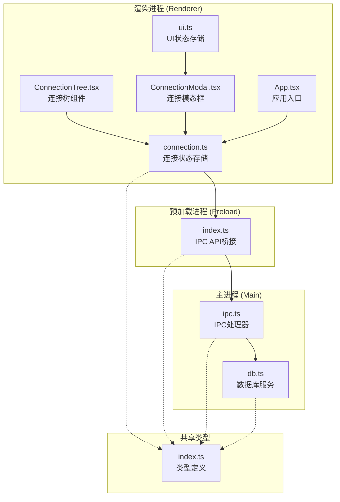

**图表来源**
- [connection.ts:1-64](file://src/renderer/src/stores/connection.ts#L1-L64)
- [index.ts:1-60](file://src/preload/index.ts#L1-L60)
- [ipc.ts:1-132](file://src/main/ipc.ts#L1-L132)
- [db.ts:1-277](file://src/main/services/db.ts#L1-L277)

**章节来源**
- [connection.ts:1-64](file://src/renderer/src/stores/connection.ts#L1-L64)
- [index.ts:1-60](file://src/preload/index.ts#L1-L60)
- [ipc.ts:1-132](file://src/main/ipc.ts#L1-L132)

## 核心组件

连接状态管理模块包含以下核心组件：

### 状态存储接口定义

连接状态存储使用 TypeScript 接口定义了完整的状态结构：

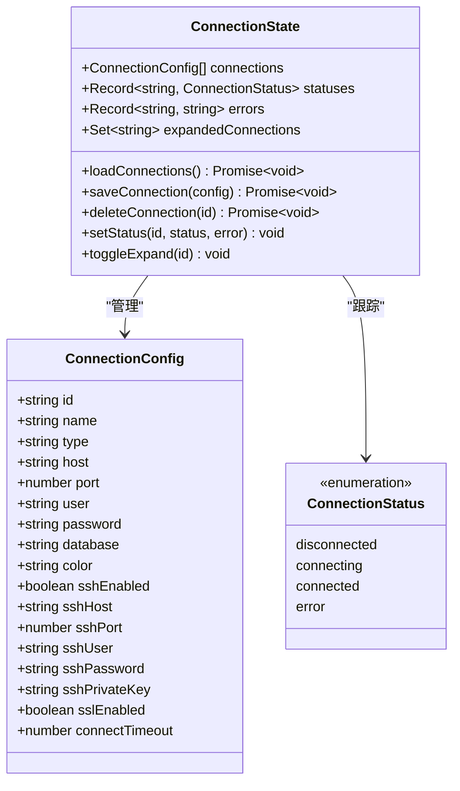

**图表来源**
- [connection.ts:4-15](file://src/renderer/src/stores/connection.ts#L4-L15)
- [index.ts:3-22](file://src/shared/types/index.ts#L3-L22)
- [index.ts:24](file://src/shared/types/index.ts#L24)

### 数据结构详解

连接状态管理模块维护以下关键数据结构：

1. **connections 数组**: 存储所有连接配置对象
2. **statuses 记录**: 以连接 ID 为键的状态映射
3. **errors 记录**: 以连接 ID 为键的错误信息映射
4. **expandedConnections 集合**: 跟踪展开状态的连接 ID

**章节来源**
- [connection.ts:4-21](file://src/renderer/src/stores/connection.ts#L4-L21)
- [index.ts:3-22](file://src/shared/types/index.ts#L3-L22)

## 架构概览

连接状态管理采用分层架构设计，实现了清晰的职责分离：

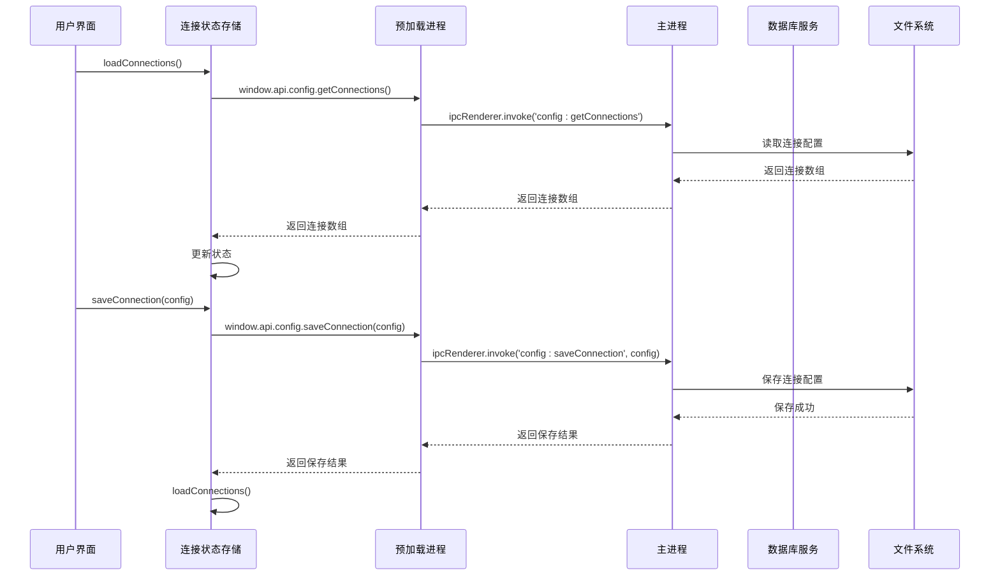

**图表来源**
- [connection.ts:23-31](file://src/renderer/src/stores/connection.ts#L23-L31)
- [index.ts:17-23](file://src/preload/index.ts#L17-L23)
- [ipc.ts:19-34](file://src/main/ipc.ts#L19-L34)

## 详细组件分析

### 连接状态存储实现

连接状态存储使用 Zustand 实现，提供了完整的 CRUD 操作和状态管理功能：

#### 状态初始化

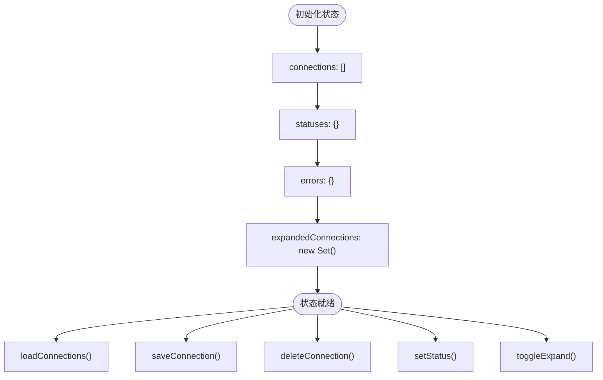

**图表来源**
- [connection.ts:17-21](file://src/renderer/src/stores/connection.ts#L17-L21)

#### 动作函数实现

##### loadConnections 函数

`loadConnections` 函数负责从持久化存储中加载连接配置：

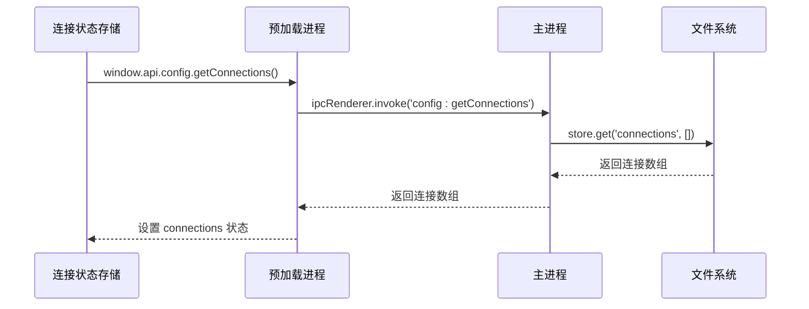

**图表来源**
- [connection.ts:23-26](file://src/renderer/src/stores/connection.ts#L23-L26)
- [ipc.ts:19-21](file://src/main/ipc.ts#L19-L21)

##### saveConnection 函数

`saveConnection` 函数实现了连接配置的保存和更新：

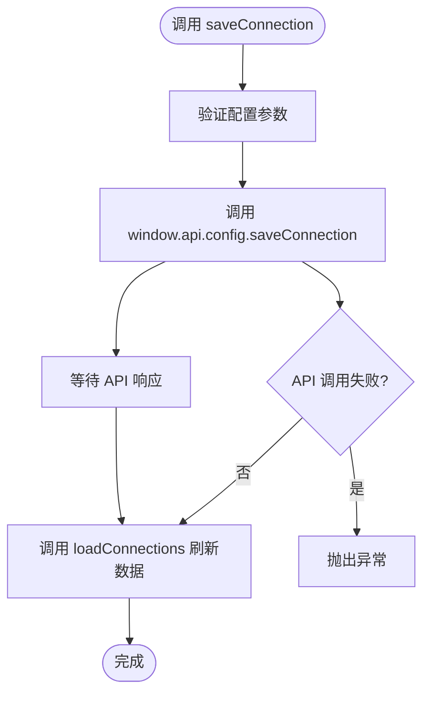

**图表来源**
- [connection.ts:28-31](file://src/renderer/src/stores/connection.ts#L28-L31)
- [index.ts:19](file://src/preload/index.ts#L19)

##### deleteConnection 函数

`deleteConnection` 函数负责删除连接配置并清理相关状态：

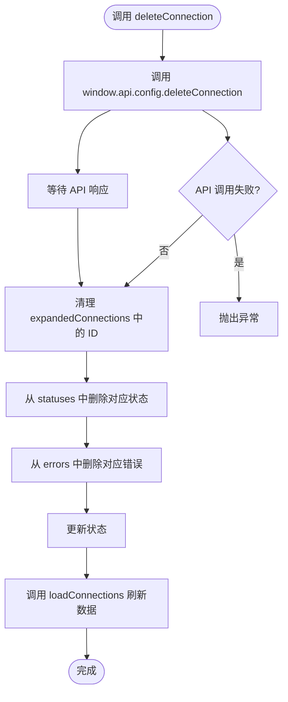

**图表来源**
- [connection.ts:33-45](file://src/renderer/src/stores/connection.ts#L33-L45)
- [ipc.ts:36-43](file://src/main/ipc.ts#L36-L43)

##### setStatus 函数

`setStatus` 函数用于更新连接状态和错误信息：

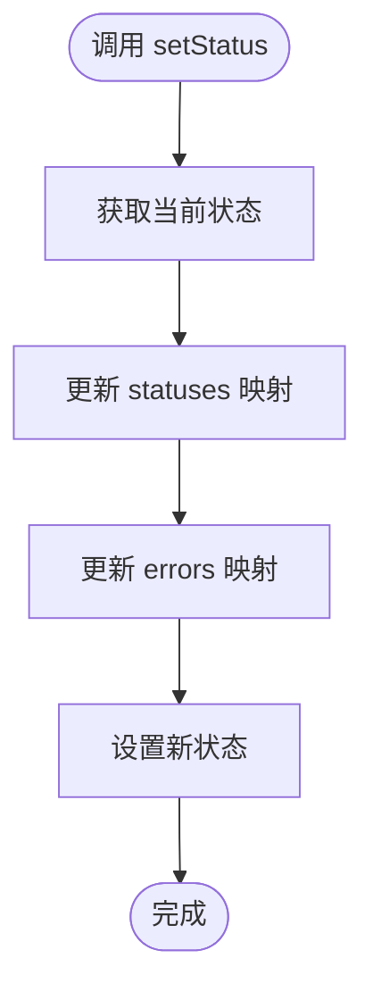

**图表来源**
- [connection.ts:47-51](file://src/renderer/src/stores/connection.ts#L47-L51)

##### toggleExpand 函数

`toggleExpand` 函数控制连接树的展开/折叠状态：

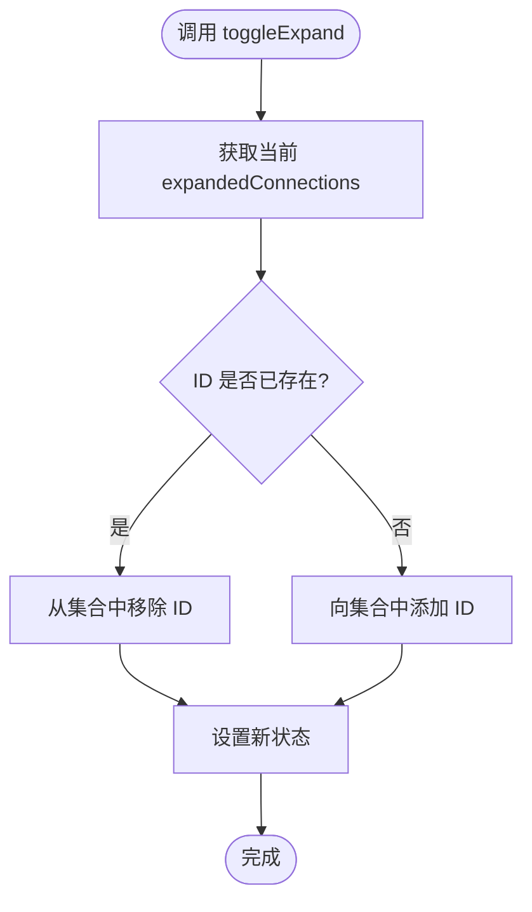

**图表来源**
- [connection.ts:53-62](file://src/renderer/src/stores/connection.ts#L53-L62)

**章节来源**
- [connection.ts:17-63](file://src/renderer/src/stores/connection.ts#L17-L63)

### IPC 通信集成

连接状态管理模块通过预加载进程实现了与主进程的 IPC 通信：

#### 预加载进程 API 定义

预加载进程提供了统一的 API 接口，封装了所有 IPC 调用：

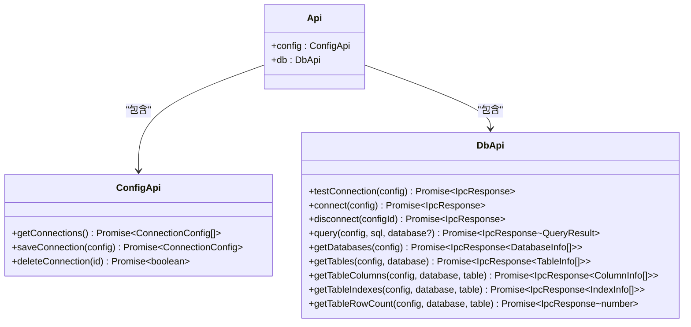

**图表来源**
- [index.ts:14-45](file://src/preload/index.ts#L14-L45)

#### 主进程 IPC 处理器

主进程实现了完整的 IPC 处理逻辑，包括连接配置管理和数据库操作：

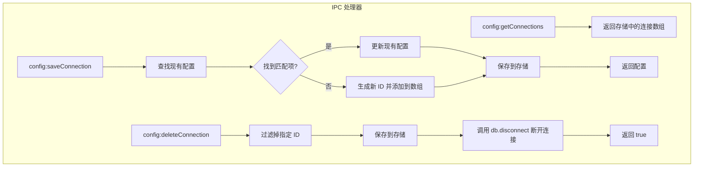

**图表来源**
- [ipc.ts:19-43](file://src/main/ipc.ts#L19-L43)

**章节来源**
- [index.ts:14-45](file://src/preload/index.ts#L14-L45)
- [ipc.ts:16-127](file://src/main/ipc.ts#L16-L127)

### 数据库服务集成

数据库服务模块提供了完整的数据库操作功能，与连接状态管理紧密集成：

#### 连接池管理

数据库服务使用连接池管理多个数据库连接：

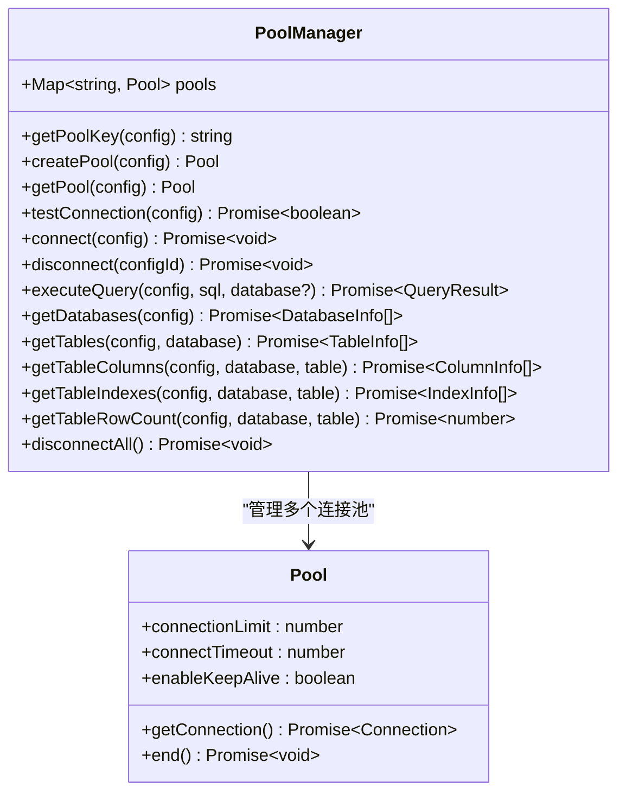

**图表来源**
- [db.ts:4-36](file://src/main/services/db.ts#L4-L36)

**章节来源**
- [db.ts:1-277](file://src/main/services/db.ts#L1-L277)

### 组件集成

连接状态管理模块与用户界面组件紧密集成，提供了完整的用户体验：

#### 连接树组件

连接树组件展示了连接状态的可视化表示：

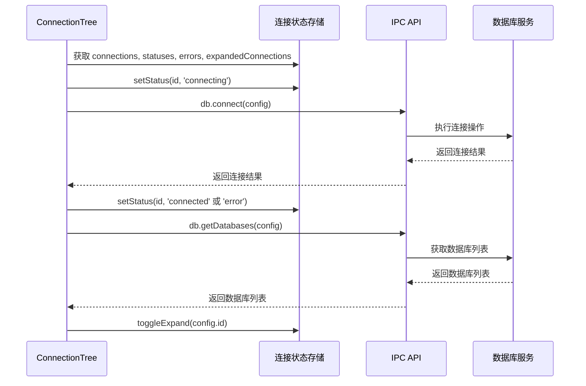

**图表来源**
- [ConnectionTree.tsx:40-58](file://src/renderer/src/components/ConnectionTree.tsx#L40-L58)
- [connection.ts:47-51](file://src/renderer/src/stores/connection.ts#L47-L51)

#### 连接模态框组件

连接模态框提供了连接配置的编辑和测试功能：

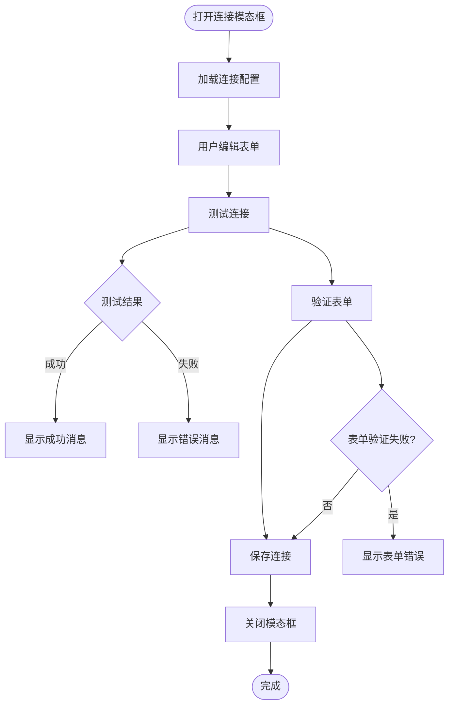

**图表来源**
- [ConnectionModal.tsx:44-65](file://src/renderer/src/components/ConnectionModal.tsx#L44-L65)

**章节来源**
- [ConnectionTree.tsx:1-313](file://src/renderer/src/components/ConnectionTree.tsx#L1-L313)
- [ConnectionModal.tsx:1-230](file://src/renderer/src/components/ConnectionModal.tsx#L1-L230)

## 依赖关系分析

连接状态管理模块的依赖关系如下：

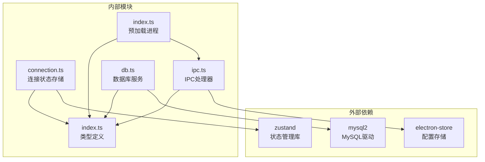

**图表来源**
- [connection.ts:1](file://src/renderer/src/stores/connection.ts#L1)
- [ipc.ts:2](file://src/main/ipc.ts#L2)
- [db.ts:1](file://src/main/services/db.ts#L1)

### 组件耦合度分析

连接状态管理模块具有良好的内聚性和较低的耦合度：

1. **状态存储与 UI 组件**: 通过 hooks 解耦，UI 组件只关心状态读取
2. **IPC 层抽象**: 预加载进程隐藏了 IPC 通信细节
3. **数据库服务独立**: 数据库操作与状态管理完全分离

**章节来源**
- [connection.ts:17-63](file://src/renderer/src/stores/connection.ts#L17-L63)
- [index.ts:14-45](file://src/preload/index.ts#L14-L45)

## 性能考虑

连接状态管理模块在设计时充分考虑了性能优化：

### 异步操作优化

1. **批量状态更新**: 使用状态合并减少不必要的重渲染
2. **连接池复用**: 避免频繁创建和销毁数据库连接
3. **缓存策略**: 连接树组件使用内存缓存避免重复请求

### 内存管理

1. **Set 数据结构**: 使用 Set 存储展开状态，提供 O(1) 查找性能
2. **对象引用**: 避免创建不必要的中间对象
3. **及时清理**: 删除连接时同步清理相关状态

### 网络优化

1. **延迟加载**: 数据库和表信息按需加载
2. **错误处理**: 异常情况下的资源清理和状态恢复

## 故障排除指南

### 常见问题及解决方案

#### 连接状态不同步

**问题描述**: UI 显示的连接状态与实际状态不一致

**可能原因**:
1. 状态更新未触发重新渲染
2. IPC 通信失败但状态已更新
3. 并发状态更新冲突

**解决方法**:
1. 确保使用正确的状态更新模式
2. 检查 IPC 调用的错误处理
3. 使用状态合并函数避免竞态条件

#### 连接配置丢失

**问题描述**: 保存的连接配置在重启后丢失

**可能原因**:
1. 存储文件损坏
2. 权限问题
3. 应用退出时未正确保存

**解决方法**:
1. 检查存储文件权限
2. 验证存储路径有效性
3. 实施自动备份机制

#### 性能问题

**问题描述**: 应用响应缓慢或内存占用过高

**可能原因**:
1. 连接池过大
2. 缓存数据过多
3. 频繁的状态更新

**解决方法**:
1. 调整连接池大小配置
2. 实施缓存清理策略
3. 优化状态更新频率

**章节来源**
- [connection.ts:47-62](file://src/renderer/src/stores/connection.ts#L47-L62)
- [ipc.ts:47-54](file://src/main/ipc.ts#L47-L54)

## 结论

连接状态管理模块通过精心设计的架构和实现，为 nexSql 应用程序提供了稳定可靠的连接管理功能。模块采用了现代化的技术栈和最佳实践，包括：

1. **清晰的架构分离**: 渲染进程、预加载进程和主进程职责明确
2. **完善的错误处理**: 全面的异常捕获和状态恢复机制
3. **高性能设计**: 连接池管理、缓存策略和异步操作优化
4. **良好的扩展性**: 模块化设计便于功能扩展和维护

该模块不仅满足了当前的功能需求，还为未来的功能扩展奠定了坚实的基础。通过合理的状态管理和 IPC 通信机制，确保了应用程序的稳定性和用户体验。