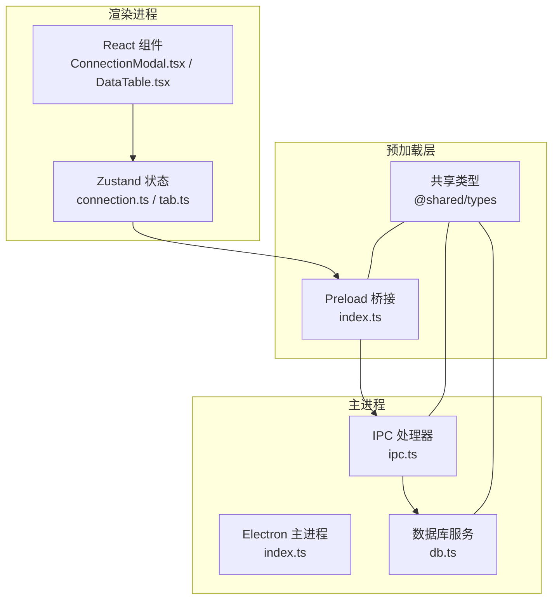
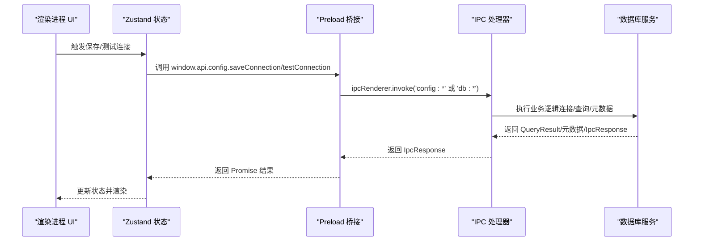
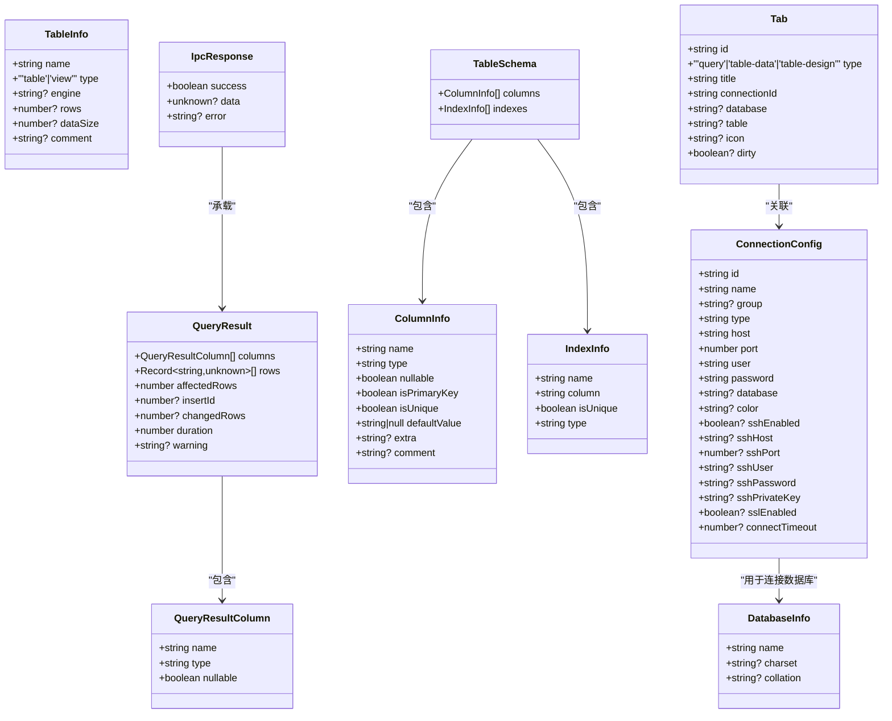

# 配置与类型系统

<cite>
**本文引用的文件**
- [src/shared/types/index.ts](file://src/shared/types/index.ts)
- [src/main/services/db.ts](file://src/main/services/db.ts)
- [src/main/ipc.ts](file://src/main/ipc.ts)
- [src/preload/index.ts](file://src/preload/index.ts)
- [src/preload/index.d.ts](file://src/preload/index.d.ts)
- [src/renderer/src/stores/connection.ts](file://src/renderer/src/stores/connection.ts)
- [src/renderer/src/stores/tab.ts](file://src/renderer/src/stores/tab.ts)
- [src/renderer/src/components/ConnectionModal.tsx](file://src/renderer/src/components/ConnectionModal.tsx)
- [src/renderer/src/components/DataTable.tsx](file://src/renderer/src/components/DataTable.tsx)
- [src/main/index.ts](file://src/main/index.ts)
- [tsconfig.json](file://tsconfig.json)
- [tsconfig.node.json](file://tsconfig.node.json)
- [tsconfig.web.json](file://tsconfig.web.json)
- [package.json](file://package.json)
</cite>

## 目录
1. [引言](#引言)
2. [项目结构](#项目结构)
3. [核心组件](#核心组件)
4. [架构总览](#架构总览)
5. [详细组件分析](#详细组件分析)
6. [依赖关系分析](#依赖关系分析)
7. [性能考量](#性能考量)
8. [故障排查指南](#故障排查指南)
9. [结论](#结论)
10. [附录](#附录)

## 引言
本文件系统性梳理 nexSql 的“配置与类型系统”，覆盖以下方面：
- 所有数据类型定义（连接配置、查询结果、数据库元数据、IPC 响应、标签页等）
- 类型系统设计原则与命名约定
- 配置项结构与验证规则
- 类型在前端与后端的实际使用示例与最佳实践
- 前后端类型同步机制与共享类型管理
- 类型扩展与自定义方法
- 类型系统在整个项目架构中的作用与价值

## 项目结构
项目采用 Electron + React 技术栈，类型定义集中于共享模块，前后端通过 IPC 通信协同工作。核心路径如下：
- 共享类型：src/shared/types/index.ts
- 主进程服务：src/main/services/db.ts、src/main/ipc.ts
- 预加载桥接：src/preload/index.ts、src/preload/index.d.ts
- 渲染进程状态与组件：src/renderer/src/stores/*、src/renderer/src/components/*
- TypeScript 路径映射与编译配置：tsconfig*.json
- 应用入口：src/main/index.ts

图表来源
- [src/renderer/src/components/ConnectionModal.tsx:1-230](file://src/renderer/src/components/ConnectionModal.tsx#L1-L230)
- [src/renderer/src/components/DataTable.tsx:1-297](file://src/renderer/src/components/DataTable.tsx#L1-L297)
- [src/renderer/src/stores/connection.ts:1-64](file://src/renderer/src/stores/connection.ts#L1-L64)
- [src/renderer/src/stores/tab.ts:1-65](file://src/renderer/src/stores/tab.ts#L1-L65)
- [src/preload/index.ts:1-60](file://src/preload/index.ts#L1-L60)
- [src/main/ipc.ts:1-132](file://src/main/ipc.ts#L1-L132)
- [src/main/services/db.ts:1-277](file://src/main/services/db.ts#L1-L277)
- [src/main/index.ts:1-64](file://src/main/index.ts#L1-L64)
- [src/shared/types/index.ts:1-124](file://src/shared/types/index.ts#L1-L124)

章节来源
- [tsconfig.json:1-29](file://tsconfig.json#L1-L29)
- [tsconfig.node.json:1-20](file://tsconfig.node.json#L1-L20)
- [tsconfig.web.json:1-28](file://tsconfig.web.json#L1-L28)

## 核心组件
本节对共享类型进行逐类解析，并说明其在系统中的职责与约束。

- 连接相关类型
  - ConnectionConfig：连接配置的核心载体，包含标识、名称、分组、数据库类型、主机、端口、用户、密码、默认数据库、颜色、SSH/SSL 开关、超时等字段；部分字段为可选，体现灵活性与向后兼容。
  - ConnectionStatus：连接状态枚举，涵盖断开、连接中、已连接、错误四种状态。
  - ConnectionInfo：连接信息对象，组合了配置与状态，便于 UI 展示与交互。

- 数据库元数据类型
  - DatabaseInfo：数据库基本信息，含名称、字符集、排序规则。
  - TableInfo：表或视图信息，含名称、类型（table/view）、引擎、行数、大小、注释。
  - ColumnInfo：列信息，含名称、类型字符串、是否可空、是否主键/唯一、默认值、额外信息、注释。
  - IndexInfo：索引信息，含名称、列名、是否唯一、类型。
  - TableSchema：表模式，聚合列与索引列表。

- 查询结果类型
  - QueryResultColumn：查询结果列元数据，含名称、类型字符串、是否可空。
  - QueryResult：查询结果对象，包含列定义、行数组、受影响行数、插入 ID、变更行数、耗时、警告信息。
  - QueryHistory：查询历史记录，用于记录执行 SQL、连接、数据库、时间、耗时、行数、错误等。

- IPC 通信类型
  - IpcResponse<T>：统一响应结构，包含成功标志、数据与错误信息，泛型支持不同返回类型。

- 标签页类型
  - TabType：标签页类型枚举，支持查询、表数据浏览、表设计三种类型。
  - Tab：标签页对象，包含标识、类型、标题、连接 ID、数据库/表、图标、脏标记等。

章节来源
- [src/shared/types/index.ts:1-124](file://src/shared/types/index.ts#L1-L124)

## 架构总览
类型系统贯穿三层：共享类型层、主进程服务层、渲染进程 UI 层。共享类型作为契约，确保前后端一致的数据结构与行为。

图表来源
- [src/preload/index.ts:1-60](file://src/preload/index.ts#L1-L60)
- [src/main/ipc.ts:1-132](file://src/main/ipc.ts#L1-L132)
- [src/main/services/db.ts:1-277](file://src/main/services/db.ts#L1-L277)
- [src/renderer/src/stores/connection.ts:1-64](file://src/renderer/src/stores/connection.ts#L1-L64)

## 详细组件分析

### 连接配置与状态管理
- 设计要点
  - ConnectionConfig 以最小必要字段保证可用性，同时提供 SSH/SSL/超时等高级配置，满足多场景需求。
  - ConnectionStatus 使用字面量联合类型，避免魔法字符串，提升可读性与安全性。
  - 渲染层通过 Zustand 管理连接集合、状态映射与展开状态，减少重复请求与冗余状态。

- 实际使用示例
  - 新建/编辑连接：组件初始化默认配置，用户输入校验后调用 window.api.config.saveConnection，随后重新加载连接列表。
  - 测试连接：调用 window.api.db.testConnection，根据 IpcResponse.success 更新 UI 提示。

- 最佳实践
  - 保存前进行必填字段校验（如名称、主机），并在 UI 显示明确错误提示。
  - 对连接状态使用 ConnectionStatus 枚举，避免状态不一致。
  - 将连接 ID 作为缓存键与断开连接的关键依据。

章节来源
- [src/renderer/src/components/ConnectionModal.tsx:1-230](file://src/renderer/src/components/ConnectionModal.tsx#L1-L230)
- [src/renderer/src/stores/connection.ts:1-64](file://src/renderer/src/stores/connection.ts#L1-L64)
- [src/main/ipc.ts:1-132](file://src/main/ipc.ts#L1-L132)
- [src/preload/index.ts:1-60](file://src/preload/index.ts#L1-L60)

### 数据库元数据与查询结果处理
- 设计要点
  - QueryResult 与各元数据类型严格对应 MySQL 返回结构，通过信息库查询生成，保证 UI 与后端一致性。
  - TableSchema 聚合列与索引，便于表设计与数据浏览组件复用。

- 实际使用示例
  - 表数据展示：先获取列信息，再按分页构建 SQL 并执行查询，最终渲染到数据网格组件。
  - 元数据查询：通过 window.api.db.getTables/getTableColumns/getTableIndexes 获取结构信息，驱动 UI 呈现。

- 最佳实践
  - 对查询结果的列定义与行数据分别处理，避免类型不匹配。
  - 对 DML 语句补充 warning 字段，提示潜在问题。
  - 分页查询时结合总行数与 LIMIT/OFFSET，控制内存占用。

章节来源
- [src/main/services/db.ts:1-277](file://src/main/services/db.ts#L1-L277)
- [src/renderer/src/components/DataTable.tsx:1-297](file://src/renderer/src/components/DataTable.tsx#L1-L297)

### IPC 通信与类型同步
- 设计要点
  - IpcResponse<T> 统一前后端通信格式，简化错误处理与数据解包。
  - preload 暴露的 API 接口与主进程 handlers 一一对应，类型完全由共享类型定义驱动。

- 实际使用示例
  - 配置管理：config:getConnections/saveConnection/deleteConnection 的调用链。
  - 数据库操作：db:testConnection/connect/disconnect/query 等。

- 最佳实践
  - 严格区分“成功”与“失败”的响应分支，避免遗漏错误处理。
  - 对可选字段进行判空处理，防止运行时异常。

章节来源
- [src/main/ipc.ts:1-132](file://src/main/ipc.ts#L1-L132)
- [src/preload/index.ts:1-60](file://src/preload/index.ts#L1-L60)
- [src/preload/index.d.ts:1-10](file://src/preload/index.d.ts#L1-L10)

### 标签页与状态管理
- 设计要点
  - Tab 类型抽象标签页上下文，TabType 限定类型范围，避免误用。
  - Zustand 状态管理打开/关闭/激活标签页，去重相同上下文的标签页，提升用户体验。

- 实际使用示例
  - 打开标签页：根据连接、数据库、表与类型判断是否已存在，决定复用或新增。
  - 更新标签页：支持动态更新标题、脏标记等属性。

章节来源
- [src/renderer/src/stores/tab.ts:1-65](file://src/renderer/src/stores/tab.ts#L1-L65)
- [src/shared/types/index.ts:110-124](file://src/shared/types/index.ts#L110-L124)

### 类型系统设计原则与命名约定
- 原则
  - 单一职责：每个接口聚焦一类领域对象（连接、元数据、结果、IPC、标签）。
  - 可扩展性：使用可选字段与泛型，允许未来扩展而不破坏现有结构。
  - 一致性：前后端共享同一套类型定义，避免重复维护。
  - 安全性：使用字面量联合类型与严格模式，降低运行时风险。

- 命名约定
  - 接口以名词短语命名（如 ConnectionConfig、TableInfo）。
  - 枚举/联合类型以动词或形容词命名（如 ConnectionStatus、TabType）。
  - 响应类型统一以 IpcResponse<T> 命名，突出其契约性质。

章节来源
- [src/shared/types/index.ts:1-124](file://src/shared/types/index.ts#L1-L124)

### 配置选项结构与验证规则
- 结构
  - 必填项：id、name、type、host、port、user、password。
  - 可选项：group、database、color、sshEnabled/sshHost/sshPort/sshUser/sshPassword/sshPrivateKey、sslEnabled、connectTimeout。
  - 状态项：status、error。

- 验证规则
  - 名称与主机地址必填，端口需为数字。
  - 当启用 SSH/SSL 时，相关参数需完整。
  - 连接状态通过 ConnectionStatus 枚举约束，错误信息随 IpcResponse 返回。

章节来源
- [src/shared/types/index.ts:3-30](file://src/shared/types/index.ts#L3-L30)
- [src/renderer/src/components/ConnectionModal.tsx:52-65](file://src/renderer/src/components/ConnectionModal.tsx#L52-L65)

### 前后端类型同步机制与共享类型管理
- 同步机制
  - 共享类型位于 src/shared/types/index.ts，被主进程、预加载、渲染进程共同导入。
  - tsconfig.json 中通过路径别名 @shared/* 与 @types/* 精确定位共享类型目录，确保编译期类型检查一致。

- 管理方式
  - 通过 Electron Store 存储 ConnectionConfig 数组，主进程 IPC 处理器负责增删改查。
  - 预加载层将 API 方法暴露给渲染进程，所有调用均基于共享类型签名。

章节来源
- [tsconfig.json:14-21](file://tsconfig.json#L14-L21)
- [tsconfig.node.json:13-18](file://tsconfig.node.json#L13-L18)
- [tsconfig.web.json:13-19](file://tsconfig.web.json#L13-L19)
- [src/main/ipc.ts:7-14](file://src/main/ipc.ts#L7-L14)
- [src/preload/index.ts:1-10](file://src/preload/index.ts#L1-L10)

### 类型扩展与自定义方法
- 扩展方向
  - 新增连接类型：在 ConnectionConfig.type 中添加新枚举值，并在主进程与 UI 层补充相应配置项与校验。
  - 新增标签页类型：在 TabType 中添加新枚举值，并在标签页路由与渲染逻辑中处理。
  - 新增查询结果字段：在 QueryResult 中追加字段，并在 db.ts 的结果组装处填充。

- 自定义建议
  - 保持向后兼容：新增字段尽量设为可选，避免破坏既有数据。
  - 统一错误处理：通过 IpcResponse 统一封装错误，便于 UI 侧统一提示。
  - 编写单元测试：针对关键类型转换与边界条件编写测试，确保类型安全。

章节来源
- [src/shared/types/index.ts:7-22](file://src/shared/types/index.ts#L7-L22)
- [src/shared/types/index.ts:112-123](file://src/shared/types/index.ts#L112-L123)
- [src/main/services/db.ts:96-130](file://src/main/services/db.ts#L96-L130)

## 依赖关系分析
类型系统与模块之间的耦合关系如下：

图表来源
- [src/shared/types/index.ts:1-124](file://src/shared/types/index.ts#L1-L124)

章节来源
- [src/shared/types/index.ts:1-124](file://src/shared/types/index.ts#L1-L124)

## 性能考量
- 连接池与超时
  - 主进程使用连接池管理，设置连接超时与心跳参数，避免资源泄露与长时间阻塞。
- 查询优化
  - 分页查询与 LIMIT/OFFSET 控制单次传输数据量；仅在需要时获取列定义与索引信息。
- UI 渲染
  - 使用虚拟滚动与列宽缓存，减少大数据量下的重排与重绘。

章节来源
- [src/main/services/db.ts:11-28](file://src/main/services/db.ts#L11-L28)
- [src/renderer/src/components/DataTable.tsx:23-83](file://src/renderer/src/components/DataTable.tsx#L23-L83)

## 故障排查指南
- 常见问题
  - 连接失败：检查主机、端口、用户、密码与超时设置；查看 IpcResponse.error。
  - 查询报错：确认数据库与表名拼写，检查 SQL 语法；关注 QueryResult.warning。
  - 类型不匹配：核对共享类型版本，确保主进程与渲染进程使用同一份类型定义。

- 排查步骤
  - 在渲染层打印 window.api 调用返回的 IpcResponse.success/error。
  - 在主进程日志中定位 db.ts 的具体错误堆栈。
  - 使用最小化配置复现问题，逐步排除 SSH/SSL/超时等因素。

章节来源
- [src/main/ipc.ts:47-81](file://src/main/ipc.ts#L47-L81)
- [src/main/services/db.ts:114-130](file://src/main/services/db.ts#L114-L130)
- [src/preload/index.ts:27-44](file://src/preload/index.ts#L27-L44)

## 结论
本项目通过“共享类型 + IPC + 连接池”的架构，实现了前后端类型一致、职责清晰、易于扩展的配置与类型系统。类型定义覆盖连接、元数据、查询结果、IPC 响应与标签页等关键领域，配合严格的命名约定与验证规则，显著提升了系统的稳定性与可维护性。建议在后续迭代中持续完善类型边界与错误处理，保持向后兼容与向前演进的平衡。

## 附录
- 关键实现参考路径
  - 连接配置与状态：[src/renderer/src/stores/connection.ts:1-64](file://src/renderer/src/stores/connection.ts#L1-L64)
  - 表数据展示：[src/renderer/src/components/DataTable.tsx:1-297](file://src/renderer/src/components/DataTable.tsx#L1-L297)
  - IPC 与数据库服务：[src/main/ipc.ts:1-132](file://src/main/ipc.ts#L1-L132)、[src/main/services/db.ts:1-277](file://src/main/services/db.ts#L1-L277)
  - 共享类型定义：[src/shared/types/index.ts:1-124](file://src/shared/types/index.ts#L1-L124)
  - 预加载桥接与类型声明：[src/preload/index.ts:1-60](file://src/preload/index.ts#L1-L60)、[src/preload/index.d.ts:1-10](file://src/preload/index.d.ts#L1-L10)
  - 应用入口与退出清理：[src/main/index.ts:1-64](file://src/main/index.ts#L1-L64)
  - TypeScript 路径映射：[tsconfig.json:14-21](file://tsconfig.json#L14-L21)、[tsconfig.node.json:13-18](file://tsconfig.node.json#L13-L18)、[tsconfig.web.json:13-19](file://tsconfig.web.json#L13-L19)
  - 依赖与脚本：[package.json:1-42](file://package.json#L1-L42)