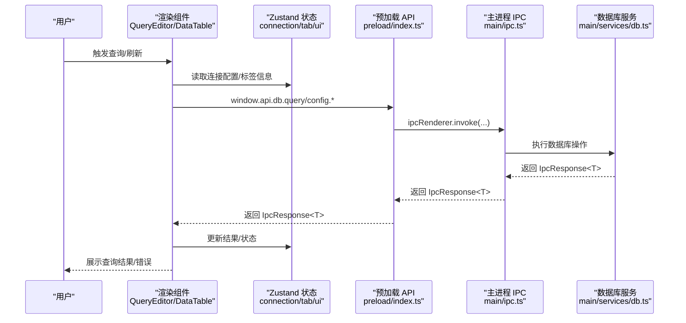
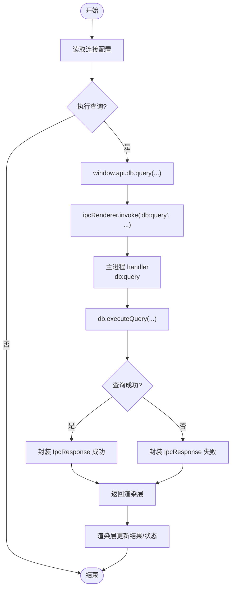
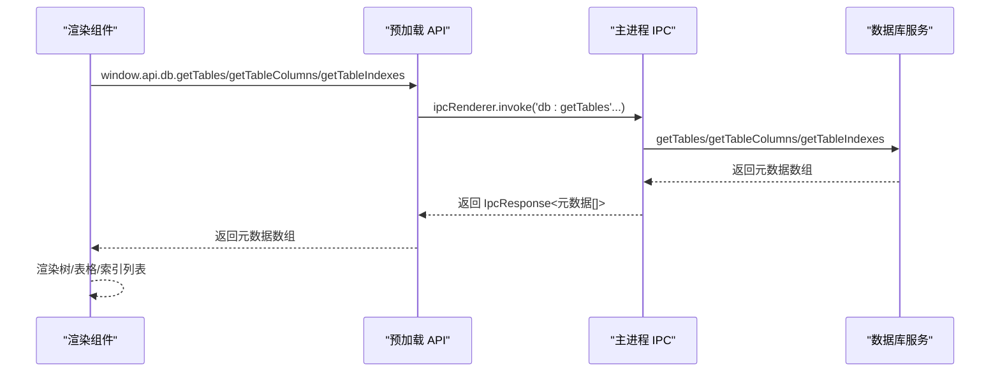
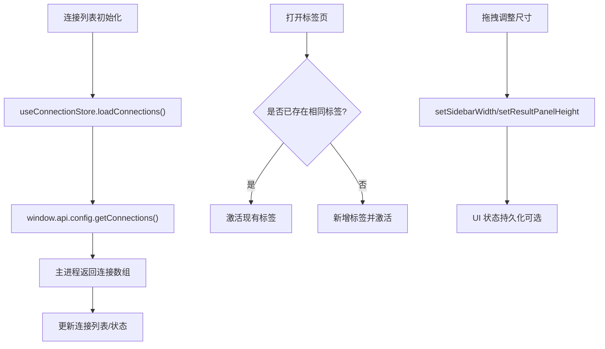
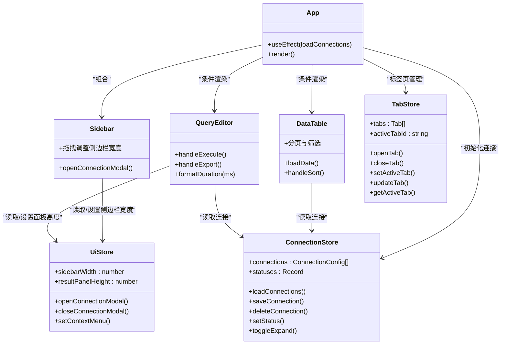

# 项目概述

<cite>
**本文档引用的文件**
- [package.json](file://package.json)
- [electron.vite.config.ts](file://electron.vite.config.ts)
- [tsconfig.json](file://tsconfig.json)
- [src/main/index.ts](file://src/main/index.ts)
- [src/main/ipc.ts](file://src/main/ipc.ts)
- [src/main/services/db.ts](file://src/main/services/db.ts)
- [src/preload/index.ts](file://src/preload/index.ts)
- [src/shared/types/index.ts](file://src/shared/types/index.ts)
- [src/renderer/src/App.tsx](file://src/renderer/src/App.tsx)
- [src/renderer/src/components/QueryEditor.tsx](file://src/renderer/src/components/QueryEditor.tsx)
- [src/renderer/src/components/DataTable.tsx](file://src/renderer/src/components/DataTable.tsx)
- [src/renderer/src/components/Sidebar.tsx](file://src/renderer/src/components/Sidebar.tsx)
- [src/renderer/src/stores/connection.ts](file://src/renderer/src/stores/connection.ts)
- [src/renderer/src/stores/tab.ts](file://src/renderer/src/stores/tab.ts)
- [src/renderer/src/stores/ui.ts](file://src/renderer/src/stores/ui.ts)
</cite>

## 目录
1. [简介](#简介)
2. [项目结构](#项目结构)
3. [核心组件](#核心组件)
4. [架构总览](#架构总览)
5. [详细组件分析](#详细组件分析)
6. [依赖关系分析](#依赖关系分析)
7. [性能考虑](#性能考虑)
8. [故障排除指南](#故障排除指南)
9. [结论](#结论)

## 简介
nexSql 是一个基于 Electron + React 的跨平台桌面数据库管理工具，专注于提供直观、高效的数据库连接与查询体验。项目采用现代前端技术栈与安全的主进程-渲染进程隔离架构，支持 MySQL 数据库连接、SQL 查询执行、数据库对象浏览（表、视图、索引）、以及交互式数据表格展示。通过 IPC 通信机制在渲染层与主进程之间传递数据库操作请求，确保安全性与可维护性。

本项目适合以下人群：
- 初学者：快速上手数据库连接与查询，无需学习复杂命令行工具
- 中级用户：通过标签页管理多个查询与表数据，配合筛选与排序提升效率
- 高级开发者：参考模块化架构、状态管理与 IPC 设计，扩展更多数据库类型或功能

## 项目结构
项目采用“主进程-预加载-渲染进程”三层架构，并通过 Vite 与 electron-vite 进行开发与构建。核心目录组织如下：
- 主进程：负责窗口创建、IPC 注册、数据库连接池管理
- 预加载脚本：通过 contextBridge 暴露受控 API 给渲染进程
- 渲染进程：React + TypeScript 前端界面，包含组件、状态管理与 UI 逻辑
- 共享类型：定义连接配置、查询结果、IPC 响应等跨进程数据结构
- 构建配置：Vite 别名与 TypeScript 路径映射，统一开发体验

```mermaid
graph TB
subgraph "主进程"
M_Index["index.ts<br/>窗口与生命周期"]
M_Ipc["ipc.ts<br/>IPC 处理器"]
M_Db["services/db.ts<br/>数据库服务"]
end
subgraph "预加载"
P_Index["preload/index.ts<br/>contextBridge 暴露 API"]
end
subgraph "渲染进程"
R_App["App.tsx<br/>应用根组件"]
R_Comps["组件集合<br/>Sidebar/QueryEditor/DataTable 等"]
R_Stores["状态管理<br/>connection/tab/ui/zustand"]
end
subgraph "共享"
S_Types["shared/types/index.ts<br/>类型定义"]
end
M_Index --> M_Ipc
M_Ipc --> M_Db
P_Index <- --> M_Ipc
R_App --> R_Comps
R_App --> R_Stores
R_Comps --> P_Index
R_Stores --> P_Index
M_Ipc --> S_Types
P_Index --> S_Types
```

**图表来源**
- [src/main/index.ts:1-64](file://src/main/index.ts#L1-L64)
- [src/main/ipc.ts:1-132](file://src/main/ipc.ts#L1-L132)
- [src/main/services/db.ts:1-277](file://src/main/services/db.ts#L1-L277)
- [src/preload/index.ts:1-60](file://src/preload/index.ts#L1-L60)
- [src/renderer/src/App.tsx:1-24](file://src/renderer/src/App.tsx#L1-L24)
- [src/shared/types/index.ts:1-124](file://src/shared/types/index.ts#L1-L124)

**章节来源**
- [package.json:1-42](file://package.json#L1-L42)
- [electron.vite.config.ts:1-31](file://electron.vite.config.ts#L1-L31)
- [tsconfig.json:1-29](file://tsconfig.json#L1-L29)

## 核心组件
- 主进程入口与窗口管理：负责创建 BrowserWindow、设置 webPreferences、处理窗口事件与应用生命周期；在 ready-to-show 时显示窗口，外部链接打开由系统浏览器处理。
- IPC 通信：集中注册配置与数据库操作相关的 handler，统一返回 IpcResponse 结构，便于渲染层错误处理与状态更新。
- 数据库服务：基于 mysql2/promise 提供连接池管理、连接测试、查询执行、元数据获取（数据库、表、列、索引、行数）等能力。
- 预加载 API：通过 contextBridge 将受限 API 暴露到渲染进程，避免直接访问 Node.js API，保证安全边界。
- 渲染层组件：侧边栏连接树、查询编辑器、数据表格、标签页管理、上下文菜单等，提供完整的数据库管理体验。
- 状态管理：使用 Zustand 管理连接列表、标签页、UI 状态（侧边栏宽度、结果面板高度、上下文菜单等），降低组件间耦合。

**章节来源**
- [src/main/index.ts:1-64](file://src/main/index.ts#L1-L64)
- [src/main/ipc.ts:16-127](file://src/main/ipc.ts#L16-L127)
- [src/main/services/db.ts:1-277](file://src/main/services/db.ts#L1-L277)
- [src/preload/index.ts:14-59](file://src/preload/index.ts#L14-L59)
- [src/renderer/src/App.tsx:1-24](file://src/renderer/src/App.tsx#L1-L24)
- [src/renderer/src/stores/connection.ts:1-64](file://src/renderer/src/stores/connection.ts#L1-L64)
- [src/renderer/src/stores/tab.ts:1-65](file://src/renderer/src/stores/tab.ts#L1-L65)
- [src/renderer/src/stores/ui.ts:1-41](file://src/renderer/src/stores/ui.ts#L1-L41)

## 架构总览
下图展示了从用户操作到数据库查询的完整流程，涵盖 IPC 调用链与数据流向：



**图表来源**
- [src/renderer/src/components/QueryEditor.tsx:36-64](file://src/renderer/src/components/QueryEditor.tsx#L36-L64)
- [src/renderer/src/components/DataTable.tsx:41-83](file://src/renderer/src/components/DataTable.tsx#L41-L83)
- [src/renderer/src/stores/connection.ts:23-45](file://src/renderer/src/stores/connection.ts#L23-L45)
- [src/preload/index.ts:14-59](file://src/preload/index.ts#L14-L59)
- [src/main/ipc.ts:74-81](file://src/main/ipc.ts#L74-L81)
- [src/main/services/db.ts:73-135](file://src/main/services/db.ts#L73-L135)

## 详细组件分析

### 数据库连接与查询执行流程
该流程体现了 IPC 的调用顺序与错误处理策略，确保查询结果与错误信息清晰反馈给渲染层。



**图表来源**
- [src/renderer/src/components/QueryEditor.tsx:36-64](file://src/renderer/src/components/QueryEditor.tsx#L36-L64)
- [src/preload/index.ts:33-34](file://src/preload/index.ts#L33-L34)
- [src/main/ipc.ts:74-81](file://src/main/ipc.ts#L74-L81)
- [src/main/services/db.ts:73-135](file://src/main/services/db.ts#L73-L135)

**章节来源**
- [src/renderer/src/components/QueryEditor.tsx:1-329](file://src/renderer/src/components/QueryEditor.tsx#L1-L329)
- [src/preload/index.ts:14-59](file://src/preload/index.ts#L14-L59)
- [src/main/ipc.ts:74-81](file://src/main/ipc.ts#L74-L81)
- [src/main/services/db.ts:73-135](file://src/main/services/db.ts#L73-L135)

### 数据库元数据获取（表、列、索引）
渲染层通过预加载 API 获取数据库对象信息，主进程调用数据库服务进行查询，最终返回给渲染层用于 UI 展示。



**图表来源**
- [src/renderer/src/components/DataTable.tsx:47-83](file://src/renderer/src/components/DataTable.tsx#L47-L83)
- [src/preload/index.ts:37-44](file://src/preload/index.ts#L37-L44)
- [src/main/ipc.ts:92-126](file://src/main/ipc.ts#L92-L126)
- [src/main/services/db.ts:157-253](file://src/main/services/db.ts#L157-L253)

**章节来源**
- [src/renderer/src/components/DataTable.tsx:1-297](file://src/renderer/src/components/DataTable.tsx#L1-L297)
- [src/preload/index.ts:37-44](file://src/preload/index.ts#L37-L44)
- [src/main/ipc.ts:92-126](file://src/main/ipc.ts#L92-L126)
- [src/main/services/db.ts:157-253](file://src/main/services/db.ts#L157-L253)

### 状态管理与 UI 控制流
Zustand 状态在渲染层承担连接、标签页与 UI 状态的集中管理，组件通过状态派发动作触发 IPC 请求或 UI 变更。



**图表来源**
- [src/renderer/src/stores/connection.ts:23-45](file://src/renderer/src/stores/connection.ts#L23-L45)
- [src/renderer/src/stores/tab.ts:19-34](file://src/renderer/src/stores/tab.ts#L19-L34)
- [src/renderer/src/stores/ui.ts:33-34](file://src/renderer/src/stores/ui.ts#L33-L34)

**章节来源**
- [src/renderer/src/stores/connection.ts:1-64](file://src/renderer/src/stores/connection.ts#L1-L64)
- [src/renderer/src/stores/tab.ts:1-65](file://src/renderer/src/stores/tab.ts#L1-L65)
- [src/renderer/src/stores/ui.ts:1-41](file://src/renderer/src/stores/ui.ts#L1-L41)

### 组件类图（代码级）
展示关键组件与状态管理的关系，体现职责分离与数据流向。



**图表来源**
- [src/renderer/src/App.tsx:1-24](file://src/renderer/src/App.tsx#L1-L24)
- [src/renderer/src/components/Sidebar.tsx:1-80](file://src/renderer/src/components/Sidebar.tsx#L1-L80)
- [src/renderer/src/components/QueryEditor.tsx:1-329](file://src/renderer/src/components/QueryEditor.tsx#L1-L329)
- [src/renderer/src/components/DataTable.tsx:1-297](file://src/renderer/src/components/DataTable.tsx#L1-L297)
- [src/renderer/src/stores/connection.ts:1-64](file://src/renderer/src/stores/connection.ts#L1-L64)
- [src/renderer/src/stores/tab.ts:1-65](file://src/renderer/src/stores/tab.ts#L1-L65)
- [src/renderer/src/stores/ui.ts:1-41](file://src/renderer/src/stores/ui.ts#L1-L41)

**章节来源**
- [src/renderer/src/App.tsx:1-24](file://src/renderer/src/App.tsx#L1-L24)
- [src/renderer/src/components/Sidebar.tsx:1-80](file://src/renderer/src/components/Sidebar.tsx#L1-L80)
- [src/renderer/src/components/QueryEditor.tsx:1-329](file://src/renderer/src/components/QueryEditor.tsx#L1-L329)
- [src/renderer/src/components/DataTable.tsx:1-297](file://src/renderer/src/components/DataTable.tsx#L1-L297)
- [src/renderer/src/stores/connection.ts:1-64](file://src/renderer/src/stores/connection.ts#L1-L64)
- [src/renderer/src/stores/tab.ts:1-65](file://src/renderer/src/stores/tab.ts#L1-L65)
- [src/renderer/src/stores/ui.ts:1-41](file://src/renderer/src/stores/ui.ts#L1-L41)

## 依赖关系分析
- 技术栈概览
  - Electron：桌面应用框架，提供主进程、渲染进程与预加载脚本运行时
  - React + TypeScript：构建用户界面与类型安全的状态管理
  - Vite/electron-vite：开发与构建工具链，支持热重载与多端别名解析
  - Zustand：轻量级状态管理，替代 Redux，降低样板代码
  - Monaco Editor：内置 SQL 编辑器，提供语法高亮与智能提示
  - react-data-grid：高性能数据网格，支持排序、筛选与分页
  - mysql2：MySQL 官方驱动，提供 Promise 化接口与连接池
  - TailwindCSS：原子化样式工具，快速构建一致的 UI 设计
  - electron-store：本地配置存储，持久化连接配置
  - lucide-react：图标库，统一视觉风格

- 关键依赖路径映射
  - 主进程别名：@main、@shared
  - 渲染进程别名：@renderer、@components、@stores、@shared、@types
  - TypeScript 路径映射与 Vite 别名保持一致，确保开发体验统一

**章节来源**
- [package.json:16-40](file://package.json#L16-L40)
- [electron.vite.config.ts:5-30](file://electron.vite.config.ts#L5-L30)
- [tsconfig.json:14-21](file://tsconfig.json#L14-L21)

## 性能考虑
- 连接池优化：数据库服务使用连接池复用连接，限制并发连接数，启用 keep-alive 与超时控制，减少频繁建立/销毁连接的开销。
- 查询结果处理：区分 SELECT 与 DML 查询，仅在 SELECT 时提取字段元数据与行数据，避免不必要的解析成本。
- UI 响应性：查询执行与结果展示分离，使用异步渲染与分页加载，避免大结果集阻塞界面。
- 状态粒度：Zustand 将连接、标签页、UI 状态拆分管理，按需更新，降低重渲染范围。
- 编辑器性能：Monaco Editor 与 react-data-grid 均支持虚拟滚动与懒加载，适配大数据量场景。

## 故障排除指南
- 连接失败
  - 现象：连接测试或连接请求返回错误
  - 排查：检查主机、端口、用户名、密码与数据库名称；确认网络连通性与防火墙设置；查看 IpcResponse.error 字段
  - 参考：连接测试与连接处理器返回 IpcResponse 的错误分支
- 查询异常
  - 现象：执行查询后出现错误提示或空结果
  - 排查：确认 SQL 语法与目标数据库；检查权限与表是否存在；查看 warning 信息与错误消息
  - 参考：查询处理器与数据库服务的错误捕获与封装
- 元数据获取失败
  - 现象：无法列出数据库、表或列信息
  - 排查：确认当前连接状态与数据库选择；检查信息架构视图访问权限
  - 参考：元数据获取处理器与数据库服务对应方法
- 应用退出未断开连接
  - 现象：关闭应用后数据库连接仍存在
  - 排查：确认 before-quit 事件中调用断开所有连接
  - 参考：主进程 before-quit 与数据库服务断开所有连接

**章节来源**
- [src/main/ipc.ts:47-54](file://src/main/ipc.ts#L47-L54)
- [src/main/services/db.ts:38-56](file://src/main/services/db.ts#L38-L56)
- [src/main/ipc.ts:74-81](file://src/main/ipc.ts#L74-L81)
- [src/main/services/db.ts:73-135](file://src/main/services/db.ts#L73-L135)
- [src/main/ipc.ts:83-126](file://src/main/ipc.ts#L83-L126)
- [src/main/services/db.ts:137-269](file://src/main/services/db.ts#L137-L269)
- [src/main/index.ts:61-63](file://src/main/index.ts#L61-L63)
- [src/main/services/db.ts:271-277](file://src/main/services/db.ts#L271-L277)

## 结论
nexSql 通过 Electron + React 的组合，结合 IPC 与连接池设计，提供了安全、高效且易用的桌面数据库管理体验。其模块化架构与清晰的数据流使项目具备良好的可扩展性：未来可扩展至更多数据库类型、增强查询历史与导入导出能力、集成更多可视化分析组件。对于初学者，项目提供了直观的图形界面与一键连接能力；对于有经验的开发者，项目展示了现代桌面应用的工程实践与最佳实践。